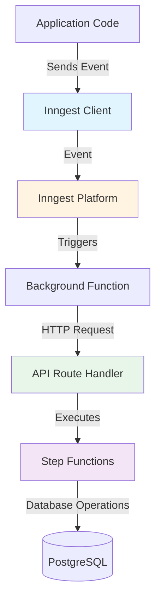
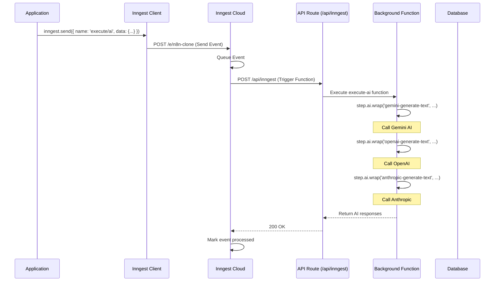
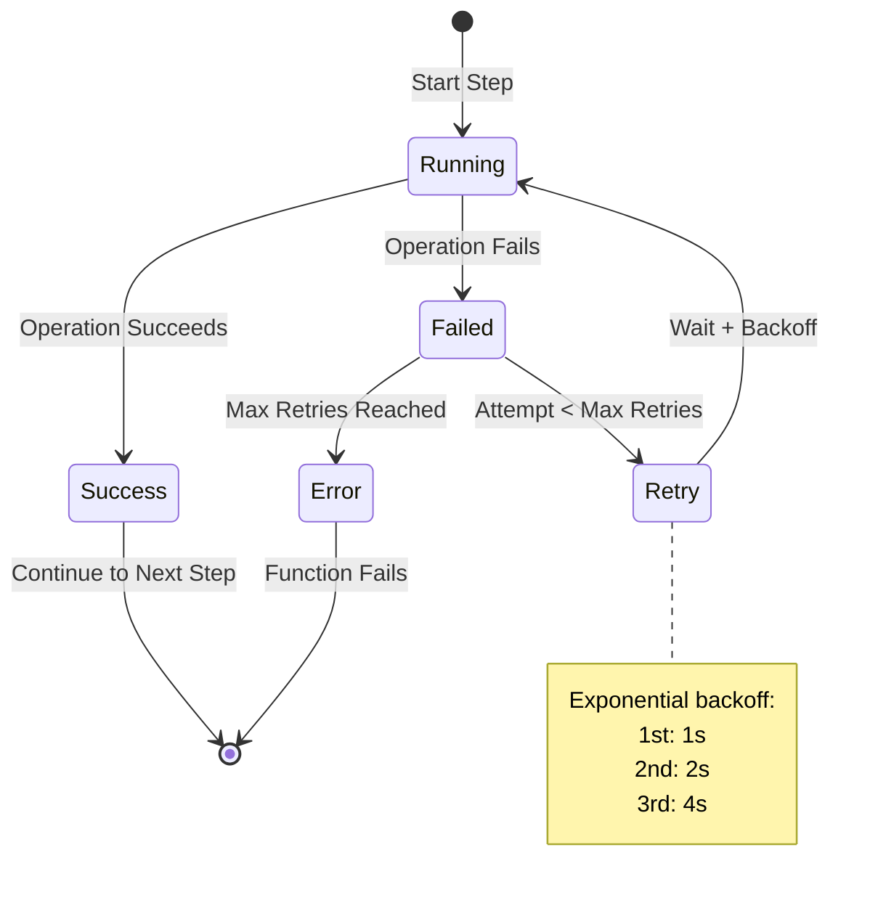

# Background Jobs with Inngest

This document provides a comprehensive guide to how background jobs work in this n8n clone using Inngest.

## Table of Contents
- [Overview](#overview)
- [What is Inngest?](#what-is-inngest)
- [Architecture](#architecture)
- [Setup and Configuration](#setup-and-configuration)
- [How It Works](#how-it-works)
- [Function Anatomy](#function-anatomy)
- [Event Flow](#event-flow)
- [Step Functions](#step-functions)
- [Development Workflow](#development-workflow)
- [Best Practices](#best-practices)

## Overview

Inngest is a developer platform for building reliable workflow and background job orchestration. In this project, Inngest handles asynchronous tasks like:

- Processing long-running workflows
- Managing multi-step operations with retries
- Handling event-driven automation
- Coordinating complex business logic with automatic retries and error handling

## What is Inngest?

Inngest provides:
- **Event-driven functions**: Functions that respond to events
- **Step functions**: Break complex jobs into retriable, observable steps
- **Automatic retries**: Built-in retry logic for failed steps
- **Durability**: Functions survive server restarts
- **Observability**: Built-in monitoring and debugging
- **Type safety**: Full TypeScript support

## Architecture

The Inngest implementation in this project consists of three main components:



### Component Breakdown

1. **Inngest Client** (`inngest/client.ts`): Singleton instance for sending and receiving events
2. **Function Definitions** (`inngest/functions.ts`): Background job logic with steps
3. **API Route Handler** (`app/api/inngest/route.ts`): Next.js API endpoint that serves Inngest functions

## Setup and Configuration

### 1. Inngest Client

**Location**: `inngest/client.ts`

```typescript
import { Inngest } from 'inngest';

// Create a client to send and receive events
export const inngest = new Inngest({ id: 'n8n-clone' });
```

The client ID (`n8n-clone`) uniquely identifies your application in the Inngest platform.

### 2. Function Definitions

**Location**: `inngest/functions.ts`

Functions are defined using the `inngest.createFunction()` method:

```typescript
import { generateText } from 'ai';
import { inngest } from './client';
import { createGoogleGenerativeAI } from '@ai-sdk/google';
import { createOpenAI } from '@ai-sdk/openai';
import { createAnthropic } from '@ai-sdk/anthropic';

const google = createGoogleGenerativeAI();
const openai = createOpenAI();
const anthropic = createAnthropic();

export const execute = inngest.createFunction(
  { id: 'execute-ai' },
  { event: 'execute/ai' },
  async ({ event, step }) => {
    // Function implementation with AI SDK integration
  }
);
```

### 3. API Route Handler

**Location**: `app/api/inngest/route.ts`

This Next.js API route serves as the webhook endpoint for Inngest:

```typescript
import { serve } from 'inngest/next';
import { inngest } from '@/inngest/client';
import { execute } from '@/inngest/functions';

// Create an API that serves functions
export const { GET, POST, PUT } = serve({
  client: inngest,
  functions: [execute],
});
```

**Note**: All functions must be imported and registered in the `functions` array for them to be active.

### 4. Dependencies

```json
{
  "dependencies": {
    "inngest": "^3.45.0",
    "ai": "^5.0.90",
    "@ai-sdk/google": "^2.0.30",
    "@ai-sdk/openai": "^2.0.64",
    "@ai-sdk/anthropic": "^2.0.43"
  },
  "devDependencies": {
    "inngest-cli": "^1.13.4"
  }
}
```

**AI SDK Integration**: This project integrates Inngest with Vercel AI SDK for AI model orchestration using `step.ai.wrap()`.

## How It Works

### Complete Request Flow



### Step-by-Step Breakdown

1. **Event Emission**: Application code sends an event using `inngest.send()`
2. **Event Queuing**: Inngest receives and queues the event
3. **Function Matching**: Inngest matches the event to registered functions
4. **Webhook Call**: Inngest calls your API route (`/api/inngest`)
5. **Function Execution**: Your function runs with step-by-step execution
6. **Step Checkpointing**: Each step is checkpointed for reliability
7. **Completion**: Function completes and Inngest marks the event as processed

## Function Anatomy

### Example Function Structure

```typescript
export const execute = inngest.createFunction(
  // 1. Function Configuration
  {
    id: 'execute-ai',
    name: 'Execute AI Function',
    retries: 3  // Optional: number of retry attempts
  },

  // 2. Event Trigger
  {
    event: 'execute/ai'  // Event name to listen for
  },

  // 3. Function Handler
  async ({ event, step }) => {
    // event.data contains the payload sent with the event
    // step provides methods for creating retriable steps

    // AI steps (for AI model calls with automatic tracking)
    const { steps: geminiSteps } = await step.ai.wrap(
      'gemini-generate-text',
      generateText,
      {
        model: google('gemini-2.5-flash'),
        system: 'You are a helpful assistant.',
        prompt: 'What is 2 + 2?',
      }
    );

    const { steps: openaiSteps } = await step.ai.wrap(
      'openai-generate-text',
      generateText,
      {
        model: openai('gpt-4'),
        system: 'You are a helpful assistant.',
        prompt: 'What is 2 + 2?',
      }
    );

    const { steps: anthropicSteps } = await step.ai.wrap(
      'anthropic-generate-text',
      generateText,
      {
        model: anthropic('claude-sonnet-4-5'),
        system: 'You are a helpful assistant.',
        prompt: 'What is 2 + 2?',
      }
    );

    return {
      geminiSteps,
      openaiSteps,
      anthropicSteps,
    };
  }
);
```

### Configuration Object

| Property | Type | Description |
|----------|------|-------------|
| `id` | string | Unique identifier for the function |
| `name` | string | Human-readable name (optional) |
| `retries` | number | Number of retry attempts (optional, default: 3) |
| `concurrency` | object | Concurrency limits (optional) |

### Event Object

```typescript
{
  event: 'event/name',        // Event name pattern
  if: 'event.data.status == "active"',  // Optional condition
  match: 'event.data.userId'  // Optional deduplication key
}
```

### Handler Parameters

- **event**: Contains event data, name, timestamp, and user information
- **step**: Provides methods for creating durable, retriable steps

## Event Flow

### Sending Events

Events can be sent from anywhere in your application:

```typescript
import { inngest } from '@/inngest/client';

// In a tRPC procedure, API route, or server action
await inngest.send({
  name: 'execute/ai',
  data: {
    prompt: 'What is the capital of France?',
    userId: 'user_456',
    context: { /* custom data */ }
  }
});
```

### Event Naming Convention

Use a hierarchical naming structure:

- `workflow/created`
- `workflow/executed`
- `workflow/failed`
- `user/signup`
- `execute/ai`

### Multiple Events

You can send multiple events at once:

```typescript
await inngest.send([
  { name: 'workflow/created', data: { id: '1' } },
  { name: 'workflow/executed', data: { id: '1', result: 'success' } }
]);
```

## Step Functions

Steps are the core building blocks of Inngest functions. Each step is:

- **Durable**: Survives server restarts
- **Retriable**: Automatically retries on failure
- **Observable**: Tracked in the Inngest dashboard

### Step Types

#### 1. `step.run()` - Execute Code

```typescript
const result = await step.run('step-name', async () => {
  // Any async operation
  return await prisma.workflow.create({ data: { name: 'test' } });
});

// Use result in next steps
console.log(result.id);
```

**Use cases**: Database operations, API calls, computations

#### 1b. `step.ai.wrap()` - Execute AI Model Calls

```typescript
const { steps } = await step.ai.wrap(
  'ai-call-name',
  generateText,  // or streamText, generateObject, etc.
  {
    model: google('gemini-2.5-flash'),
    system: 'You are a helpful assistant.',
    prompt: event.data.prompt,
  }
);

// Access AI response
console.log(steps);
```

**Use cases**: AI model inference, text generation, embeddings, structured output generation

**Benefits**:
- Automatic token usage tracking in Inngest dashboard
- Automatic cost estimation
- Detailed AI call observability
- Works with any Vercel AI SDK provider (OpenAI, Anthropic, Google, etc.)

#### 2. `step.sleep()` - Add Delays (Deprecated in favor of `step.sleepUntil()` and `step.waitForEvent()`)

```typescript
await step.sleep('wait-for-processing', '5m');
await step.sleep('wait-1-hour', '1h');
await step.sleep('wait-30-seconds', '30s');
```

**Use cases**: Rate limiting, waiting for external processes, scheduled delays

#### 3. `step.sendEvent()` - Trigger Other Functions

```typescript
await step.sendEvent('trigger-next-workflow', {
  name: 'workflow/next-step',
  data: { workflowId: event.data.workflowId }
});
```

**Use cases**: Chaining workflows, fan-out patterns, orchestration

#### 4. `step.waitForEvent()` - Wait for External Events

```typescript
const result = await step.waitForEvent('wait-for-approval', {
  event: 'workflow/approved',
  timeout: '24h',
  match: 'data.workflowId'
});
```

**Use cases**: Human-in-the-loop, external system webhooks, conditional logic

### Step Execution Model



## Development Workflow

### 1. Local Development

Start the Inngest Dev Server alongside your Next.js app:

```bash
# Terminal 1: Start Next.js
npm run dev

# Terminal 2: Start Inngest Dev Server
npx inngest-cli@latest dev
```

The Inngest Dev Server:
- Runs at `http://localhost:8288`
- Provides a local UI for testing functions
- Shows function execution logs and step details
- Allows manual event triggering

### 2. Testing Functions Locally

#### Option A: Use the Inngest Dev UI

1. Open `http://localhost:8288`
2. Navigate to "Test" tab
3. Send a test event:
   ```json
   {
     "name": "execute/ai",
     "data": {
       "prompt": "What is 2 + 2?"
     }
   }
   ```

#### Option B: Send Events from Code

```typescript
// In a tRPC procedure or API route
import { inngest } from '@/inngest/client';

export const aiRouter = createTRPCRouter({
  executeAI: protectedProcedure
    .input(z.object({ prompt: z.string() }))
    .mutation(async ({ input }) => {
      await inngest.send({
        name: 'execute/ai',
        data: { prompt: input.prompt }
      });
      return { success: true };
    })
});
```

### 3. Registering Functions

To activate a function, add it to the API route:

```typescript
// app/api/inngest/route.ts
import { serve } from 'inngest/next';
import { inngest } from '@/inngest/client';
import { execute } from '@/inngest/functions';  // Import your function

export const { GET, POST, PUT } = serve({
  client: inngest,
  functions: [
    execute,  // Register your function
    // Add more functions here
  ],
});
```

### 4. Deployment

When deploying to production:

1. **Set Environment Variables**:
   ```env
   INNGEST_EVENT_KEY=your_event_key
   INNGEST_SIGNING_KEY=your_signing_key
   ```

2. **Configure Inngest Dashboard**:
   - Add your production URL: `https://yourdomain.com/api/inngest`
   - Inngest will sync and register your functions

3. **Verify Connection**:
   - Check the Inngest dashboard for sync status
   - Test with a production event

## Best Practices

### 1. Naming Conventions

**Events**: Use hierarchical, descriptive names
```typescript
// Good
'workflow/created'
'workflow/node/executed'
'user/email/sent'
'execute/ai'

// Avoid
'created'
'doStuff'
'event1'
```

**Steps**: Use descriptive, action-oriented names
```typescript
// Good
await step.run('fetch-external-api', ...)
await step.run('validate-user-input', ...)

// Avoid
await step.run('step1', ...)
await step.run('do-thing', ...)
```

### 2. Error Handling

Inngest automatically retries failed steps, but you can add custom error handling:

```typescript
await step.run('risky-operation', async () => {
  try {
    return await externalAPI.call();
  } catch (error) {
    if (error.code === 'RATE_LIMIT') {
      // Log for debugging
      console.error('Rate limited, will retry');
      throw error;  // Let Inngest retry
    }
    // Handle non-retriable errors
    return { error: 'Non-retriable error' };
  }
});
```

### 3. Data Passing Between Steps

Store step results in variables to pass data between steps:

```typescript
const workflow = await step.run('create-workflow', () => {
  return prisma.workflow.create({ data: { name: 'test' } });
});

const nodes = await step.run('create-nodes', () => {
  return prisma.node.createMany({
    data: [
      { workflowId: workflow.id, type: 'trigger' },
      { workflowId: workflow.id, type: 'action' }
    ]
  });
});

await step.run('link-nodes', () => {
  return prisma.edge.create({
    data: {
      workflowId: workflow.id,
      sourceId: nodes[0].id,
      targetId: nodes[1].id
    }
  });
});
```

### 4. Idempotency

Ensure your steps can be safely retried:

```typescript
// Good: Idempotent operation
await step.run('create-or-update-user', () => {
  return prisma.user.upsert({
    where: { email: 'user@example.com' },
    create: { email: 'user@example.com', name: 'User' },
    update: { name: 'User' }
  });
});

// Risky: Non-idempotent operation
await step.run('increment-counter', () => {
  // This could increment multiple times on retry
  return prisma.counter.update({
    where: { id: '1' },
    data: { count: { increment: 1 } }
  });
});
```

### 5. Timeout Configuration

Set appropriate timeouts for long-running operations:

```typescript
export const longRunningJob = inngest.createFunction(
  {
    id: 'long-running-job',
    timeout: '10m'  // Function-level timeout
  },
  { event: 'job/long-running' },
  async ({ step }) => {
    // Individual step timeout (not yet supported in v3)
    await step.run('external-api', async () => {
      // Use Promise.race for custom timeouts
      return await Promise.race([
        externalAPI.call(),
        new Promise((_, reject) =>
          setTimeout(() => reject(new Error('Timeout')), 30000)
        )
      ]);
    });
  }
);
```

### 6. Monitoring and Observability

Use step names strategically for debugging:

```typescript
await step.run(`fetch-user-${userId}`, () => {
  return prisma.user.findUnique({ where: { id: userId } });
});

await step.run(`send-email-${emailType}`, () => {
  return sendEmail({ type: emailType, to: user.email });
});
```

This makes it easy to identify which specific operation failed in the Inngest dashboard.

### 7. Concurrency Control

Limit concurrent executions when needed:

```typescript
export const rateLimitedJob = inngest.createFunction(
  {
    id: 'rate-limited-job',
    concurrency: {
      limit: 5,  // Max 5 concurrent executions
      key: 'event.data.userId'  // Per-user concurrency
    }
  },
  { event: 'job/rate-limited' },
  async ({ step }) => {
    // Function implementation
  }
);
```

## Current Implementation Status

### Configured Components
- ✅ Inngest client initialized with ID `n8n-clone`
- ✅ AI execution function `execute` defined in `inngest/functions.ts`
- ✅ Function registered in API route handler at `/api/inngest`
- ✅ AI SDK integration with Google Gemini, OpenAI, and Anthropic
- ✅ `step.ai.wrap()` for AI model orchestration

### Implementation Details

The `execute` function demonstrates:
- **Multi-provider AI calls**: Google Gemini, OpenAI GPT-4, and Anthropic Claude
- **AI tracking**: Automatic token usage and cost tracking with `step.ai.wrap()`
- **Parallel AI execution**: Multiple AI models called within a single function
- **Type-safe AI responses**: Structured return values from AI providers

### Ready to Use

1. **Start Inngest Dev Server** for local development:
   ```bash
   npx inngest-cli@latest dev
   ```

2. **Send events** to trigger the AI execution:
   ```typescript
   await inngest.send({
     name: 'execute/ai',
     data: { prompt: 'Your prompt here' }
   });
   ```

3. **Monitor execution** in the Inngest dashboard at `http://localhost:8288`

## AI SDK Integration with Inngest

### Overview

This project integrates Inngest's `step.ai.wrap()` feature with Vercel AI SDK to provide automatic tracking and observability for AI model calls.

### Benefits of `step.ai.wrap()`

1. **Automatic Token Tracking**: Every AI call's token usage is automatically tracked
2. **Cost Estimation**: Approximate costs calculated based on model pricing
3. **Detailed Observability**: View AI call details in Inngest dashboard
4. **Provider Agnostic**: Works with any Vercel AI SDK provider
5. **Error Handling**: Automatic retries for AI API failures
6. **Performance Metrics**: Track latency and response times

### Supported Providers

The current implementation includes:
- **Google Gemini** (`@ai-sdk/google`): `gemini-2.5-flash`
- **OpenAI** (`@ai-sdk/openai`): `gpt-4`, `gpt-3.5-turbo`, etc.
- **Anthropic** (`@ai-sdk/anthropic`): `claude-sonnet-4-5`, `claude-opus-4`, etc.

### Environment Variables Required

```env
# Google AI
GOOGLE_GENERATIVE_AI_API_KEY=your_google_api_key

# OpenAI
OPENAI_API_KEY=your_openai_api_key

# Anthropic
ANTHROPIC_API_KEY=your_anthropic_api_key
```

### Example Usage Patterns

#### Single AI Call
```typescript
export const generateContent = inngest.createFunction(
  { id: 'generate-content' },
  { event: 'content/generate' },
  async ({ event, step }) => {
    const { text } = await step.ai.wrap(
      'generate-text',
      generateText,
      {
        model: openai('gpt-4'),
        system: 'You are a content writer.',
        prompt: event.data.prompt,
      }
    );
    return { content: text };
  }
);
```

#### Structured Output
```typescript
import { generateObject } from 'ai';
import { z } from 'zod';

export const extractData = inngest.createFunction(
  { id: 'extract-data' },
  { event: 'data/extract' },
  async ({ event, step }) => {
    const { object } = await step.ai.wrap(
      'extract-structured-data',
      generateObject,
      {
        model: anthropic('claude-sonnet-4-5'),
        schema: z.object({
          name: z.string(),
          email: z.string(),
          age: z.number(),
        }),
        prompt: event.data.text,
      }
    );
    return object;
  }
);
```

#### Streaming (Note: Requires special handling)
```typescript
import { streamText } from 'ai';

export const streamResponse = inngest.createFunction(
  { id: 'stream-response' },
  { event: 'response/stream' },
  async ({ event, step }) => {
    // Note: Streaming is captured as a complete response in step.ai.wrap()
    const result = await step.ai.wrap(
      'stream-text',
      streamText,
      {
        model: google('gemini-2.5-flash'),
        prompt: event.data.prompt,
      }
    );

    // The result contains the full streamed output
    return result;
  }
);
```

### Viewing AI Metrics in Inngest Dashboard

When you run functions with `step.ai.wrap()`, the Inngest Dev Server (`http://localhost:8288`) displays:

1. **Token Usage**: Input tokens, output tokens, total tokens
2. **Model Information**: Provider and model name
3. **Latency**: Time taken for AI API call
4. **Cost Estimate**: Approximate cost based on model pricing
5. **Step Timeline**: Visual representation of AI call duration

### Best Practices for AI Steps

1. **Use Descriptive Step Names**: Include model name and purpose
   ```typescript
   await step.ai.wrap('gpt4-summarize-article', ...)
   await step.ai.wrap('claude-extract-entities', ...)
   ```

2. **Handle Model-Specific Errors**:
   ```typescript
   await step.ai.wrap('ai-call', async () => {
     try {
       return await generateText({ ... });
     } catch (error) {
       if (error.message.includes('rate limit')) {
         // Let Inngest retry with backoff
         throw error;
       }
       // Handle non-retriable errors
       return { error: 'Model unavailable', fallback: true };
     }
   });
   ```

3. **Use Dynamic Prompts from Event Data**:
   ```typescript
   const { text } = await step.ai.wrap('generate', generateText, {
     model: openai('gpt-4'),
     system: event.data.systemPrompt || 'You are a helpful assistant.',
     prompt: event.data.userPrompt,
   });
   ```

4. **Chain AI Calls with Step Results**:
   ```typescript
   const summary = await step.ai.wrap('summarize', generateText, {
     model: openai('gpt-4'),
     prompt: `Summarize: ${event.data.text}`,
   });

   const keywords = await step.ai.wrap('extract-keywords', generateText, {
     model: google('gemini-2.5-flash'),
     prompt: `Extract keywords from: ${summary.text}`,
   });

   return { summary: summary.text, keywords: keywords.text };
   ```

5. **Set Appropriate Timeouts for AI Calls**:
   ```typescript
   export const longAIJob = inngest.createFunction(
     {
       id: 'long-ai-job',
       timeout: '5m'  // AI calls can take time
     },
     { event: 'ai/long-job' },
     async ({ event, step }) => {
       // Your AI processing
     }
   );
   ```

## Additional Resources

- [Inngest Documentation](https://www.inngest.com/docs)
- [Inngest AI Observability](https://www.inngest.com/docs/guides/ai-observability)
- [Inngest TypeScript SDK](https://www.inngest.com/docs/reference/typescript)
- [Next.js Integration Guide](https://www.inngest.com/docs/sdk/serve#framework-next-js)
- [Step Functions Guide](https://www.inngest.com/docs/guides/step-functions)
- [Vercel AI SDK Documentation](https://sdk.vercel.ai/docs)
- [AI SDK Providers](https://sdk.vercel.ai/providers/ai-sdk-providers)

## Related Documentation

- [Authentication System](./authentication-system.md) - For protecting Inngest triggers
- [Data Fetching Pattern](./data-fetching-pattern.md) - For triggering jobs from tRPC
