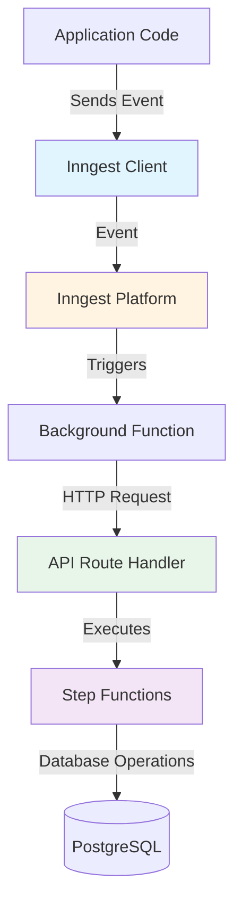
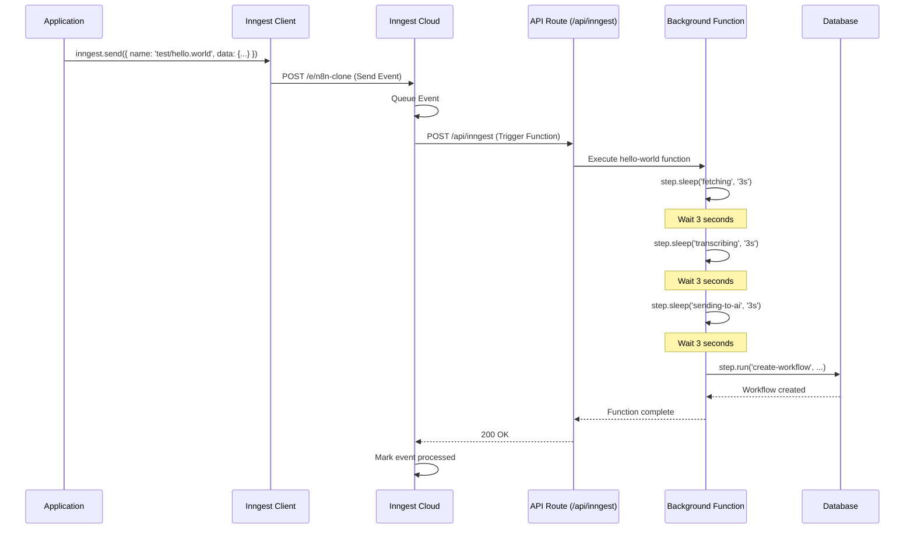
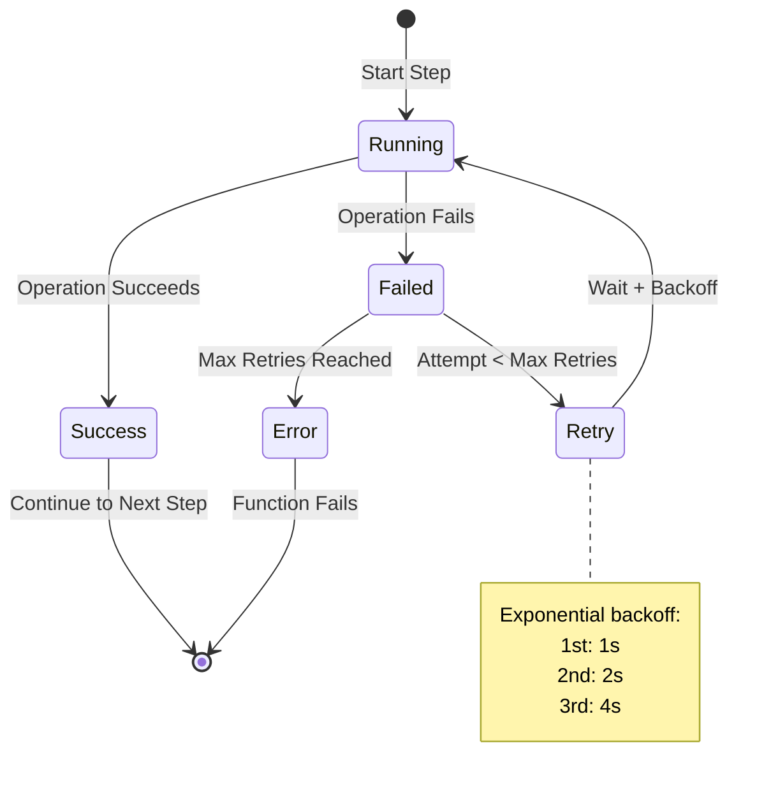

# Background Jobs with Inngest

This document provides a comprehensive guide to how background jobs work in this n8n clone using Inngest.

## Table of Contents
- [Overview](#overview)
- [What is Inngest?](#what-is-inngest)
- [Architecture](#architecture)
- [Setup and Configuration](#setup-and-configuration)
- [How It Works](#how-it-works)
- [Function Anatomy](#function-anatomy)
- [Event Flow](#event-flow)
- [Step Functions](#step-functions)
- [Development Workflow](#development-workflow)
- [Best Practices](#best-practices)

## Overview

Inngest is a developer platform for building reliable workflow and background job orchestration. In this project, Inngest handles asynchronous tasks like:

- Processing long-running workflows
- Managing multi-step operations with retries
- Handling event-driven automation
- Coordinating complex business logic with automatic retries and error handling

## What is Inngest?

Inngest provides:
- **Event-driven functions**: Functions that respond to events
- **Step functions**: Break complex jobs into retriable, observable steps
- **Automatic retries**: Built-in retry logic for failed steps
- **Durability**: Functions survive server restarts
- **Observability**: Built-in monitoring and debugging
- **Type safety**: Full TypeScript support

## Architecture

The Inngest implementation in this project consists of three main components:



### Component Breakdown

1. **Inngest Client** (`inngest/client.ts`): Singleton instance for sending and receiving events
2. **Function Definitions** (`inngest/functions.ts`): Background job logic with steps
3. **API Route Handler** (`app/api/inngest/route.ts`): Next.js API endpoint that serves Inngest functions

## Setup and Configuration

### 1. Inngest Client

**Location**: `inngest/client.ts`

```typescript
import { Inngest } from 'inngest';

// Create a client to send and receive events
export const inngest = new Inngest({ id: 'n8n-clone' });
```

The client ID (`n8n-clone`) uniquely identifies your application in the Inngest platform.

### 2. Function Definitions

**Location**: `inngest/functions.ts`

Functions are defined using the `inngest.createFunction()` method:

```typescript
import prisma from '@/lib/db';
import { inngest } from './client';

export const helloWorld = inngest.createFunction(
  { id: 'hello-world' },
  { event: 'test/hello.world' },
  async ({ event, step }) => {
    // Function implementation
  }
);
```

### 3. API Route Handler

**Location**: `app/api/inngest/route.ts`

This Next.js API route serves as the webhook endpoint for Inngest:

```typescript
import { serve } from 'inngest/next';
import { inngest } from '@/inngest/client';

// Create an API that serves functions
export const { GET, POST, PUT } = serve({
  client: inngest,
  functions: [
    /* your functions will be passed here later! */
  ],
});
```

**Note**: Functions need to be registered in the `functions` array for them to be active.

### 4. Dependencies

```json
{
  "dependencies": {
    "inngest": "^3.45.0"
  },
  "devDependencies": {
    "inngest-cli": "^1.13.4"
  }
}
```

## How It Works

### Complete Request Flow



### Step-by-Step Breakdown

1. **Event Emission**: Application code sends an event using `inngest.send()`
2. **Event Queuing**: Inngest receives and queues the event
3. **Function Matching**: Inngest matches the event to registered functions
4. **Webhook Call**: Inngest calls your API route (`/api/inngest`)
5. **Function Execution**: Your function runs with step-by-step execution
6. **Step Checkpointing**: Each step is checkpointed for reliability
7. **Completion**: Function completes and Inngest marks the event as processed

## Function Anatomy

### Example Function Structure

```typescript
export const helloWorld = inngest.createFunction(
  // 1. Function Configuration
  {
    id: 'hello-world',
    name: 'Hello World Function',
    retries: 3  // Optional: number of retry attempts
  },

  // 2. Event Trigger
  {
    event: 'test/hello.world'  // Event name to listen for
  },

  // 3. Function Handler
  async ({ event, step }) => {
    // event.data contains the payload sent with the event
    // step provides methods for creating retriable steps

    // Sleep steps (for delays)
    await step.sleep('fetching', '3s');
    await step.sleep('transcribing', '3s');
    await step.sleep('sending-to-ai', '3s');

    // Run steps (for operations)
    await step.run('create-workflow', () => {
      return prisma.workflow.create({
        data: {
          name: 'workflow-from-inngest',
        },
      });
    });
  }
);
```

### Configuration Object

| Property | Type | Description |
|----------|------|-------------|
| `id` | string | Unique identifier for the function |
| `name` | string | Human-readable name (optional) |
| `retries` | number | Number of retry attempts (optional, default: 3) |
| `concurrency` | object | Concurrency limits (optional) |

### Event Object

```typescript
{
  event: 'event/name',        // Event name pattern
  if: 'event.data.status == "active"',  // Optional condition
  match: 'event.data.userId'  // Optional deduplication key
}
```

### Handler Parameters

- **event**: Contains event data, name, timestamp, and user information
- **step**: Provides methods for creating durable, retriable steps

## Event Flow

### Sending Events

Events can be sent from anywhere in your application:

```typescript
import { inngest } from '@/inngest/client';

// In a tRPC procedure, API route, or server action
await inngest.send({
  name: 'test/hello.world',
  data: {
    workflowId: '123',
    userId: 'user_456',
    payload: { /* custom data */ }
  }
});
```

### Event Naming Convention

Use a hierarchical naming structure:

- `workflow/created`
- `workflow/executed`
- `workflow/failed`
- `user/signup`
- `test/hello.world`

### Multiple Events

You can send multiple events at once:

```typescript
await inngest.send([
  { name: 'workflow/created', data: { id: '1' } },
  { name: 'workflow/executed', data: { id: '1', result: 'success' } }
]);
```

## Step Functions

Steps are the core building blocks of Inngest functions. Each step is:

- **Durable**: Survives server restarts
- **Retriable**: Automatically retries on failure
- **Observable**: Tracked in the Inngest dashboard

### Step Types

#### 1. `step.run()` - Execute Code

```typescript
const result = await step.run('step-name', async () => {
  // Any async operation
  return await prisma.workflow.create({ data: { name: 'test' } });
});

// Use result in next steps
console.log(result.id);
```

**Use cases**: Database operations, API calls, computations

#### 2. `step.sleep()` - Add Delays

```typescript
await step.sleep('wait-for-processing', '5m');
await step.sleep('wait-1-hour', '1h');
await step.sleep('wait-30-seconds', '30s');
```

**Use cases**: Rate limiting, waiting for external processes, scheduled delays

#### 3. `step.sendEvent()` - Trigger Other Functions

```typescript
await step.sendEvent('trigger-next-workflow', {
  name: 'workflow/next-step',
  data: { workflowId: event.data.workflowId }
});
```

**Use cases**: Chaining workflows, fan-out patterns, orchestration

#### 4. `step.waitForEvent()` - Wait for External Events

```typescript
const result = await step.waitForEvent('wait-for-approval', {
  event: 'workflow/approved',
  timeout: '24h',
  match: 'data.workflowId'
});
```

**Use cases**: Human-in-the-loop, external system webhooks, conditional logic

### Step Execution Model



## Development Workflow

### 1. Local Development

Start the Inngest Dev Server alongside your Next.js app:

```bash
# Terminal 1: Start Next.js
npm run dev

# Terminal 2: Start Inngest Dev Server
npx inngest-cli@latest dev
```

The Inngest Dev Server:
- Runs at `http://localhost:8288`
- Provides a local UI for testing functions
- Shows function execution logs and step details
- Allows manual event triggering

### 2. Testing Functions Locally

#### Option A: Use the Inngest Dev UI

1. Open `http://localhost:8288`
2. Navigate to "Test" tab
3. Send a test event:
   ```json
   {
     "name": "test/hello.world",
     "data": {
       "workflowId": "test-123"
     }
   }
   ```

#### Option B: Send Events from Code

```typescript
// In a tRPC procedure or API route
import { inngest } from '@/inngest/client';

export const testRouter = createTRPCRouter({
  triggerJob: protectedProcedure.mutation(async () => {
    await inngest.send({
      name: 'test/hello.world',
      data: { test: true }
    });
    return { success: true };
  })
});
```

### 3. Registering Functions

To activate a function, add it to the API route:

```typescript
// app/api/inngest/route.ts
import { serve } from 'inngest/next';
import { inngest } from '@/inngest/client';
import { helloWorld } from '@/inngest/functions';  // Import your function

export const { GET, POST, PUT } = serve({
  client: inngest,
  functions: [
    helloWorld,  // Register your function
    // Add more functions here
  ],
});
```

### 4. Deployment

When deploying to production:

1. **Set Environment Variables**:
   ```env
   INNGEST_EVENT_KEY=your_event_key
   INNGEST_SIGNING_KEY=your_signing_key
   ```

2. **Configure Inngest Dashboard**:
   - Add your production URL: `https://yourdomain.com/api/inngest`
   - Inngest will sync and register your functions

3. **Verify Connection**:
   - Check the Inngest dashboard for sync status
   - Test with a production event

## Best Practices

### 1. Naming Conventions

**Events**: Use hierarchical, descriptive names
```typescript
// Good
'workflow/created'
'workflow/node/executed'
'user/email/sent'

// Avoid
'created'
'doStuff'
'event1'
```

**Steps**: Use descriptive, action-oriented names
```typescript
// Good
await step.run('fetch-external-api', ...)
await step.run('validate-user-input', ...)

// Avoid
await step.run('step1', ...)
await step.run('do-thing', ...)
```

### 2. Error Handling

Inngest automatically retries failed steps, but you can add custom error handling:

```typescript
await step.run('risky-operation', async () => {
  try {
    return await externalAPI.call();
  } catch (error) {
    if (error.code === 'RATE_LIMIT') {
      // Log for debugging
      console.error('Rate limited, will retry');
      throw error;  // Let Inngest retry
    }
    // Handle non-retriable errors
    return { error: 'Non-retriable error' };
  }
});
```

### 3. Data Passing Between Steps

Store step results in variables to pass data between steps:

```typescript
const workflow = await step.run('create-workflow', () => {
  return prisma.workflow.create({ data: { name: 'test' } });
});

const nodes = await step.run('create-nodes', () => {
  return prisma.node.createMany({
    data: [
      { workflowId: workflow.id, type: 'trigger' },
      { workflowId: workflow.id, type: 'action' }
    ]
  });
});

await step.run('link-nodes', () => {
  return prisma.edge.create({
    data: {
      workflowId: workflow.id,
      sourceId: nodes[0].id,
      targetId: nodes[1].id
    }
  });
});
```

### 4. Idempotency

Ensure your steps can be safely retried:

```typescript
// Good: Idempotent operation
await step.run('create-or-update-user', () => {
  return prisma.user.upsert({
    where: { email: 'user@example.com' },
    create: { email: 'user@example.com', name: 'User' },
    update: { name: 'User' }
  });
});

// Risky: Non-idempotent operation
await step.run('increment-counter', () => {
  // This could increment multiple times on retry
  return prisma.counter.update({
    where: { id: '1' },
    data: { count: { increment: 1 } }
  });
});
```

### 5. Timeout Configuration

Set appropriate timeouts for long-running operations:

```typescript
export const longRunningJob = inngest.createFunction(
  {
    id: 'long-running-job',
    timeout: '10m'  // Function-level timeout
  },
  { event: 'job/long-running' },
  async ({ step }) => {
    // Individual step timeout (not yet supported in v3)
    await step.run('external-api', async () => {
      // Use Promise.race for custom timeouts
      return await Promise.race([
        externalAPI.call(),
        new Promise((_, reject) =>
          setTimeout(() => reject(new Error('Timeout')), 30000)
        )
      ]);
    });
  }
);
```

### 6. Monitoring and Observability

Use step names strategically for debugging:

```typescript
await step.run(`fetch-user-${userId}`, () => {
  return prisma.user.findUnique({ where: { id: userId } });
});

await step.run(`send-email-${emailType}`, () => {
  return sendEmail({ type: emailType, to: user.email });
});
```

This makes it easy to identify which specific operation failed in the Inngest dashboard.

### 7. Concurrency Control

Limit concurrent executions when needed:

```typescript
export const rateLimitedJob = inngest.createFunction(
  {
    id: 'rate-limited-job',
    concurrency: {
      limit: 5,  // Max 5 concurrent executions
      key: 'event.data.userId'  // Per-user concurrency
    }
  },
  { event: 'job/rate-limited' },
  async ({ step }) => {
    // Function implementation
  }
);
```

## Current Implementation Status

### Configured Components
- Inngest client initialized with ID `n8n-clone`
- Example function `helloWorld` defined in `inngest/functions.ts`
- API route handler set up at `/api/inngest`

### To Complete Setup
1. **Register functions** in `app/api/inngest/route.ts`:
   ```typescript
   import { helloWorld } from '@/inngest/functions';

   export const { GET, POST, PUT } = serve({
     client: inngest,
     functions: [helloWorld],  // Add your functions here
   });
   ```

2. **Start Inngest Dev Server** for local development:
   ```bash
   npx inngest-cli@latest dev
   ```

3. **Send test events** to trigger functions:
   ```typescript
   await inngest.send({
     name: 'test/hello.world',
     data: { test: true }
   });
   ```

## Additional Resources

- [Inngest Documentation](https://www.inngest.com/docs)
- [Inngest TypeScript SDK](https://www.inngest.com/docs/reference/typescript)
- [Next.js Integration Guide](https://www.inngest.com/docs/sdk/serve#framework-next-js)
- [Step Functions Guide](https://www.inngest.com/docs/guides/step-functions)

## Related Documentation

- [Authentication System](./authentication-system.md) - For protecting Inngest triggers
- [Data Fetching Pattern](./data-fetching-pattern.md) - For triggering jobs from tRPC
