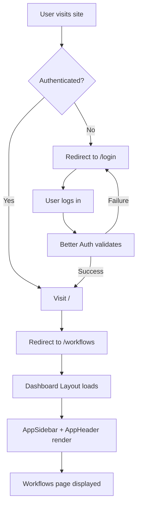
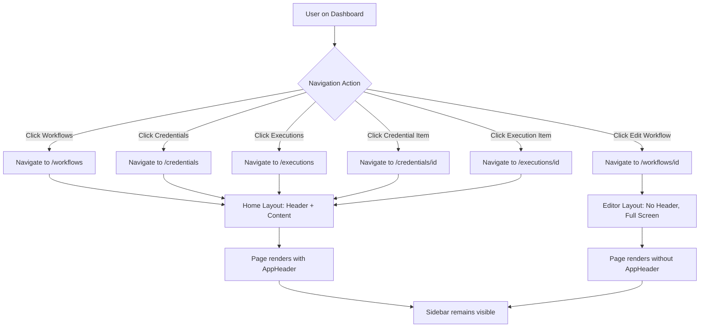
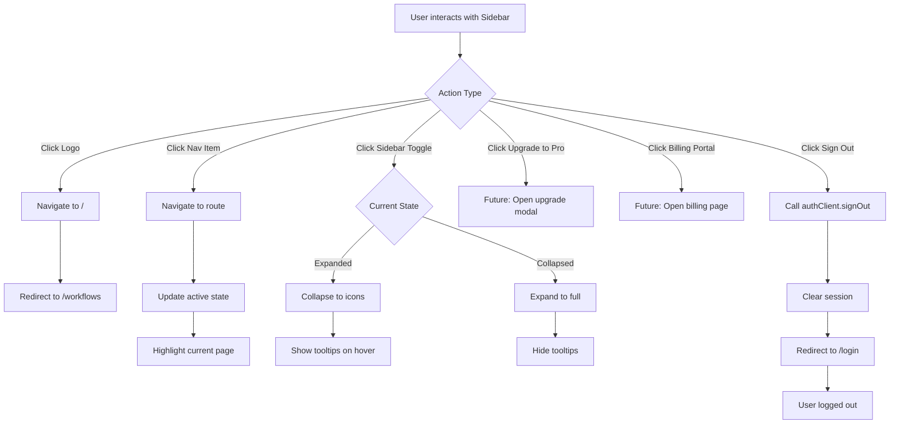
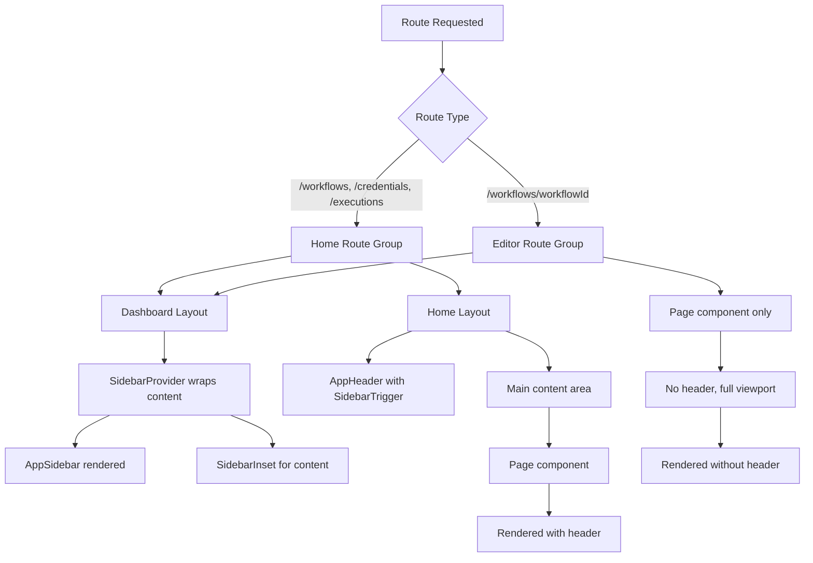
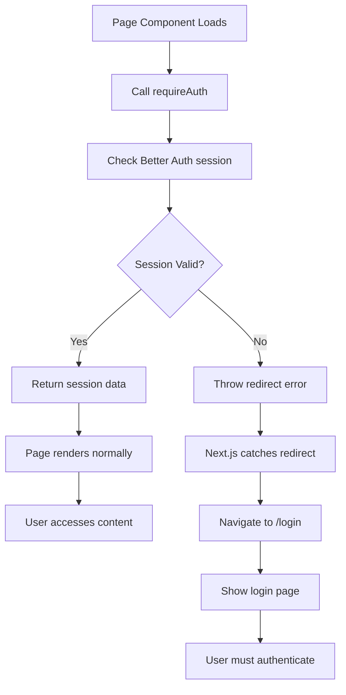
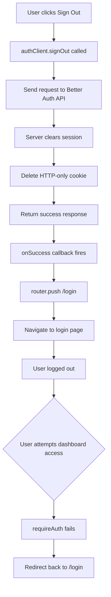

# Dashboard Layout and Navigation System

This document describes the layout architecture and navigation system for the n8n clone dashboard.

## Overview

The application uses a nested layout system powered by Next.js App Router with a collapsible sidebar navigation and responsive header. The layout is built using shadcn/ui's Sidebar components and follows modern React patterns with server and client components.

## Architecture

### Route Groups

The dashboard uses Next.js route groups to organize pages with different layout requirements:

```
app/(dashboard)/
├── layout.tsx              # Base dashboard layout with sidebar
├── (home)/                 # Pages with header
│   ├── layout.tsx         # Adds header to pages
│   ├── workflows/
│   ├── credentials/
│   └── executions/
└── (editor)/              # Pages without header (full-screen editor)
    └── workflows/[workflowId]/
```

**Key Benefits:**
- Route groups `(home)` and `(editor)` don't affect URL structure
- Allows different layouts for different page types
- Editor gets full-screen space without header
- Main pages get consistent header with sidebar toggle

## Components

### 1. Dashboard Layout (`app/(dashboard)/layout.tsx`)

**Purpose:** Provides the base layout for all authenticated dashboard pages with sidebar navigation.

**Implementation:**
```typescript
import AppSidebar from '@/components/app-sidebar';
import { SidebarInset, SidebarProvider } from '@/components/ui/sidebar';

function DashboardLayout({ children }: { children: React.ReactNode }) {
  return (
    <SidebarProvider>
      <AppSidebar />
      <SidebarInset className="bg-accent/20">{children}</SidebarInset>
    </SidebarProvider>
  );
}
```

**Features:**
- Uses `SidebarProvider` for sidebar state management
- `SidebarInset` provides the main content area with proper spacing
- Background styling with accent color
- Wraps all dashboard routes

### 2. Home Layout (`app/(dashboard)/(home)/layout.tsx`)

**Purpose:** Adds a header to main dashboard pages (workflows, credentials, executions).

**Implementation:**
```typescript
import AppHeader from '@/components/app-header';

function RestLayout({ children }: { children: React.ReactNode }) {
  return (
    <>
      <AppHeader />
      <main className="flex-1">{children}</main>
    </>
  );
}
```

**Features:**
- Nested inside dashboard layout
- Includes `AppHeader` component
- Main content area with flex-1 for full height

### 3. AppSidebar Component (`components/app-sidebar.tsx`)

**Purpose:** Main navigation sidebar with collapsible functionality.

**Type:** Client Component (`'use client'`)

**Key Features:**
- **Header Section:**
  - Logo and branding
  - Clickable link to home
  - Collapses to icon-only view

- **Navigation Menu:**
  - Workflows (`/workflows`) - File management
  - Credentials (`/credentials`) - API keys and auth
  - Executions (`/executions`) - Workflow run history
  - Active route highlighting
  - Tooltip labels in collapsed mode

- **Footer Actions:**
  - Upgrade to Pro (placeholder)
  - Billing Portal (placeholder)
  - Sign out (functional with Better Auth)

**Implementation Details:**
```typescript
import { authClient } from '@/lib/auth-client';
import { usePathname, useRouter } from 'next/navigation';

// Navigation items configuration
const menuItems = [
  {
    title: 'Main',
    items: [
      { title: 'Workflows', icon: FolderOpenIcon, url: '/workflows' },
      { title: 'Credentials', icon: KeyIcon, url: '/credentials' },
      { title: 'Executions', icon: HistoryIcon, url: '/executions' },
    ],
  },
];

// Active route detection
isActive={
  item.url === '/'
    ? pathname === '/'
    : pathname.startsWith(item.url)
}

// Sign out handler
onClick={() =>
  authClient.signOut({
    fetchOptions: {
      onSuccess: () => {
        router.push('/login');
      },
    },
  })
}
```

**Icons Used:**
- `FolderOpenIcon` - Workflows
- `KeyIcon` - Credentials
- `HistoryIcon` - Executions
- `StarIcon` - Upgrade to Pro
- `CreditCardIcon` - Billing
- `LogOutIcon` - Sign out

### 4. AppHeader Component (`components/app-header.tsx`)

**Purpose:** Simple header with sidebar toggle button.

**Type:** Server Component

**Implementation:**
```typescript
import { SidebarTrigger } from './ui/sidebar';

function AppHeader() {
  return (
    <header className="flex h-14 shrink-0 items-center gap-2 border-b px-4 bg-background">
      <SidebarTrigger />
    </header>
  );
}
```

**Features:**
- Fixed height (56px / h-14)
- Border bottom for visual separation
- Contains `SidebarTrigger` button for collapsing sidebar
- Can be extended with additional header actions (search, notifications, user menu, etc.)

## Page Structure

### Protected Pages

All dashboard pages use `requireAuth()` to ensure users are authenticated:

```typescript
import { requireAuth } from '@/lib/auth-utils';

async function WorkflowsPage() {
  await requireAuth(); // Redirects to /login if not authenticated

  return <div>Workflows</div>;
}
```

### Current Routes

1. **Workflows (`/workflows`)** - Main workflow management page
2. **Credentials (`/credentials`)** - Credential management
   - Dynamic route: `/credentials/[credentialId]` - Individual credential
3. **Executions (`/executions`)** - Workflow execution history
   - Dynamic route: `/executions/[executionId]` - Individual execution
4. **Workflow Editor (`/workflows/[workflowId]`)** - Full-screen workflow editor

## User Flow Diagrams

### 1. Initial Authentication & Entry Flow



**Flow Explanation:**
- Unauthenticated users are redirected to `/login` via `requireAuth()`
- After successful login, users are redirected to root `/`
- Root path automatically redirects to `/workflows` (default landing page)
- Dashboard layout wraps the page with sidebar navigation
- Home layout adds the header with sidebar toggle

### 2. Main Navigation Flow



**Navigation Patterns:**
- Main pages (Workflows, Credentials, Executions) use Home layout with header
- Workflow editor uses Editor layout without header for maximum space
- Sidebar persists across all dashboard pages
- Active route is highlighted in sidebar
- All routes protected by `requireAuth()`

### 3. Sidebar Interaction Flow



**Sidebar Features:**
- Toggle button in header collapses/expands sidebar
- Collapsed state shows icon-only view with tooltips
- Logo click returns to workflows page
- Sign out is fully functional with session cleanup
- Upgrade and Billing are placeholders for future features

### 4. Layout Composition Flow



**Layout Hierarchy:**
1. **Dashboard Layout** - Base wrapper for all dashboard pages
2. **Route Groups** - Determine which nested layout to use
3. **Home Layout** - Adds header for standard pages
4. **Editor Layout** - No additional wrapper, just page content
5. **Page Component** - Actual page content

### 5. Authentication Check Flow



**Protection Flow:**
- Every dashboard page calls `requireAuth()` at the start
- Better Auth validates session server-side
- Invalid/expired sessions redirect to login
- After successful login, user returns to intended page
- Session data available to page component

### 6. Sign Out Flow



**Sign Out Process:**
1. User clicks "Sign out" in sidebar footer
2. `authClient.signOut()` makes API call to Better Auth
3. Server-side session cleared from database
4. HTTP-only session cookie deleted
5. Success callback navigates to `/login`
6. Any subsequent dashboard access attempts redirect to login

## Navigation Flow

### Home Page Redirect

The root path redirects to workflows (configured in `next.config.ts`):

```typescript
async redirects() {
  return [
    {
      source: '/',
      destination: '/workflows',
      permanent: false,
    },
  ];
}
```

### User Sign Out Flow

1. User clicks "Sign out" in sidebar
2. `authClient.signOut()` called
3. Session cleared via Better Auth
4. Redirect to `/login` page
5. Better Auth middleware handles session validation

## Styling

### Sidebar
- Collapsible with `collapsible="icon"` prop
- Uses shadcn/ui `Sidebar` components for consistent behavior
- Tooltips shown in collapsed state
- Smooth transitions

### Header
- Fixed height for consistency
- Border bottom for visual hierarchy
- Background matches theme

### Content Area
- `SidebarInset` handles proper spacing
- Background with subtle accent color (`bg-accent/20`)
- Responsive to sidebar state changes

## Best Practices

### Adding New Navigation Items

1. Update `menuItems` array in `app-sidebar.tsx`:
```typescript
{
  title: 'New Item',
  icon: IconComponent,
  url: '/new-route',
}
```

2. Create corresponding page in appropriate route group:
   - With header: `app/(dashboard)/(home)/new-route/page.tsx`
   - Without header: `app/(dashboard)/(editor)/new-route/page.tsx`

3. Protect the page with `requireAuth()`

### Extending AppHeader

To add additional header elements:

```typescript
function AppHeader() {
  return (
    <header className="flex h-14 shrink-0 items-center gap-2 border-b px-4 bg-background">
      <SidebarTrigger />
      {/* Add more header items here */}
      <div className="ml-auto flex items-center gap-2">
        {/* Search, notifications, user menu, etc. */}
      </div>
    </header>
  );
}
```

### Creating Full-Screen Pages

For pages that need full viewport (like editors):

1. Place in `(editor)` route group
2. Page won't have `AppHeader`
3. Still has access to sidebar for navigation

## Related Documentation

- [Authentication System](./authentication-system.md) - Better Auth setup and protected routes
- [Styling and Theming](./styling-and-theming-system.md) - Tailwind CSS and component styling
- [shadcn/ui Sidebar Documentation](https://ui.shadcn.com/docs/components/sidebar) - Official component docs

## Future Enhancements

Potential improvements to consider:

1. **User Menu** - Add user profile dropdown in header
2. **Search** - Global search functionality in header
3. **Breadcrumbs** - Show current location in header
4. **Notifications** - Bell icon with notification panel
5. **Theme Toggle** - Dark/light mode switcher
6. **Mobile Responsiveness** - Optimize sidebar for mobile views
7. **Sidebar Persistence** - Remember collapsed state in localStorage
8. **Command Palette** - Keyboard shortcuts for navigation (Cmd+K)
