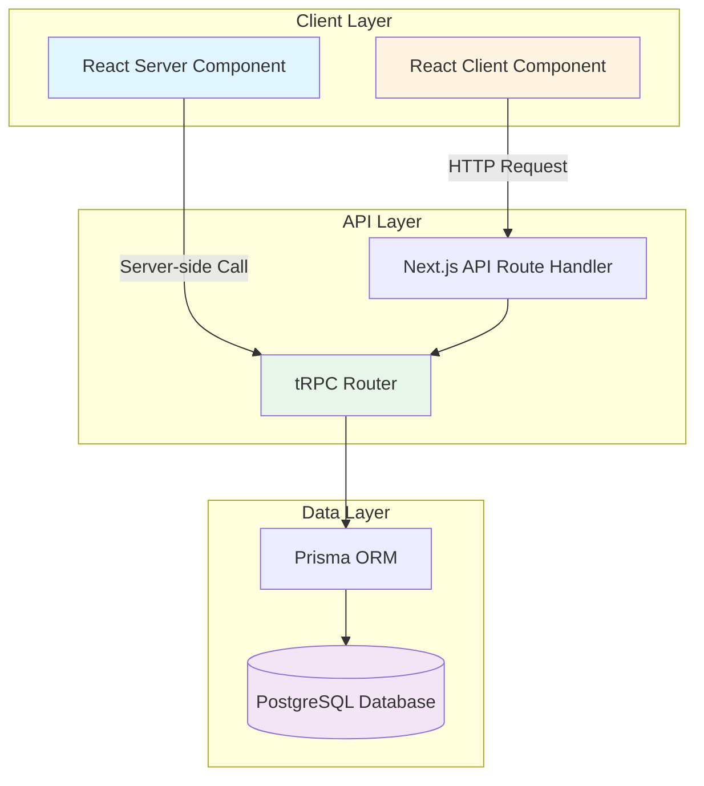
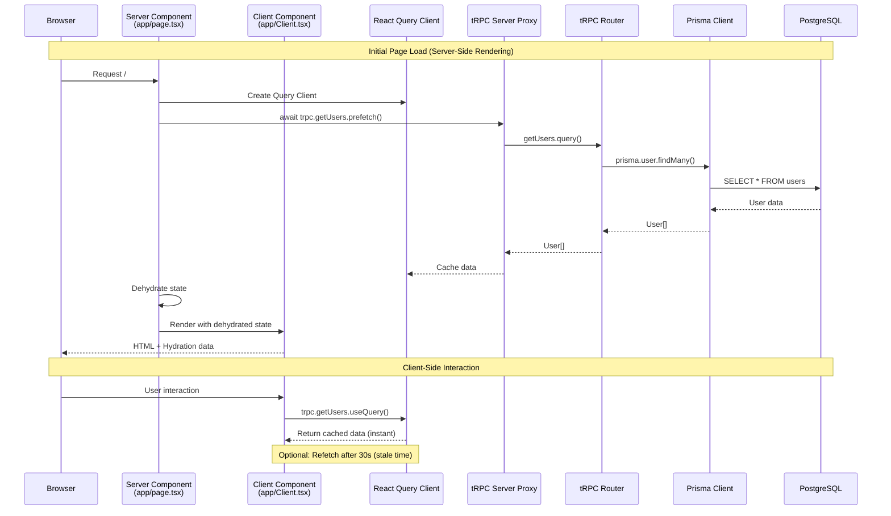
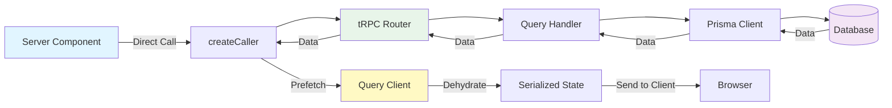
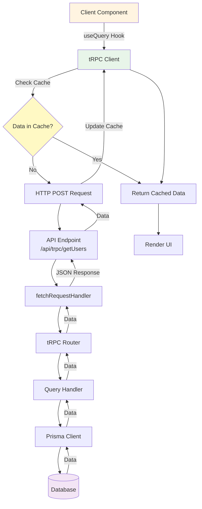
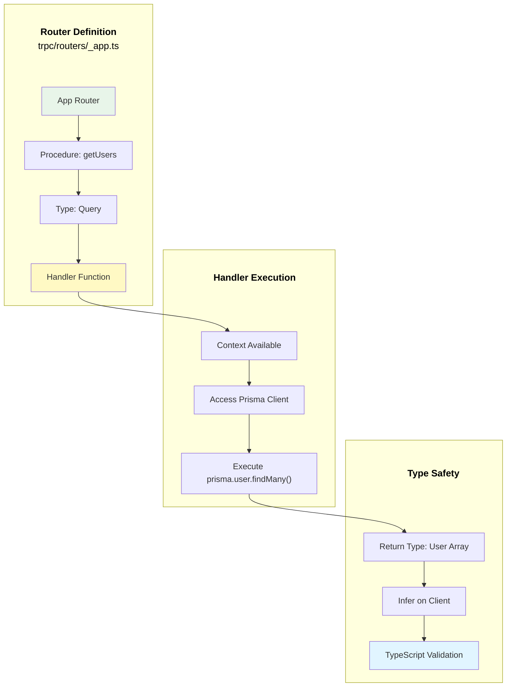
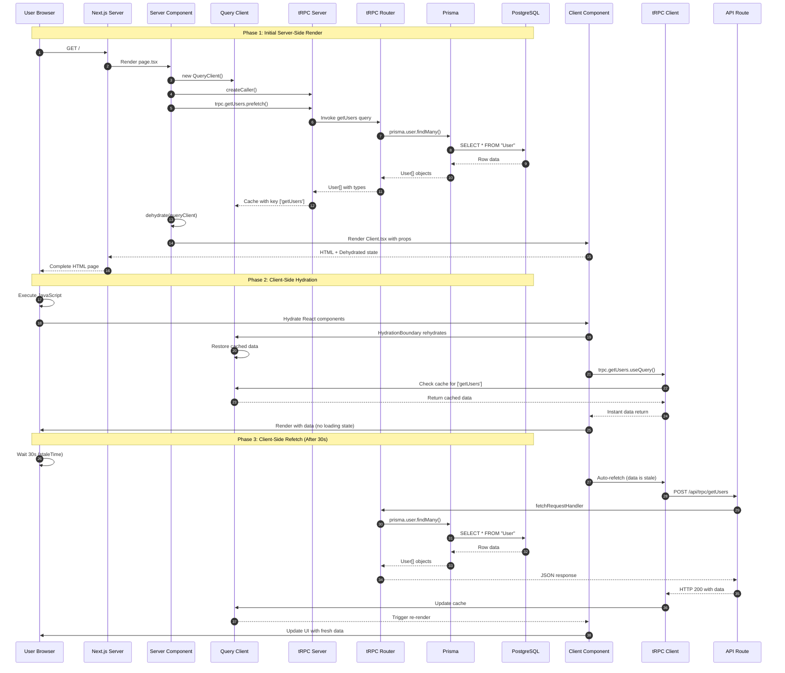
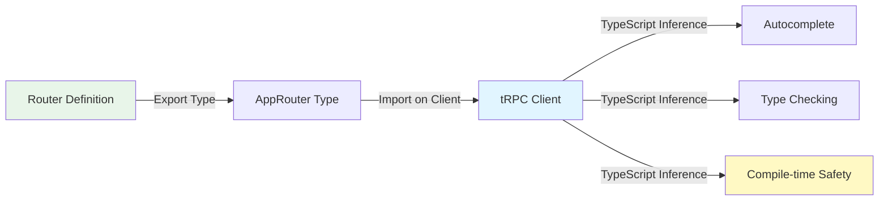
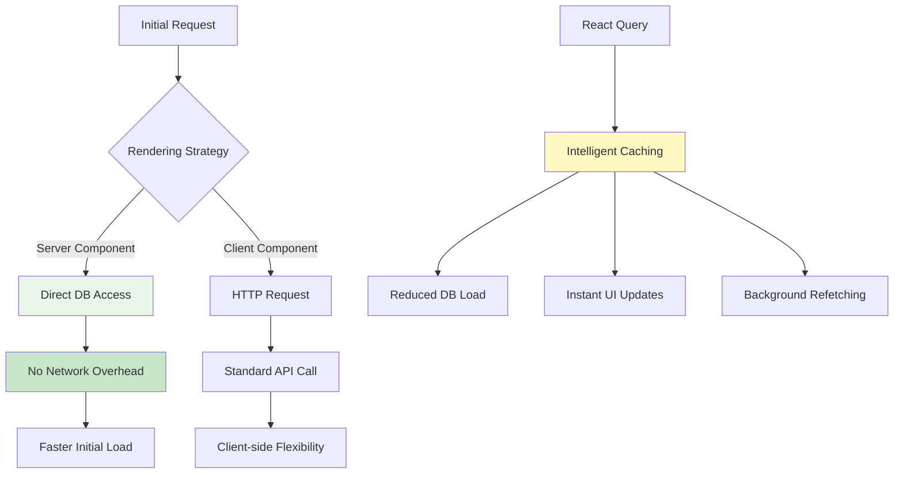
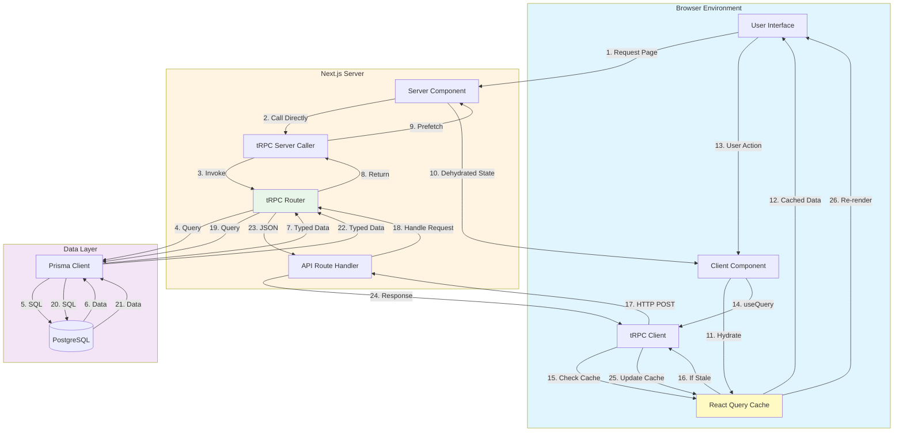
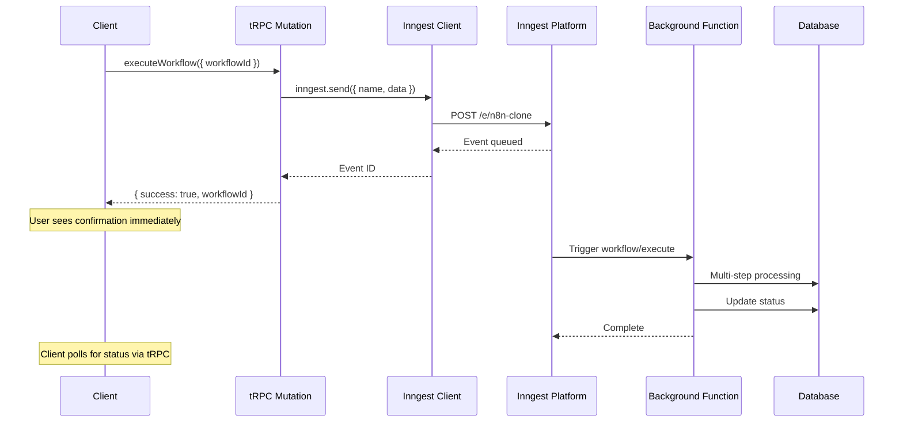

# Data Fetching Pattern

## Overview

This project uses a modern, type-safe data fetching pattern that combines **tRPC**, **TanStack React Query**, and **Next.js Server Components** to provide optimal performance and developer experience.

## Table of Contents

1. [Architecture Overview](#architecture-overview)
2. [Component Flow](#component-flow)
3. [Server-Side Flow](#server-side-flow)
4. [Client-Side Flow](#client-side-flow)
5. [tRPC Router Flow](#trpc-router-flow)
6. [Complete Request Lifecycle](#complete-request-lifecycle)
7. [Key Benefits](#key-benefits)
8. [Code Examples](#code-examples)

---

## Architecture Overview

The architecture consists of three main layers:



### Layer Responsibilities

| Layer | Technology | Purpose |
|-------|-----------|---------|
| **Client Layer** | React 19 + Next.js 15 | UI rendering, user interactions |
| **API Layer** | tRPC 11.7 | Type-safe API endpoints, request routing |
| **Data Layer** | Prisma + PostgreSQL | Data persistence and queries |

---

## Component Flow

This diagram shows how data flows between Server and Client Components:



---

## Server-Side Flow

Server Components can directly call tRPC routers without HTTP overhead:



### Server-Side Prefetch Process

1. **Query Client Creation**: A new React Query client is instantiated per request
2. **tRPC Server Caller**: `createCaller()` creates a server-side proxy
3. **Data Prefetch**: `await trpc.getUsers.prefetch()` fetches data during SSR
4. **Query Cache**: React Query caches the result
5. **State Dehydration**: `dehydrate()` serializes the cache into JSON
6. **HTML Generation**: Server renders HTML with data
7. **Hydration**: Client receives both HTML and dehydrated state

---

## Client-Side Flow

Client Components use HTTP to communicate with tRPC endpoints:



### Client-Side Query Process

1. **Hook Invocation**: Component calls `trpc.getUsers.useQuery()`
2. **Cache Check**: React Query checks if data exists and is fresh (< 30s)
3. **Return Cached**: If fresh, return immediately without network request
4. **HTTP Request**: If stale/missing, POST to `/api/trpc/getUsers`
5. **API Handler**: Next.js route handler receives request
6. **tRPC Processing**: `fetchRequestHandler` routes to correct procedure
7. **Database Query**: Prisma executes SQL query
8. **Response**: JSON data returned to client
9. **Cache Update**: React Query updates cache
10. **Re-render**: Component re-renders with new data

---

## tRPC Router Flow

The router defines procedures and their handlers:



### Router Code Structure

```typescript
// Define the router
export const appRouter = router({
  getUsers: publicProcedure    // 1. Procedure definition
    .query(async () => {       // 2. Query type (vs mutation)
      const prisma = db;       // 3. Access context/dependencies
      return await prisma.user.findMany(); // 4. Execute logic
    }),
});

// Export type for client inference
export type AppRouter = typeof appRouter;
```

---

## Complete Request Lifecycle

This diagram shows the full lifecycle of a data request from initial page load to client-side updates:



### Lifecycle Phases Explained

#### Phase 1: Server-Side Render (Steps 1-16)
- Server fetches data before sending HTML
- No loading states on initial render
- SEO-friendly with complete content
- Data is cached in Query Client
- State is serialized and embedded in HTML

#### Phase 2: Client-Side Hydration (Steps 17-25)
- Browser executes JavaScript
- React components mount
- Query Client restores cached data
- No network request needed
- Instant UI render with data

#### Phase 3: Client-Side Refetch (Steps 26-35)
- After 30 seconds, data becomes "stale"
- React Query automatically refetches
- Uses HTTP endpoint (not server-side)
- Cache updates trigger re-render
- UI stays responsive during refetch

---

## Key Benefits

### 1. Type Safety



**Benefits:**
- No manual type definitions needed
- Autocomplete for all procedures
- Compile-time error detection
- Refactoring safety

### 2. Performance Optimization



**Optimizations:**
- Server components avoid HTTP roundtrips
- React Query prevents duplicate requests
- Automatic request deduplication
- Background data synchronization
- Configurable stale times

### 3. Developer Experience

```typescript
// Backend: Define once
export const appRouter = router({
  getUsers: publicProcedure.query(async () => {
    return await prisma.user.findMany();
  }),
});

// Frontend: Fully typed automatically
const { data } = trpc.getUsers.useQuery();
//    ^? data: User[] | undefined
```

**DX Features:**
- Single source of truth for types
- No API route boilerplate
- Automatic query invalidation
- Built-in loading/error states
- DevTools integration

---

## Code Examples

### Example 1: Server Component with Prefetch

**File:** `app/page.tsx`

```typescript
import { HydrationBoundary, dehydrate } from "@tanstack/react-query";
import { createQueryClient } from "@/trpc/query-client";
import { trpc } from "@/trpc/server";
import Client from "./Client";

export default async function Home() {
  // 1. Create a query client for this request
  const queryClient = createQueryClient();

  // 2. Prefetch data on the server (await ensures data loads before render)
  await trpc.getUsers.prefetch();

  // 3. Dehydrate the query cache into serializable state
  const dehydratedState = dehydrate(queryClient);

  return (
    <main>
      {/* 4. Pass dehydrated state to client components */}
      <HydrationBoundary state={dehydratedState}>
        <Client />
      </HydrationBoundary>
    </main>
  );
}
```

**What happens:**
1. Server creates isolated query client
2. Data fetches during SSR (blocks rendering)
3. Data serialized into JSON
4. HTML sent to browser with embedded data
5. Client hydrates without refetching

---

### Example 2: Client Component with useQuery

**File:** `app/Client.tsx`

```typescript
"use client";

import { trpc } from "@/trpc/client";

export default function Client() {
  // 1. Call the tRPC hook (checks cache first)
  const { data, isLoading, error, refetch } = trpc.getUsers.useQuery();

  // 2. Handle loading state (usually skipped due to prefetch)
  if (isLoading) return <div>Loading...</div>;

  // 3. Handle errors
  if (error) return <div>Error: {error.message}</div>;

  // 4. Render data (TypeScript knows exact shape)
  return (
    <div>
      <h1>Users ({data?.length})</h1>
      <ul>
        {data?.map((user) => (
          <li key={user.id}>
            {user.name} - {user.email}
          </li>
        ))}
      </ul>

      {/* 5. Manual refetch option */}
      <button onClick={() => refetch()}>Refresh</button>
    </div>
  );
}
```

**What happens:**
1. Hook invoked on component mount
2. Checks cache for `['getUsers']` key
3. Finds prefetched data (instant return)
4. Component renders immediately
5. After 30s, auto-refetches in background

---

### Example 3: tRPC Router Definition

**File:** `trpc/routers/_app.ts`

```typescript
import { router, publicProcedure } from "../init";
import { db } from "@/lib/db";

export const appRouter = router({
  // Query procedure (GET-like, should not have side effects)
  getUsers: publicProcedure.query(async () => {
    const prisma = db;
    // Return value is automatically typed on client
    return await prisma.user.findMany({
      include: {
        posts: true,    // Include relations
        profile: true,
      },
    });
  }),

  // Mutation procedure example (POST-like, has side effects)
  createUser: publicProcedure
    .input(z.object({  // Zod schema for input validation
      email: z.string().email(),
      name: z.string().optional(),
    }))
    .mutation(async ({ input }) => {
      const prisma = db;
      return await prisma.user.create({
        data: input,
      });
    }),
});

// Export type for client-side inference
export type AppRouter = typeof appRouter;
```

---

### Example 4: tRPC Server Caller

**File:** `trpc/server.tsx`

```typescript
import "server-only";
import { createQueryClient } from "./query-client";
import { appRouter } from "./routers/_app";

// Create a server-side caller (no HTTP)
export const trpc = appRouter.createCaller({
  // Pass context (same shape as HTTP requests)
  userId: "user_123",
});

// Helper to prefetch queries
export async function prefetchQuery<T>(
  queryKey: string[],
  queryFn: () => Promise<T>
) {
  const queryClient = createQueryClient();
  await queryClient.prefetchQuery({
    queryKey,
    queryFn,
  });
  return queryClient;
}
```

---

### Example 5: React Query Configuration

**File:** `trpc/query-client.ts`

```typescript
import { QueryClient, defaultShouldDehydrateQuery } from "@tanstack/react-query";

export function createQueryClient() {
  return new QueryClient({
    defaultOptions: {
      queries: {
        // Data stays fresh for 30 seconds
        staleTime: 30 * 1000,

        // Don't refetch on window focus by default
        refetchOnWindowFocus: false,

        // Retry failed requests 3 times
        retry: 3,

        // Exponential backoff between retries
        retryDelay: (attemptIndex) => Math.min(1000 * 2 ** attemptIndex, 30000),
      },

      // Control what gets serialized for SSR
      dehydrate: {
        shouldDehydrateQuery: (query) =>
          defaultShouldDehydrateQuery(query) ||
          query.state.status === "pending",
      },
    },
  });
}
```

---

## Data Flow Diagram (System Overview)



---

## Performance Characteristics

### Initial Page Load

| Metric | Traditional CSR | This Pattern |
|--------|----------------|--------------|
| **Time to First Byte** | ~50ms | ~50ms |
| **Data Fetch** | After JS loads | During SSR |
| **Time to Interactive** | 2-3s | 1-2s |
| **First Contentful Paint** | Shows loading state | Shows data |
| **SEO Compatibility** | Poor | Excellent |

### Subsequent Navigation

| Metric | REST API | tRPC + React Query |
|--------|----------|-------------------|
| **Type Safety** | Manual | Automatic |
| **Cache Hit Rate** | 0% (no cache) | 70-90% |
| **Request Deduplication** | Manual | Automatic |
| **Stale Data Strategy** | Manual | Configurable |
| **DevTools** | Network tab only | Full query inspector |

---

## Best Practices

### 1. Prefetch Critical Data

```typescript
// ✅ Good: Prefetch on server for critical data
export default async function Page() {
  const queryClient = createQueryClient();
  await trpc.getUsers.prefetch();  // Blocks render

  return <HydrationBoundary state={dehydrate(queryClient)}>
    <UserList />
  </HydrationBoundary>;
}

// ❌ Bad: Client-only fetch shows loading state
export default function Page() {
  return <UserList />;  // Will show loading spinner
}
```

### 2. Configure Appropriate Stale Times

```typescript
// ✅ Good: Match stale time to data volatility
const { data } = trpc.getUsers.useQuery(undefined, {
  staleTime: 5 * 60 * 1000,  // User data: 5 minutes
});

const { data: stats } = trpc.getStats.useQuery(undefined, {
  staleTime: 10 * 1000,  // Stats: 10 seconds (more volatile)
});

// ❌ Bad: Same settings for all data
const { data } = trpc.getUsers.useQuery();  // Uses default 30s
```

### 3. Handle Loading and Error States

```typescript
// ✅ Good: Comprehensive state handling
const { data, isLoading, error, isError } = trpc.getUsers.useQuery();

if (isLoading) return <Skeleton />;
if (isError) return <ErrorMessage error={error} />;
if (!data) return <EmptyState />;

return <UserList users={data} />;

// ❌ Bad: Assumes data always exists
const { data } = trpc.getUsers.useQuery();
return <UserList users={data} />;  // Crashes if data is undefined
```

### 4. Use Mutations for Side Effects

```typescript
// ✅ Good: Mutation for data changes
const createUser = trpc.createUser.useMutation({
  onSuccess: () => {
    // Invalidate and refetch users list
    queryClient.invalidateQueries(['getUsers']);
  },
});

// ❌ Bad: Query for mutations (side effects)
const { refetch } = trpc.createUser.useQuery();  // Queries shouldn't have side effects
```

---

## Troubleshooting

### Issue: Data shows loading state on initial render

**Cause:** Server-side prefetch not awaited or missing

**Solution:**
```typescript
// Ensure prefetch is awaited
await trpc.getUsers.prefetch();  // Must await!
```

### Issue: Stale data not refetching

**Cause:** `staleTime` set too high or `refetchOnWindowFocus` disabled

**Solution:**
```typescript
const { data } = trpc.getUsers.useQuery(undefined, {
  staleTime: 30 * 1000,  // Lower this value
  refetchOnWindowFocus: true,  // Enable refetch on focus
});
```

### Issue: TypeScript errors on client

**Cause:** `AppRouter` type not exported or imported correctly

**Solution:**
```typescript
// In trpc/routers/_app.ts
export type AppRouter = typeof appRouter;  // Must export!

// In trpc/client.tsx
import type { AppRouter } from "./routers/_app";  // Must import!
```

---

## Integration with Background Jobs

tRPC procedures are the ideal place to trigger background jobs with Inngest. Since tRPC provides type-safe APIs with authentication middleware, you can safely trigger long-running workflows without blocking the HTTP response.

### Triggering Background Jobs from tRPC

**File:** `trpc/routers/_app.ts`

```typescript
import { router, protectedProcedure } from "../init";
import { inngest } from "@/inngest/client";
import { db } from "@/lib/db";
import { z } from "zod";

export const appRouter = router({
  // Synchronous query - returns immediately
  getWorkflow: protectedProcedure
    .input(z.object({ id: z.string() }))
    .query(async ({ input }) => {
      return await db.workflow.findUnique({
        where: { id: input.id },
      });
    }),

  // Async mutation - triggers background job
  executeWorkflow: protectedProcedure
    .input(z.object({ workflowId: z.string() }))
    .mutation(async ({ input, ctx }) => {
      // 1. Send event to Inngest (non-blocking)
      await inngest.send({
        name: 'workflow/execute',
        data: {
          workflowId: input.workflowId,
          userId: ctx.auth.user.id,
          triggeredAt: new Date().toISOString(),
        },
      });

      // 2. Return immediately (don't wait for workflow to complete)
      return {
        success: true,
        message: 'Workflow execution started',
        workflowId: input.workflowId,
      };
    }),
});
```

### Pattern: Async Job Status Polling

For long-running jobs, create a status endpoint that the client can poll:

```typescript
export const appRouter = router({
  // Start the job
  startDataProcessing: protectedProcedure
    .input(z.object({ dataId: z.string() }))
    .mutation(async ({ input, ctx }) => {
      // Create job record
      const job = await db.job.create({
        data: {
          status: 'pending',
          userId: ctx.auth.user.id,
          dataId: input.dataId,
        },
      });

      // Trigger background job
      await inngest.send({
        name: 'data/process',
        data: { jobId: job.id, dataId: input.dataId },
      });

      return { jobId: job.id, status: 'pending' };
    }),

  // Poll for status
  getJobStatus: protectedProcedure
    .input(z.object({ jobId: z.string() }))
    .query(async ({ input, ctx }) => {
      const job = await db.job.findUnique({
        where: { id: input.jobId, userId: ctx.auth.user.id },
        include: { result: true },
      });

      return {
        status: job?.status,
        progress: job?.progress,
        result: job?.result,
        error: job?.error,
      };
    }),
});
```

**Client Component:**

```typescript
"use client";

import { trpc } from "@/trpc/client";
import { useEffect } from "react";

export function DataProcessor({ dataId }: { dataId: string }) {
  const startJob = trpc.startDataProcessing.useMutation();
  const { data: jobStatus, refetch } = trpc.getJobStatus.useQuery(
    { jobId: startJob.data?.jobId ?? '' },
    { enabled: !!startJob.data?.jobId, refetchInterval: 2000 } // Poll every 2s
  );

  const handleProcess = async () => {
    await startJob.mutateAsync({ dataId });
  };

  return (
    <div>
      <button onClick={handleProcess} disabled={startJob.isPending}>
        Process Data
      </button>

      {jobStatus && (
        <div>
          Status: {jobStatus.status}
          {jobStatus.progress && <progress value={jobStatus.progress} max={100} />}
          {jobStatus.result && <div>Result: {JSON.stringify(jobStatus.result)}</div>}
        </div>
      )}
    </div>
  );
}
```

### When to Use Background Jobs vs Direct Execution

| Use tRPC Direct | Use Inngest Background Job |
|----------------|---------------------------|
| Fast queries (< 1s) | Long-running operations (> 5s) |
| Simple CRUD operations | Multi-step workflows |
| User needs immediate response | User can wait for completion |
| No external API calls | Calls to rate-limited APIs |
| Single database query | Multiple database operations |
| No retry logic needed | Automatic retries required |

### Architecture Diagram: tRPC + Inngest Integration



---

## Summary

This data fetching pattern provides:

1. **Server-Side Rendering** with prefetched data (no loading states)
2. **Type Safety** across client and server (zero manual typing)
3. **Intelligent Caching** with automatic invalidation
4. **Optimal Performance** via request deduplication and background refetching
5. **Excellent DX** with minimal boilerplate
6. **Async Job Orchestration** by integrating with Inngest for long-running tasks

The combination of tRPC, React Query, Next.js Server Components, and Inngest creates a powerful, type-safe, and performant data layer for modern applications with both synchronous and asynchronous workflows.

## Related Documentation

- [Background Jobs with Inngest](./background-jobs-inngest.md) - Complete guide to Inngest setup and patterns
- [Authentication System](./authentication-system.md) - For protecting tRPC procedures that trigger jobs
