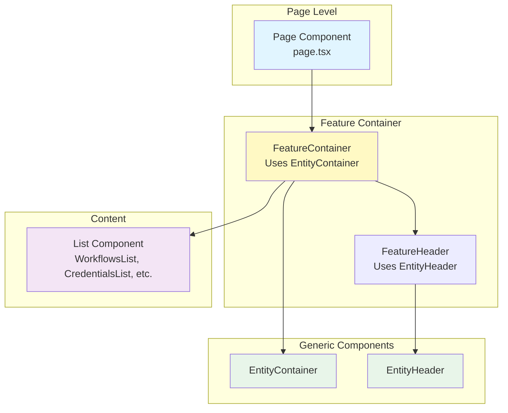

# Generic Entity Components

## Overview

This document describes the generic, reusable components used across the application for entity management pages (workflows, credentials, executions, etc.). These components provide a consistent UI pattern and reduce code duplication.

## Table of Contents

1. [Architecture](#architecture)
2. [EntityHeader Component](#entityheader-component)
3. [EntityContainer Component](#entitycontainer-component)
4. [Usage Patterns](#usage-patterns)
5. [Implementation Guide](#implementation-guide)
6. [Best Practices](#best-practices)

---

## Architecture

### Component Hierarchy



### File Locations

| Component | Location | Type |
|-----------|----------|------|
| EntityHeader | `components/entity-components.tsx` | Generic reusable component |
| EntityContainer | `components/entity-components.tsx` | Generic reusable component |
| Feature-specific containers | `app/features/[feature]/components/` | Feature implementation |
| Feature-specific headers | `app/features/[feature]/components/` | Feature implementation |

---

## EntityHeader Component

### Purpose

`EntityHeader` provides a consistent header layout for entity management pages with:
- Page title and optional description
- Optional "New" button with flexible handling (callback or navigation)
- Type-safe button configuration using discriminated union types
- Responsive design for mobile and desktop

### Component Definition

**File:** `components/entity-components.tsx`

```typescript
import { PlusIcon } from 'lucide-react';
import { Button } from './ui/button';
import Link from 'next/link';

type EntityHeaderProps = {
  title: string;
  description?: string;
  newButtonLabel?: string;
  disabled?: boolean;
  isCreating?: boolean;
} & (
  | { onNew: () => void; newButtonHref?: never }
  | { newButtonHref: string; onNew?: never }
  | { onNew?: never; newButtonHref?: never }
);

export function EntityHeader({
  title,
  description,
  onNew,
  newButtonHref,
  newButtonLabel,
  disabled,
  isCreating,
}: EntityHeaderProps) {
  return (
    <div className="flex flex-row items-center justify-between gap-x-4">
      <div className="flex flex-col">
        <h1 className="text-lg md:text-xl font-semibold">{title}</h1>
        {description && (
          <p className="text-xs md:text-sm text-muted-foreground">
            {description}
          </p>
        )}
      </div>
      {onNew && !newButtonHref && (
        <Button disabled={isCreating || disabled} size="sm" onClick={onNew}>
          <PlusIcon className="size-4" />
          {newButtonLabel}
        </Button>
      )}
      {newButtonHref && !onNew && (
        <Button asChild size="sm">
          <Link href={newButtonHref} prefetch>
            <PlusIcon className="size-4" />
            {newButtonLabel}
          </Link>
        </Button>
      )}
    </div>
  );
}
```

### Props

| Prop | Type | Required | Description |
|------|------|----------|-------------|
| `title` | `string` | Yes | Page title displayed in header |
| `description` | `string` | No | Optional description text below title |
| `newButtonLabel` | `string` | No | Label for the "New" button (e.g., "New Workflow") |
| `disabled` | `boolean` | No | Disables the button when true |
| `isCreating` | `boolean` | No | Shows loading state during creation |
| `onNew` | `() => void` | No | Callback function when button is clicked |
| `newButtonHref` | `string` | No | Navigation URL for the button |

### Type Safety

The component uses a discriminated union type to ensure type-safe button configuration:

- **With callback**: Provide `onNew` and omit `newButtonHref`
- **With navigation**: Provide `newButtonHref` and omit `onNew`
- **No button**: Omit both `onNew` and `newButtonHref`

This prevents configuration errors like providing both `onNew` and `newButtonHref` simultaneously.

### Visual Layout

```
┌──────────────────────────────────────────────────────┐
│  Title                              [+ Button Label] │
│  Description (optional)                              │
└──────────────────────────────────────────────────────┘
```

---

## EntityContainer Component

### Purpose

`EntityContainer` provides a consistent layout wrapper for entity management pages with:
- Responsive padding and spacing
- Optional header section
- Optional search section
- Main content area
- Optional pagination section

### Component Definition

**File:** `components/entity-components.tsx`

```typescript
type EntityContainerProps = {
  children: React.ReactNode;
  header?: React.ReactNode;
  search?: React.ReactNode;
  pagination?: React.ReactNode;
};

export function EntityContainer({
  children,
  header,
  search,
  pagination,
}: EntityContainerProps) {
  return (
    <div className="p-4 md:px-10 md:py-6 h-full">
      <div className="mx-auto max-x-screen-xl w-full flex flex-col gap-y-8 h-full">
        {header}

        <div className="flex flex-col gap-y-4 h-full">
          {search}
          {children}
        </div>
        {pagination}
      </div>
    </div>
  );
}
```

### Props

| Prop | Type | Required | Description |
|------|------|----------|-------------|
| `children` | `React.ReactNode` | Yes | Main content (list, table, etc.) |
| `header` | `React.ReactNode` | No | Header section (typically EntityHeader) |
| `search` | `React.ReactNode` | No | Search/filter section |
| `pagination` | `React.ReactNode` | No | Pagination controls |

### Visual Layout

```
┌─────────────────────────────────────────────────────┐
│  Padding: p-4 (mobile) / px-10 py-6 (desktop)       │
│  ┌───────────────────────────────────────────────┐  │
│  │  Header Section (optional)                    │  │
│  │                                               │  │
│  │  Search Section (optional)                    │  │
│  │                                               │  │
│  │  Main Content (children)                      │  │
│  │                                               │  │
│  │  Pagination Section (optional)                │  │
│  └───────────────────────────────────────────────┘  │
└─────────────────────────────────────────────────────┘
```

---

## Usage Patterns

### Pattern 1: With Callback Button (Most Common)

Use this pattern when creating new entities requires a mutation:

```typescript
// app/features/workflows/components/workflows.tsx
'use client';

import { EntityHeader, EntityContainer } from '@/components/entity-components';
import { api } from '@/trpc/client';

export function WorkflowsHeader({ disabled }: { disabled?: boolean }) {
  const createWorkflow = api.workflows.create.useMutation();

  return (
    <EntityHeader
      title="Workflows"
      description="Manage your workflow automations"
      newButtonLabel="New Workflow"
      onNew={() => createWorkflow.mutate()}
      disabled={disabled}
      isCreating={createWorkflow.isPending}
    />
  );
}

export function WorkflowsContainer({ children }: { children: React.ReactNode }) {
  return (
    <EntityContainer header={<WorkflowsHeader />}>
      {children}
    </EntityContainer>
  );
}
```

### Pattern 2: With Navigation Button

Use this pattern when the "New" button should navigate to a form page:

```typescript
// app/features/credentials/components/credentials.tsx
'use client';

import { EntityHeader, EntityContainer } from '@/components/entity-components';

export function CredentialsHeader() {
  return (
    <EntityHeader
      title="Credentials"
      description="Manage your API keys and authentication credentials"
      newButtonLabel="New Credential"
      newButtonHref="/credentials/new"
    />
  );
}

export function CredentialsContainer({ children }: { children: React.ReactNode }) {
  return (
    <EntityContainer header={<CredentialsHeader />}>
      {children}
    </EntityContainer>
  );
}
```

### Pattern 3: Without Button

Use this pattern for read-only pages:

```typescript
// app/features/executions/components/executions.tsx
'use client';

import { EntityHeader, EntityContainer } from '@/components/entity-components';

export function ExecutionsHeader() {
  return (
    <EntityHeader
      title="Executions"
      description="View workflow execution history and results"
      // No button - read-only page
    />
  );
}

export function ExecutionsContainer({ children }: { children: React.ReactNode }) {
  return (
    <EntityContainer header={<ExecutionsHeader />}>
      {children}
    </EntityContainer>
  );
}
```

### Pattern 4: With Search and Pagination

```typescript
// app/features/workflows/components/workflows.tsx
'use client';

import { EntityHeader, EntityContainer } from '@/components/entity-components';
import { SearchInput } from '@/components/search-input';
import { Pagination } from '@/components/pagination';

export function WorkflowsContainer({ children }: { children: React.ReactNode }) {
  return (
    <EntityContainer
      header={<WorkflowsHeader />}
      search={<SearchInput placeholder="Search workflows..." />}
      pagination={<Pagination totalPages={10} currentPage={1} />}
    >
      {children}
    </EntityContainer>
  );
}
```

---

## Implementation Guide

### Step 1: Create Feature-Specific Components

For each new entity feature (e.g., credentials, executions), create wrapper components:

```typescript
// app/features/[feature]/components/[feature].tsx
'use client';

import { EntityHeader, EntityContainer } from '@/components/entity-components';
import { api } from '@/trpc/client';

// Header component
export function [Feature]Header({ disabled }: { disabled?: boolean }) {
  const create[Feature] = api.[feature].create.useMutation();

  return (
    <EntityHeader
      title="[Features]"
      description="[Feature description]"
      newButtonLabel="New [Feature]"
      onNew={() => create[Feature].mutate()}
      disabled={disabled}
      isCreating={create[Feature].isPending}
    />
  );
}

// Container component
export function [Feature]Container({ children }: { children: React.ReactNode }) {
  return (
    <EntityContainer header={<[Feature]Header />}>
      {children}
    </EntityContainer>
  );
}

// List component
export function [Feature]List() {
  const { data } = useSuspense[Features]();

  return (
    // Render list...
  );
}
```

### Step 2: Use in Page Component

```typescript
// app/(dashboard)/(home)/[feature]/page.tsx
import { requireAuth } from '@/lib/auth-utils';
import { HydrateClient } from '@/trpc/server';
import { ErrorBoundary } from 'react-error-boundary';
import { Suspense } from 'react';
import {
  [Feature]List,
  [Feature]Container,
} from '@/app/features/[feature]/components/[feature]';
import { prefetch[Features] } from '@/app/features/[feature]/server/prefetch';

export default async function [Feature]Page() {
  await requireAuth();
  await prefetch[Features]();

  return (
    <[Feature]Container>
      <HydrateClient>
        <ErrorBoundary fallback={<p>Error loading [feature]</p>}>
          <Suspense fallback={<p>Loading [feature]...</p>}>
            <[Feature]List />
          </Suspense>
        </ErrorBoundary>
      </HydrateClient>
    </[Feature]Container>
  );
}
```

### Step 3: Customize as Needed

The generic components provide a solid foundation, but you can customize them by:

1. **Adding extra props** to your feature-specific components
2. **Extending the layout** with additional sections
3. **Overriding styles** using Tailwind classes
4. **Adding conditional rendering** based on feature requirements

---

## Best Practices

### 1. Always Use Generic Components for Entity Pages

```typescript
// ✅ Good: Uses EntityHeader and EntityContainer
export function WorkflowsContainer({ children }) {
  return (
    <EntityContainer header={<WorkflowsHeader />}>
      {children}
    </EntityContainer>
  );
}

// ❌ Bad: Duplicates layout code
export function WorkflowsContainer({ children }) {
  return (
    <div className="p-4 md:px-10 md:py-6 h-full">
      <div className="flex justify-between">
        <h1>Workflows</h1>
        <button>New Workflow</button>
      </div>
      {children}
    </div>
  );
}
```

### 2. Use Type-Safe Button Configuration

```typescript
// ✅ Good: Uses onNew callback for mutations
<EntityHeader
  title="Workflows"
  onNew={() => createWorkflow.mutate()}
  isCreating={createWorkflow.isPending}
/>

// ✅ Good: Uses newButtonHref for navigation
<EntityHeader
  title="Credentials"
  newButtonHref="/credentials/new"
/>

// ❌ Bad: TypeScript error - can't use both
<EntityHeader
  title="Workflows"
  onNew={() => {}}
  newButtonHref="/workflows/new"  // Type error!
/>
```

### 3. Keep Feature Components Thin

```typescript
// ✅ Good: Feature components are simple wrappers
export function WorkflowsHeader() {
  const createWorkflow = api.workflows.create.useMutation();

  return (
    <EntityHeader
      title="Workflows"
      description="Manage your workflow automations"
      newButtonLabel="New Workflow"
      onNew={() => createWorkflow.mutate()}
      isCreating={createWorkflow.isPending}
    />
  );
}

// ❌ Bad: Feature component reimplements layout logic
export function WorkflowsHeader() {
  return (
    <div className="flex justify-between">
      <div>
        <h1>Workflows</h1>
        <p>Manage your workflow automations</p>
      </div>
      <Button>New Workflow</Button>
    </div>
  );
}
```

### 4. Maintain Consistent Component Naming

Follow this naming pattern for all entity features:

- `[Feature]Header` - Header component using EntityHeader
- `[Feature]Container` - Container component using EntityContainer
- `[Feature]List` - List/table component displaying data

Examples:
- `WorkflowsHeader`, `WorkflowsContainer`, `WorkflowsList`
- `CredentialsHeader`, `CredentialsContainer`, `CredentialsList`
- `ExecutionsHeader`, `ExecutionsContainer`, `ExecutionsList`

### 5. Handle Loading and Error States Consistently

```typescript
// ✅ Good: Consistent error and loading handling
<[Feature]Container>
  <HydrateClient>
    <ErrorBoundary fallback={<ErrorMessage />}>
      <Suspense fallback={<LoadingSpinner />}>
        <[Feature]List />
      </Suspense>
    </ErrorBoundary>
  </HydrateClient>
</[Feature]Container>

// ❌ Bad: Inconsistent patterns across features
<[Feature]Container>
  {isLoading ? <LoadingSpinner /> : <[Feature]List />}
</[Feature]Container>
```

---

## Component Composition Benefits

### 1. Consistency

All entity management pages share the same layout, spacing, and visual hierarchy.

### 2. Maintainability

Changes to the layout only need to be made in one place (`entity-components.tsx`).

### 3. Type Safety

TypeScript discriminated unions prevent configuration errors at compile time.

### 4. Reusability

New entity features can be built quickly by following established patterns.

### 5. Testability

Generic components can be tested once and reused across all features.

---

## Related Documentation

- [Workflows Feature](./workflows-feature.md) - Complete implementation example
- [Data Fetching Pattern](./data-fetching-pattern.md) - tRPC + React Query guide
- [Dashboard Layout and Navigation](./dashboard-layout-navigation.md) - Overall layout system
- [CLAUDE.md](../CLAUDE.md) - Project overview and conventions
