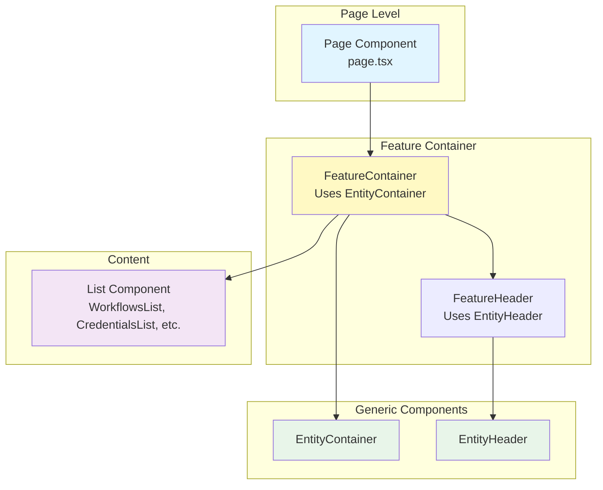

# Generic Entity Components

## Overview

This document describes the generic, reusable components used across the application for entity management pages (workflows, credentials, executions, etc.). These components provide a consistent UI pattern and reduce code duplication.

## Table of Contents

1. [Architecture](#architecture)
2. [EntityHeader Component](#entityheader-component)
3. [EntityContainer Component](#entitycontainer-component)
4. [EntitySearch Component](#entitysearch-component)
5. [EntityPagination Component](#entitypagination-component)
6. [Usage Patterns](#usage-patterns)
7. [Implementation Guide](#implementation-guide)
8. [Best Practices](#best-practices)

---

## Architecture

### Component Hierarchy



### File Locations

| Component | Location | Type |
|-----------|----------|------|
| EntityHeader | `components/entity-components.tsx` | Generic reusable component |
| EntityContainer | `components/entity-components.tsx` | Generic reusable component |
| EntitySearch | `components/entity-components.tsx` | Generic reusable component |
| EntityPagination | `components/entity-components.tsx` | Generic reusable component |
| Feature-specific containers | `app/features/[feature]/components/` | Feature implementation |
| Feature-specific headers | `app/features/[feature]/components/` | Feature implementation |
| Feature-specific search | `app/features/[feature]/components/` | Feature implementation |
| Feature-specific pagination | `app/features/[feature]/components/` | Feature implementation |

---

## EntityHeader Component

### Purpose

`EntityHeader` provides a consistent header layout for entity management pages with:
- Page title and optional description
- Optional "New" button with flexible handling (callback or navigation)
- Type-safe button configuration using discriminated union types
- Responsive design for mobile and desktop

### Component Definition

**File:** `components/entity-components.tsx`

```typescript
import { PlusIcon } from 'lucide-react';
import { Button } from './ui/button';
import Link from 'next/link';

type EntityHeaderProps = {
  title: string;
  description?: string;
  newButtonLabel?: string;
  disabled?: boolean;
  isCreating?: boolean;
} & (
  | { onNew: () => void; newButtonHref?: never }
  | { newButtonHref: string; onNew?: never }
  | { onNew?: never; newButtonHref?: never }
);

export function EntityHeader({
  title,
  description,
  onNew,
  newButtonHref,
  newButtonLabel,
  disabled,
  isCreating,
}: EntityHeaderProps) {
  return (
    <div className="flex flex-row items-center justify-between gap-x-4">
      <div className="flex flex-col">
        <h1 className="text-lg md:text-xl font-semibold">{title}</h1>
        {description && (
          <p className="text-xs md:text-sm text-muted-foreground">
            {description}
          </p>
        )}
      </div>
      {onNew && !newButtonHref && (
        <Button disabled={isCreating || disabled} size="sm" onClick={onNew}>
          <PlusIcon className="size-4" />
          {newButtonLabel}
        </Button>
      )}
      {newButtonHref && !onNew && (
        <Button asChild size="sm">
          <Link href={newButtonHref} prefetch>
            <PlusIcon className="size-4" />
            {newButtonLabel}
          </Link>
        </Button>
      )}
    </div>
  );
}
```

### Props

| Prop | Type | Required | Description |
|------|------|----------|-------------|
| `title` | `string` | Yes | Page title displayed in header |
| `description` | `string` | No | Optional description text below title |
| `newButtonLabel` | `string` | No | Label for the "New" button (e.g., "New Workflow") |
| `disabled` | `boolean` | No | Disables the button when true |
| `isCreating` | `boolean` | No | Shows loading state during creation |
| `onNew` | `() => void` | No | Callback function when button is clicked |
| `newButtonHref` | `string` | No | Navigation URL for the button |

### Type Safety

The component uses a discriminated union type to ensure type-safe button configuration:

- **With callback**: Provide `onNew` and omit `newButtonHref`
- **With navigation**: Provide `newButtonHref` and omit `onNew`
- **No button**: Omit both `onNew` and `newButtonHref`

This prevents configuration errors like providing both `onNew` and `newButtonHref` simultaneously.

### Visual Layout

```
┌──────────────────────────────────────────────────────┐
│  Title                              [+ Button Label] │
│  Description (optional)                              │
└──────────────────────────────────────────────────────┘
```

---

## EntityContainer Component

### Purpose

`EntityContainer` provides a consistent layout wrapper for entity management pages with:
- Responsive padding and spacing
- Optional header section
- Optional search section
- Main content area
- Optional pagination section

### Component Definition

**File:** `components/entity-components.tsx`

```typescript
type EntityContainerProps = {
  children: React.ReactNode;
  header?: React.ReactNode;
  search?: React.ReactNode;
  pagination?: React.ReactNode;
};

export function EntityContainer({
  children,
  header,
  search,
  pagination,
}: EntityContainerProps) {
  return (
    <div className="p-4 md:px-10 md:py-6 h-full">
      <div className="mx-auto max-x-screen-xl w-full flex flex-col gap-y-8 h-full">
        {header}

        <div className="flex flex-col gap-y-4 h-full">
          {search}
          {children}
        </div>
        {pagination}
      </div>
    </div>
  );
}
```

### Props

| Prop | Type | Required | Description |
|------|------|----------|-------------|
| `children` | `React.ReactNode` | Yes | Main content (list, table, etc.) |
| `header` | `React.ReactNode` | No | Header section (typically EntityHeader) |
| `search` | `React.ReactNode` | No | Search/filter section |
| `pagination` | `React.ReactNode` | No | Pagination controls |

### Visual Layout

```
┌─────────────────────────────────────────────────────┐
│  Padding: p-4 (mobile) / px-10 py-6 (desktop)       │
│  ┌───────────────────────────────────────────────┐  │
│  │  Header Section (optional)                    │  │
│  │                                               │  │
│  │  Search Section (optional)                    │  │
│  │                                               │  │
│  │  Main Content (children)                      │  │
│  │                                               │  │
│  │  Pagination Section (optional)                │  │
│  └───────────────────────────────────────────────┘  │
└─────────────────────────────────────────────────────┘
```

---

## EntitySearch Component

### Purpose

`EntitySearch` provides a consistent search input component for entity management pages with:
- Search icon and placeholder text
- Integrated debouncing via `useEntitySearch` hook
- Customizable debounce delay
- Accessible with proper ARIA labels

### Component Definition

**File:** `components/entity-components.tsx`

```typescript
import { SearchIcon } from 'lucide-react';
import { Input } from './ui/input';

interface EntitySearchProps {
  value: string;
  onChange: (value: string) => void;
  placeholder?: string;
}

export function EntitySearch({
  value,
  onChange,
  placeholder = 'Search',
}: EntitySearchProps) {
  return (
    <div className="relative ml-auto">
      <SearchIcon className="size-3.5 absolute left-3 top-1/2 -translate-y-1/2 text-muted-foreground" />
      <Input
        className="max-w-[200px] bg-background shadow-none border-border pl-8"
        placeholder={placeholder}
        value={value}
        onChange={(e) => onChange(e.target.value)}
      />
    </div>
  );
}
```

### Props

| Prop | Type | Required | Default | Description |
|------|------|----------|---------|-------------|
| `value` | `string` | Yes | - | Current search value |
| `onChange` | `(value: string) => void` | Yes | - | Callback when value changes |
| `placeholder` | `string` | No | `"Search"` | Placeholder text for input |

### useEntitySearch Hook

**File:** `hooks/use-entity-search.tsx`

This hook provides debounced search functionality with local state management:

```typescript
import { PAGINATION } from '@/config/constants';
import { useEffect, useState } from 'react';

interface UseEntitySearchProps<T extends { search: string; page: number }> {
  params: T;
  setParams: (params: T) => void;
  debounceMs?: number;
}

export function useEntitySearch<T extends { search: string; page: number }>({
  params,
  setParams,
  debounceMs = 500,
}: UseEntitySearchProps<T>) {
  const [localSearch, setLocalSearch] = useState(params.search);

  useEffect(() => {
    if (localSearch === '' && params.search !== '') {
      setParams({
        ...params,
        search: '',
        page: PAGINATION.DEFAULT_PAGE,
      });
      return;
    }

    const timer = setTimeout(() => {
      if (localSearch !== params.search) {
        setParams({
          ...params,
          search: localSearch,
          page: PAGINATION.DEFAULT_PAGE,
        });
      }
    }, debounceMs);

    return () => clearTimeout(timer);
  }, [localSearch, params, setParams, debounceMs]);

  useEffect(() => {
    setLocalSearch(params.search);
  }, [params.search]);

  return {
    searchValue: localSearch,
    onSearchChange: setLocalSearch,
  };
}
```

**Key Features:**
- Maintains local state for immediate UI updates
- Debounces updates to URL params (500ms default)
- Automatically resets page to 1 when search changes
- Syncs with URL params when they change externally

### Visual Layout

```
┌─────────────────────────────────────────────┐
│ 🔍 Search...                                │
└─────────────────────────────────────────────┘
```

---

## EntityPagination Component

### Purpose

`EntityPagination` provides consistent pagination controls for entity management pages with:
- Previous/Next buttons
- Current page and total pages display
- Automatic button disabling at boundaries
- Accessible button states

### Component Definition

**File:** `components/entity-components.tsx`

```typescript
import { Button } from './ui/button';

interface EntityPaginationProps {
  page: number;
  totalPages: number;
  onPageChange: (page: number) => void;
  disabled: boolean;
}

export function EntityPagination({
  page,
  totalPages,
  onPageChange,
  disabled,
}: EntityPaginationProps) {
  return (
    <div className="flex items-center justify-between gap-x-2 w-full">
      <div className="flex-1 text-sm text-muted-foreground">
        Page {page} of {totalPages || 1}
      </div>
      <div className="flex items-center justify-end space-x-2 py-4">
        <Button
          disabled={page === 1 || disabled}
          variant="outline"
          size="sm"
          onClick={() => onPageChange(Math.max(1, page - 1))}
        >
          Previous
        </Button>
        <Button
          disabled={page === totalPages || totalPages === 0 || disabled}
          variant="outline"
          size="sm"
          onClick={() => onPageChange(Math.min(totalPages, page + 1))}
        >
          Next
        </Button>
      </div>
    </div>
  );
}
```

### Props

| Prop | Type | Required | Description |
|------|------|----------|-------------|
| `page` | `number` | Yes | Current page number (1-based) |
| `totalPages` | `number` | Yes | Total number of pages |
| `onPageChange` | `(page: number) => void` | Yes | Callback to update page params |
| `disabled` | `boolean` | Yes | Disables buttons during data fetching |

### Visual Layout

```
┌─────────────────────────────────────────────────────┐
│  Page 1 of 10           [Previous] [Next]           │
└─────────────────────────────────────────────────────┘
```

---

## EntityList Component

### Purpose

`EntityList` provides a generic list component for rendering collections of entity items with:
- Custom rendering function for each item
- Support for custom key extraction
- Empty state handling
- Flexible styling

### Component Definition

**File:** `components/entity-components.tsx`

```typescript
import { cn } from '@/lib/utils';

interface EntityListProps<T> {
  items: T[];
  renderItem: (item: T, index: number) => React.ReactNode;
  getKey?: (item: T, index: number) => string | number;
  emptyView?: React.ReactNode;
  className?: string;
}

export function EntityList<T>({
  items,
  renderItem,
  getKey,
  emptyView,
  className,
}: EntityListProps<T>) {
  if (items.length === 0 && emptyView) {
    return (
      <div className="flex flex-1 justify-center items-center">
        <div className="max-w-sm mx-auto">{emptyView}</div>
      </div>
    );
  }

  return (
    <div className={cn('flex flex-col gap-y-4', className)}>
      {items.map((item, index) => (
        <div key={getKey ? getKey(item, index) : index}>
          {renderItem(item, index)}
        </div>
      ))}
    </div>
  );
}
```

### Props

| Prop | Type | Required | Description |
|------|------|----------|-------------|
| `items` | `T[]` | Yes | Array of items to render |
| `renderItem` | `(item: T, index: number) => React.ReactNode` | Yes | Function to render each item |
| `getKey` | `(item: T, index: number) => string \| number` | No | Custom key extraction (defaults to index) |
| `emptyView` | `React.ReactNode` | No | Component to show when items are empty |
| `className` | `string` | No | Additional CSS classes for the list container |

---

## EntityItem Component

### Purpose

`EntityItem` provides a reusable card component for entity list items with:
- Clickable card that navigates to detail page
- Image/icon, title, and subtitle display
- Custom actions
- Delete functionality with loading state
- Hover effects

### Component Definition

**File:** `components/entity-components.tsx`

```typescript
import Link from 'next/link';
import { Card, CardContent, CardDescription, CardTitle } from './ui/card';
import { Button } from './ui/button';
import { DropdownMenu, DropdownMenuContent, DropdownMenuItem, DropdownMenuTrigger } from './ui/dropdown-menu';
import { MoreVerticalIcon, TrashIcon } from 'lucide-react';
import { cn } from '@/lib/utils';

interface EntityItemProps {
  href: string;
  title: string;
  subtitle?: React.ReactNode;
  image?: React.ReactNode;
  actions?: React.ReactNode;
  onRemove?: () => void | Promise<void>;
  isRemoving?: boolean;
  className?: string;
}

export function EntityItem({
  href,
  title,
  subtitle,
  image,
  actions,
  onRemove,
  isRemoving,
  className,
}: EntityItemProps) {
  const handleRemove = async (e: React.MouseEvent) => {
    e.preventDefault();
    e.stopPropagation();

    if (isRemoving) {
      return;
    }

    if (onRemove) {
      await onRemove();
    }
  };

  return (
    <Link href={href} prefetch>
      <Card
        className={cn(
          'p-4 shadow-none hover:shadow cursor-pointer',
          isRemoving && 'opacity-50 cursor-not-allowed',
          className
        )}
      >
        <CardContent className="flex flex-row items-center justify-between p-0">
          <div className="flex items-center gap-3">
            {image}
            <div>
              <CardTitle className="text-base font-medium">{title}</CardTitle>
              {!!subtitle && (
                <CardDescription className="text-xs">
                  {subtitle}
                </CardDescription>
              )}
            </div>
          </div>
          {(actions || onRemove) && (
            <div className="flex gap-x-4 items-center">
              {actions}
              {onRemove && (
                <DropdownMenu>
                  <DropdownMenuTrigger asChild>
                    <Button
                      size="icon"
                      variant="ghost"
                      onClick={(e) => e.stopPropagation()}
                    >
                      <MoreVerticalIcon className="size-4" />
                    </Button>
                  </DropdownMenuTrigger>
                  <DropdownMenuContent
                    align="end"
                    onClick={(e) => e.stopPropagation()}
                  >
                    <DropdownMenuItem
                      onClick={handleRemove}
                      className="flex flex-row gap-x-3 items-center cursor-pointer"
                    >
                      <TrashIcon className="size-4" />
                      Delete
                    </DropdownMenuItem>
                  </DropdownMenuContent>
                </DropdownMenu>
              )}
            </div>
          )}
        </CardContent>
      </Card>
    </Link>
  );
}
```

### Props

| Prop | Type | Required | Description |
|------|------|----------|-------------|
| `href` | `string` | Yes | Navigation URL for the card |
| `title` | `string` | Yes | Title text |
| `subtitle` | `React.ReactNode` | No | Subtitle content (can be JSX) |
| `image` | `React.ReactNode` | No | Icon or image to display on the left |
| `actions` | `React.ReactNode` | No | Custom action buttons |
| `onRemove` | `() => void \| Promise<void>` | No | Delete handler function |
| `isRemoving` | `boolean` | No | Loading state during delete operation |
| `className` | `string` | No | Additional CSS classes |

---

## State View Components

### LoadingView

Displays a loading state with spinner and optional message.

**File:** `components/entity-components.tsx`

```typescript
import { Loader2Icon } from 'lucide-react';

interface StateViewProps {
  message?: string;
}

export function LoadingView({ message }: StateViewProps) {
  return (
    <div className="flex justify-center items-center h-full flex-1 flex-col gap-y-4">
      <Loader2Icon className="size-6 animate-spin text-primary" />
      {!!message && <p className="text-sm text-muted-foreground">{message}</p>}
    </div>
  );
}
```

### ErrorView

Displays an error state with alert icon and message.

**File:** `components/entity-components.tsx`

```typescript
import { AlertTriangleIcon } from 'lucide-react';

export function ErrorView({ message }: StateViewProps) {
  return (
    <div className="flex justify-center items-center h-full flex-1 flex-col gap-y-4">
      <AlertTriangleIcon className="size-6 text-red-800" />
      {!!message && <p className="text-sm text-red-800">{message}</p>}
    </div>
  );
}
```

### EmptyView

Displays an empty state with icon, message, and optional action button.

**File:** `components/entity-components.tsx`

```typescript
import { Package2Icon } from 'lucide-react';
import { Empty, EmptyContent, EmptyDescription, EmptyHeader, EmptyMedia, EmptyTitle } from './ui/empty';
import { Button } from './ui/button';

interface EmptyViewProps extends StateViewProps {
  onNew?: () => void;
}

export function EmptyView({ message, onNew }: EmptyViewProps) {
  return (
    <Empty className="border border-dashed bg-white">
      <EmptyHeader>
        <EmptyMedia variant="icon">
          <Package2Icon />
        </EmptyMedia>
      </EmptyHeader>
      <EmptyTitle>No Items</EmptyTitle>
      {!!message && <EmptyDescription>{message}</EmptyDescription>}
      {!!onNew && (
        <EmptyContent>
          <Button onClick={onNew}>Add item</Button>
        </EmptyContent>
      )}
    </Empty>
  );
}
```

### Props

| Component | Prop | Type | Required | Description |
|-----------|------|------|----------|-------------|
| All | `message` | `string` | No | Message to display |
| EmptyView | `onNew` | `() => void` | No | Handler for "Add item" button |

---

## Usage Patterns

### Pattern 1: With Callback Button (Most Common)

Use this pattern when creating new entities requires a mutation:

```typescript
// app/features/workflows/components/workflows.tsx
'use client';

import { EntityHeader, EntityContainer } from '@/components/entity-components';
import { api } from '@/trpc/client';

export function WorkflowsHeader({ disabled }: { disabled?: boolean }) {
  const createWorkflow = api.workflows.create.useMutation();

  return (
    <EntityHeader
      title="Workflows"
      description="Manage your workflow automations"
      newButtonLabel="New Workflow"
      onNew={() => createWorkflow.mutate()}
      disabled={disabled}
      isCreating={createWorkflow.isPending}
    />
  );
}

export function WorkflowsContainer({ children }: { children: React.ReactNode }) {
  return (
    <EntityContainer header={<WorkflowsHeader />}>
      {children}
    </EntityContainer>
  );
}
```

### Pattern 2: With Navigation Button

Use this pattern when the "New" button should navigate to a form page:

```typescript
// app/features/credentials/components/credentials.tsx
'use client';

import { EntityHeader, EntityContainer } from '@/components/entity-components';

export function CredentialsHeader() {
  return (
    <EntityHeader
      title="Credentials"
      description="Manage your API keys and authentication credentials"
      newButtonLabel="New Credential"
      newButtonHref="/credentials/new"
    />
  );
}

export function CredentialsContainer({ children }: { children: React.ReactNode }) {
  return (
    <EntityContainer header={<CredentialsHeader />}>
      {children}
    </EntityContainer>
  );
}
```

### Pattern 3: Without Button

Use this pattern for read-only pages:

```typescript
// app/features/executions/components/executions.tsx
'use client';

import { EntityHeader, EntityContainer } from '@/components/entity-components';

export function ExecutionsHeader() {
  return (
    <EntityHeader
      title="Executions"
      description="View workflow execution history and results"
      // No button - read-only page
    />
  );
}

export function ExecutionsContainer({ children }: { children: React.ReactNode }) {
  return (
    <EntityContainer header={<ExecutionsHeader />}>
      {children}
    </EntityContainer>
  );
}
```

### Pattern 4: With Search and Pagination (Complete Example)

Use this pattern for entity management pages with search and pagination functionality:

```typescript
// app/features/workflows/components/workflows.tsx
'use client';

import {
  EntityHeader,
  EntityContainer,
  EntitySearch,
  EntityPagination,
  EntityList,
  EntityItem,
  EmptyView,
} from '@/components/entity-components';
import { useRouter } from 'next/navigation';
import { useSuspenseWorkflows, useCreateWorkflow, useRemoveWorkflow } from '../hooks/use-workflows';
import { useWorkflowsParams } from '../hooks/use-workflows-params';
import { useUpgradeModal } from '@/hooks/use-upgrade-modal';
import { useEntitySearch } from '@/hooks/use-entity-search';
import { WorkflowIcon } from 'lucide-react';
import { formatDistanceToNow } from 'date-fns';

// Header with create button and upgrade modal
export function WorkflowsHeader({ disabled }: { disabled?: boolean }) {
  const createWorkflow = useCreateWorkflow();
  const router = useRouter();
  const { handleError, modal } = useUpgradeModal();

  const handleCreate = () => {
    createWorkflow.mutate(undefined, {
      onSuccess: (data) => {
        router.push(`/workflows/${data.id}`);
      },
      onError: (error) => {
        handleError(error);
      },
    });
  };

  return (
    <>
      {modal}
      <EntityHeader
        title="Workflows"
        description="Create and manage your workflows"
        onNew={handleCreate}
        newButtonLabel="New workflow"
        disabled={disabled}
        isCreating={createWorkflow.isPending}
      />
    </>
  );
}

// Search component with debouncing
export function WorkflowsSearch() {
  const [params, setParams] = useWorkflowsParams();
  const { searchValue, onSearchChange } = useEntitySearch({
    params,
    setParams,
  });

  return (
    <EntitySearch
      value={searchValue}
      onChange={onSearchChange}
      placeholder="Search workflows"
    />
  );
}

// Pagination component with disabled state during fetching
export function WorkflowsPagination() {
  const workflows = useSuspenseWorkflows();
  const [params, setParams] = useWorkflowsParams();

  return (
    <EntityPagination
      disabled={workflows.isFetching}
      totalPages={workflows.data.totalPages}
      page={workflows.data.page}
      onPageChange={(page) => setParams({ ...params, page })}
    />
  );
}

// Container with all sections
export function WorkflowsContainer({ children }: { children: React.ReactNode }) {
  return (
    <EntityContainer
      header={<WorkflowsHeader />}
      search={<WorkflowsSearch />}
      pagination={<WorkflowsPagination />}
    >
      {children}
    </EntityContainer>
  );
}

// Individual workflow item
export function WorkflowItem({ data }: { data: Workflow }) {
  const removeWorkflow = useRemoveWorkflow();

  const handleRemove = () => {
    removeWorkflow.mutate({ id: data.id });
  };

  return (
    <EntityItem
      href={`/workflows/${data.id}`}
      title={data.name}
      subtitle={
        <>
          Updated {formatDistanceToNow(data.updatedAt, { addSuffix: true })} &bull;
          Created {formatDistanceToNow(data.createdAt, { addSuffix: true })}
        </>
      }
      image={<WorkflowIcon className="size-5 text-muted-foreground" />}
      onRemove={handleRemove}
      isRemoving={removeWorkflow.isPending}
    />
  );
}

// Empty state component
export function WorkflowsEmpty() {
  const router = useRouter();
  const createWorkflow = useCreateWorkflow();
  const { handleError, modal } = useUpgradeModal();

  const handleCreate = () => {
    createWorkflow.mutate(undefined, {
      onError: (error) => {
        handleError(error);
      },
      onSuccess: (data) => {
        router.push(`/workflows/${data.id}`);
      },
    });
  };

  return (
    <>
      {modal}
      <EmptyView
        onNew={handleCreate}
        message="No workflows found. Get started by creating a workflow."
      />
    </>
  );
}

// List component displaying items
export function WorkflowsList() {
  const workflows = useSuspenseWorkflows();

  return (
    <EntityList
      items={workflows.data.items}
      getKey={(workflow) => workflow.id}
      renderItem={(workflow) => <WorkflowItem data={workflow} />}
      emptyView={<WorkflowsEmpty />}
    />
  );
}
```

**Required Setup for Search/Pagination:**

1. **Params Configuration** (`app/features/workflows/params.ts`):
```typescript
import { createSearchParamsCache, parseAsInteger, parseAsString } from 'nuqs/server';
import { DEFAULT_PAGE, DEFAULT_PAGE_SIZE, MAX_PAGE_SIZE } from '@/config/constants';

export const workflowsSearchParams = {
  page: parseAsInteger.withDefault(DEFAULT_PAGE),
  pageSize: parseAsInteger
    .withDefault(DEFAULT_PAGE_SIZE)
    .withOptions({ clearOnDefault: true })
    .validate((value) => Math.min(value, MAX_PAGE_SIZE)),
  search: parseAsString.withDefault('').withOptions({ clearOnDefault: true }),
};

export const workflowsSearchParamsCache = createSearchParamsCache(workflowsSearchParams);
```

2. **Params Hook** (`app/features/workflows/hooks/use-workflows-params.ts`):
```typescript
import { useQueryStates } from 'nuqs';
import { workflowsSearchParams } from '../params';

export const useWorkflowsParams = () => {
  return useQueryStates(workflowsSearchParams);
};
```

3. **Update tRPC Router** to accept search/pagination params in `getMany` procedure
4. **Update Page Component** to load and prefetch with params

---

## Implementation Guide

### Step 1: Create Feature-Specific Components

For each new entity feature (e.g., credentials, executions), create wrapper components:

```typescript
// app/features/[feature]/components/[feature].tsx
'use client';

import { EntityHeader, EntityContainer } from '@/components/entity-components';
import { api } from '@/trpc/client';

// Header component
export function [Feature]Header({ disabled }: { disabled?: boolean }) {
  const create[Feature] = api.[feature].create.useMutation();

  return (
    <EntityHeader
      title="[Features]"
      description="[Feature description]"
      newButtonLabel="New [Feature]"
      onNew={() => create[Feature].mutate()}
      disabled={disabled}
      isCreating={create[Feature].isPending}
    />
  );
}

// Container component
export function [Feature]Container({ children }: { children: React.ReactNode }) {
  return (
    <EntityContainer header={<[Feature]Header />}>
      {children}
    </EntityContainer>
  );
}

// List component
export function [Feature]List() {
  const { data } = useSuspense[Features]();

  return (
    // Render list...
  );
}
```

### Step 2: Use in Page Component

```typescript
// app/(dashboard)/(home)/[feature]/page.tsx
import { requireAuth } from '@/lib/auth-utils';
import { HydrateClient } from '@/trpc/server';
import { ErrorBoundary } from 'react-error-boundary';
import { Suspense } from 'react';
import {
  [Feature]List,
  [Feature]Container,
} from '@/app/features/[feature]/components/[feature]';
import { prefetch[Features] } from '@/app/features/[feature]/server/prefetch';

export default async function [Feature]Page() {
  await requireAuth();
  await prefetch[Features]();

  return (
    <[Feature]Container>
      <HydrateClient>
        <ErrorBoundary fallback={<p>Error loading [feature]</p>}>
          <Suspense fallback={<p>Loading [feature]...</p>}>
            <[Feature]List />
          </Suspense>
        </ErrorBoundary>
      </HydrateClient>
    </[Feature]Container>
  );
}
```

### Step 3: Customize as Needed

The generic components provide a solid foundation, but you can customize them by:

1. **Adding extra props** to your feature-specific components
2. **Extending the layout** with additional sections
3. **Overriding styles** using Tailwind classes
4. **Adding conditional rendering** based on feature requirements

---

## Best Practices

### 1. Always Use Generic Components for Entity Pages

```typescript
// ✅ Good: Uses EntityHeader and EntityContainer
export function WorkflowsContainer({ children }) {
  return (
    <EntityContainer header={<WorkflowsHeader />}>
      {children}
    </EntityContainer>
  );
}

// ❌ Bad: Duplicates layout code
export function WorkflowsContainer({ children }) {
  return (
    <div className="p-4 md:px-10 md:py-6 h-full">
      <div className="flex justify-between">
        <h1>Workflows</h1>
        <button>New Workflow</button>
      </div>
      {children}
    </div>
  );
}
```

### 2. Use Type-Safe Button Configuration

```typescript
// ✅ Good: Uses onNew callback for mutations
<EntityHeader
  title="Workflows"
  onNew={() => createWorkflow.mutate()}
  isCreating={createWorkflow.isPending}
/>

// ✅ Good: Uses newButtonHref for navigation
<EntityHeader
  title="Credentials"
  newButtonHref="/credentials/new"
/>

// ❌ Bad: TypeScript error - can't use both
<EntityHeader
  title="Workflows"
  onNew={() => {}}
  newButtonHref="/workflows/new"  // Type error!
/>
```

### 3. Keep Feature Components Thin

```typescript
// ✅ Good: Feature components are simple wrappers
export function WorkflowsHeader() {
  const createWorkflow = api.workflows.create.useMutation();

  return (
    <EntityHeader
      title="Workflows"
      description="Manage your workflow automations"
      newButtonLabel="New Workflow"
      onNew={() => createWorkflow.mutate()}
      isCreating={createWorkflow.isPending}
    />
  );
}

// ❌ Bad: Feature component reimplements layout logic
export function WorkflowsHeader() {
  return (
    <div className="flex justify-between">
      <div>
        <h1>Workflows</h1>
        <p>Manage your workflow automations</p>
      </div>
      <Button>New Workflow</Button>
    </div>
  );
}
```

### 4. Maintain Consistent Component Naming

Follow this naming pattern for all entity features:

- `[Feature]Header` - Header component using EntityHeader
- `[Feature]Container` - Container component using EntityContainer
- `[Feature]List` - List/table component displaying data

Examples:
- `WorkflowsHeader`, `WorkflowsContainer`, `WorkflowsList`
- `CredentialsHeader`, `CredentialsContainer`, `CredentialsList`
- `ExecutionsHeader`, `ExecutionsContainer`, `ExecutionsList`

### 5. Handle Loading and Error States Consistently

```typescript
// ✅ Good: Consistent error and loading handling
<[Feature]Container>
  <HydrateClient>
    <ErrorBoundary fallback={<ErrorMessage />}>
      <Suspense fallback={<LoadingSpinner />}>
        <[Feature]List />
      </Suspense>
    </ErrorBoundary>
  </HydrateClient>
</[Feature]Container>

// ❌ Bad: Inconsistent patterns across features
<[Feature]Container>
  {isLoading ? <LoadingSpinner /> : <[Feature]List />}
</[Feature]Container>
```

---

## Component Composition Benefits

### 1. Consistency

All entity management pages share the same layout, spacing, and visual hierarchy.

### 2. Maintainability

Changes to the layout only need to be made in one place (`entity-components.tsx`).

### 3. Type Safety

TypeScript discriminated unions prevent configuration errors at compile time.

### 4. Reusability

New entity features can be built quickly by following established patterns.

### 5. Testability

Generic components can be tested once and reused across all features.

---

## Related Documentation

- [Workflows Feature](./workflows-feature.md) - Complete implementation example
- [Data Fetching Pattern](./data-fetching-pattern.md) - tRPC + React Query guide
- [Dashboard Layout and Navigation](./dashboard-layout-navigation.md) - Overall layout system
- [CLAUDE.md](../CLAUDE.md) - Project overview and conventions
