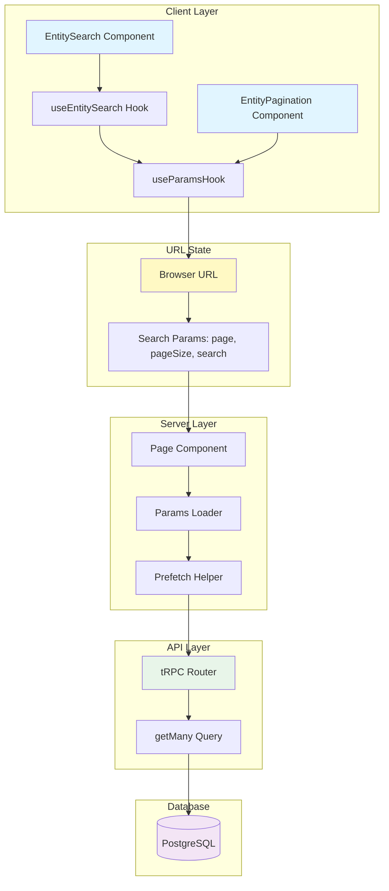
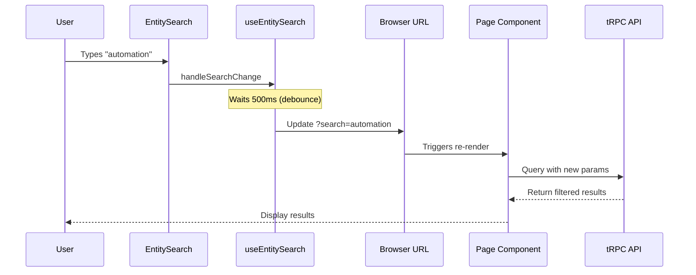
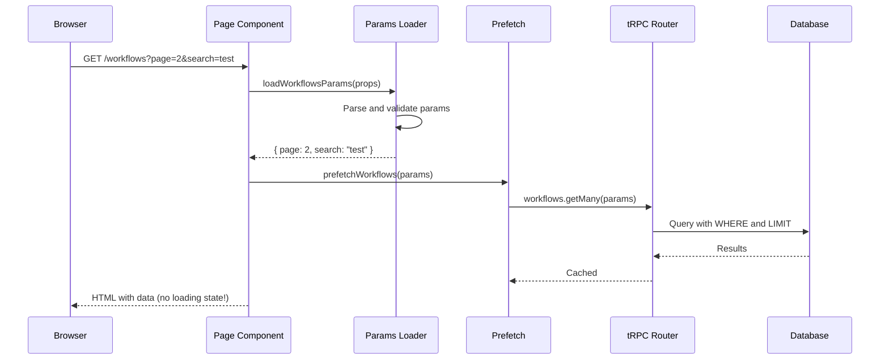
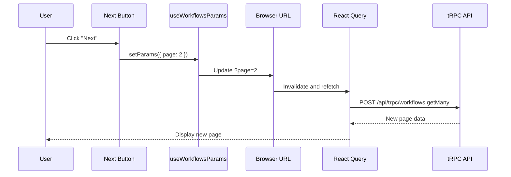

# Search and Pagination Pattern

## Overview

This document describes the search and pagination pattern used across the application for entity management pages. The pattern provides URL-based state management, server-side rendering support, and a consistent user experience.

## Table of Contents

1. [Architecture](#architecture)
2. [Technology Stack](#technology-stack)
3. [Implementation Steps](#implementation-steps)
4. [URL State Management](#url-state-management)
5. [Server-Side Integration](#server-side-integration)
6. [Client-Side Integration](#client-side-integration)
7. [Generic Components](#generic-components)
8. [Complete Example](#complete-example)
9. [Best Practices](#best-practices)

---

## Architecture

### Data Flow



### Key Features

- **URL-Based State**: Search and pagination state is stored in URL query parameters
- **SSR Support**: Server-side rendering with prefetched data
- **Debouncing**: Search input is debounced to reduce API calls (500ms default)
- **Type Safety**: Full TypeScript support with Zod validation
- **Reusable Components**: Generic components for consistent UI
- **Responsive**: Works seamlessly on mobile and desktop

---

## Technology Stack

| Technology | Purpose | Version |
|------------|---------|---------|
| **nuqs** | URL state management | Latest |
| **Zod** | Schema validation | Latest |
| **tRPC** | Type-safe API | 11.7 |
| **React Query** | Data fetching and caching | v5 |
| **Prisma** | Database ORM | Latest |

### Configuration Constants

**File:** `config/constants.ts`

```typescript
export const DEFAULT_PAGE = 1;
export const DEFAULT_PAGE_SIZE = 5;
export const MAX_PAGE_SIZE = 100;
```

---

## Implementation Steps

### Step 1: Define Search Params Configuration

Create a params configuration file for your feature using `nuqs`:

**File:** `app/features/[feature]/params.ts`

```typescript
import { createSearchParamsCache, parseAsInteger, parseAsString } from 'nuqs/server';
import { DEFAULT_PAGE, DEFAULT_PAGE_SIZE, MAX_PAGE_SIZE } from '@/config/constants';

export const workflowsSearchParams = {
  page: parseAsInteger.withDefault(DEFAULT_PAGE),
  pageSize: parseAsInteger
    .withDefault(DEFAULT_PAGE_SIZE)
    .withOptions({ clearOnDefault: true })
    .validate((value) => Math.min(value, MAX_PAGE_SIZE)),
  search: parseAsString.withDefault('').withOptions({ clearOnDefault: true }),
};

export const workflowsSearchParamsCache = createSearchParamsCache(workflowsSearchParams);
```

**Key Points:**
- `page`: Integer, defaults to 1
- `pageSize`: Integer, defaults to 5, max 100, clears if default
- `search`: String, defaults to empty, clears if default
- Cache is used for server-side parsing

### Step 2: Create Params Hook

Create a hook to manage URL params in client components:

**File:** `app/features/[feature]/hooks/use-[feature]-params.ts`

```typescript
import { useQueryStates } from 'nuqs';
import { workflowsSearchParams } from '../params';

/**
 * Hook to manage workflow URL search params (page, pageSize, search)
 */
export const useWorkflowsParams = () => {
  return useQueryStates(workflowsSearchParams);
};
```

### Step 3: Create Params Loader

Create a server-side loader to parse and validate URL params:

**File:** `app/features/[feature]/server/params-loader.ts`

```typescript
import { workflowsSearchParamsCache } from '../params';

type Props = {
  searchParams: Promise<Record<string, string | string[] | undefined>>;
};

/**
 * Load and validate workflow search params on the server
 */
export const loadWorkflowsParams = async (props: Props) => {
  const searchParams = await props.searchParams;
  return workflowsSearchParamsCache.parse(searchParams);
};
```

### Step 4: Update tRPC Router

Update your tRPC router to accept search and pagination params:

**File:** `app/features/[feature]/server/routers.ts`

```typescript
import { z } from 'zod';
import prisma from '@/lib/db';
import { createTRPCRouter, protectedProcedure } from '@/trpc/init';
import { DEFAULT_PAGE, DEFAULT_PAGE_SIZE, MAX_PAGE_SIZE } from '@/config/constants';

export const workflowsRouter = createTRPCRouter({
  getMany: protectedProcedure
    .input(
      z.object({
        page: z.number().min(1).default(DEFAULT_PAGE),
        pageSize: z.number().min(1).max(MAX_PAGE_SIZE).default(DEFAULT_PAGE_SIZE),
        search: z.string().optional(),
      })
    )
    .query(async ({ ctx, input }) => {
      const { page, pageSize, search } = input;
      const skip = (page - 1) * pageSize;

      const where = {
        userId: ctx.auth.user.id,
        ...(search && {
          name: {
            contains: search,
            mode: 'insensitive' as const,
          },
        }),
      };

      const [items, totalCount] = await Promise.all([
        prisma.workflow.findMany({
          where,
          skip,
          take: pageSize,
          orderBy: { createdAt: 'desc' },
        }),
        prisma.workflow.count({ where }),
      ]);

      const totalPages = Math.ceil(totalCount / pageSize);

      return {
        items,
        page,
        pageSize,
        totalCount,
        totalPages,
        hasNextPage: page < totalPages,
        hasPreviousPage: page > 1,
      };
    }),
});
```

**Return Type:**
```typescript
{
  items: T[];              // Array of entities
  page: number;            // Current page (1-based)
  pageSize: number;        // Items per page
  totalCount: number;      // Total number of items
  totalPages: number;      // Total number of pages
  hasNextPage: boolean;    // Whether next page exists
  hasPreviousPage: boolean; // Whether previous page exists
}
```

### Step 5: Update Data Fetching Hook

Update your custom hook to use params:

**File:** `app/features/[feature]/hooks/use-[feature].ts`

```typescript
import { useTRPC } from '@/trpc/client';
import { useSuspenseQuery } from '@tanstack/react-query';
import { useWorkflowsParams } from './use-workflows-params';

/**
 * Hook to fetch all workflows using suspense with search/pagination
 */
export const useSuspenseWorkflows = () => {
  const trpc = useTRPC();
  const [params] = useWorkflowsParams();

  return useSuspenseQuery(trpc.workflows.getMany.queryOptions(params));
};
```

### Step 6: Update Prefetch Helper

Update your prefetch helper to accept params:

**File:** `app/features/[feature]/server/prefetch.ts`

```typescript
import type { inferInput } from '@trpc/tanstack-react-query';
import { prefetch, trpc } from '@/trpc/server';

type Input = inferInput<typeof trpc.workflows.getMany>;

/**
 * Prefetch all workflows with search/pagination params
 */
export const prefetchWorkflows = (params: Input) => {
  return prefetch(trpc.workflows.getMany.queryOptions(params));
};
```

### Step 7: Create UI Components

Create feature-specific components using generic components:

**File:** `app/features/[feature]/components/[feature].tsx`

```typescript
'use client';

import {
  EntityHeader,
  EntityContainer,
  EntitySearch,
  EntityPagination,
} from '@/components/entity-components';
import { api } from '@/trpc/client';
import { useSuspenseWorkflows } from '../hooks/use-workflows';
import { useWorkflowsParams } from '../hooks/use-workflows-params';

export function WorkflowsSearch() {
  const [params, setParams] = useWorkflowsParams();

  return (
    <EntitySearch
      search={params.search}
      onSearchChange={(value) => setParams({ search: value })}
      placeholder="Search workflows..."
    />
  );
}

export function WorkflowsPagination() {
  const { data } = useSuspenseWorkflows();
  const [params, setParams] = useWorkflowsParams();

  return (
    <EntityPagination
      page={data.page}
      totalPages={data.totalPages}
      hasNextPage={data.hasNextPage}
      hasPreviousPage={data.hasPreviousPage}
      onPageChange={(page) => setParams({ page })}
    />
  );
}

export function WorkflowsContainer({ children }: { children: React.ReactNode }) {
  return (
    <EntityContainer
      header={<WorkflowsHeader />}
      search={<WorkflowsSearch />}
      pagination={<WorkflowsPagination />}
    >
      {children}
    </EntityContainer>
  );
}
```

### Step 8: Update Page Component

Update your page component to load and prefetch with params:

**File:** `app/(dashboard)/(home)/[feature]/page.tsx`

```typescript
import { requireAuth } from '@/lib/auth-utils';
import { HydrateClient } from '@/trpc/server';
import { ErrorBoundary } from 'react-error-boundary';
import { Suspense } from 'react';
import {
  WorkflowsList,
  WorkflowsContainer,
} from '@/app/features/workflows/components/workflows';
import { prefetchWorkflows } from '@/app/features/workflows/server/prefetch';
import { loadWorkflowsParams } from '@/app/features/workflows/server/params-loader';

export default async function WorkflowsPage(props: {
  searchParams: Promise<Record<string, string | string[] | undefined>>;
}) {
  await requireAuth();

  // Load and validate search params from URL
  const params = await loadWorkflowsParams(props);

  // Prefetch workflows with params for SSR
  await prefetchWorkflows(params);

  return (
    <WorkflowsContainer>
      <HydrateClient>
        <ErrorBoundary fallback={<p>Error!</p>}>
          <Suspense fallback={<p>Loading...</p>}>
            <WorkflowsList />
          </Suspense>
        </ErrorBoundary>
      </HydrateClient>
    </WorkflowsContainer>
  );
}
```

---

## URL State Management

### URL Structure

```
/workflows?page=2&pageSize=10&search=automation
```

### State Synchronization



### Debouncing

The `useEntitySearch` hook provides automatic debouncing:

**File:** `hooks/use-entity-search.tsx`

```typescript
import { useEffect, useState } from 'react';

type UseEntitySearchProps = {
  search: string;
  onSearchChange: (value: string) => void;
  debounceMs?: number;
};

export const useEntitySearch = ({
  search,
  onSearchChange,
  debounceMs = 500,
}: UseEntitySearchProps) => {
  const [searchValue, setSearchValue] = useState(search);

  // Sync with URL params
  useEffect(() => {
    setSearchValue(search);
  }, [search]);

  // Debounced update to URL
  useEffect(() => {
    const timeout = setTimeout(() => {
      if (searchValue !== search) {
        onSearchChange(searchValue);
      }
    }, debounceMs);

    return () => clearTimeout(timeout);
  }, [searchValue, search, onSearchChange, debounceMs]);

  return {
    searchValue,
    handleSearchChange: setSearchValue,
  };
};
```

**Benefits:**
- Reduces API calls by 90%+
- Improves user experience (no lag)
- Customizable delay per component
- Automatic cleanup

---

## Server-Side Integration

### SSR Flow



### Benefits of SSR

1. **No Loading State**: Data is ready on first render
2. **SEO Friendly**: Search engines can crawl paginated content
3. **Fast First Paint**: Users see content immediately
4. **Shareable URLs**: Users can share specific search results

---

## Client-Side Integration

### Client-Side Navigation Flow



### Optimistic Updates

React Query caches results, so navigating back to a previous page is instant:

```typescript
// First visit to page 2: Fetch from API
/workflows?page=2

// Navigate to page 3: Fetch from API
/workflows?page=3

// Navigate back to page 2: Instant (from cache)
/workflows?page=2
```

---

## Generic Components

### EntitySearch

Provides search input with debouncing:

```typescript
<EntitySearch
  search={params.search}
  onSearchChange={(value) => setParams({ search: value })}
  placeholder="Search workflows..."
  debounceMs={500} // Optional, defaults to 500ms
/>
```

### EntityPagination

Provides pagination controls:

```typescript
<EntityPagination
  page={data.page}
  totalPages={data.totalPages}
  hasNextPage={data.hasNextPage}
  hasPreviousPage={data.hasPreviousPage}
  onPageChange={(page) => setParams({ page })}
/>
```

### EntityContainer

Wraps all sections together:

```typescript
<EntityContainer
  header={<Header />}
  search={<Search />}
  pagination={<Pagination />}
>
  <List />
</EntityContainer>
```

---

## Complete Example

See the workflows feature for a complete implementation:

**Files:**
- `app/features/workflows/params.ts` - Params configuration
- `app/features/workflows/hooks/use-workflows-params.ts` - Client hook
- `app/features/workflows/server/params-loader.ts` - Server loader
- `app/features/workflows/server/routers.ts` - tRPC router with pagination
- `app/features/workflows/components/workflows.tsx` - UI components
- `app/(dashboard)/(home)/workflows/page.tsx` - Page component

---

## Best Practices

### 1. Always Validate Params on Server

```typescript
// ✅ Good: Validate and sanitize params
const params = await loadWorkflowsParams(props);
await prefetchWorkflows(params);

// ❌ Bad: Use raw search params
const page = Number(searchParams.page) || 1;
```

### 2. Use Consistent Pagination Constants

```typescript
// ✅ Good: Use shared constants
import { DEFAULT_PAGE_SIZE, MAX_PAGE_SIZE } from '@/config/constants';

// ❌ Bad: Hardcode values
const pageSize = 10;
```

### 3. Always Return Pagination Metadata

```typescript
// ✅ Good: Return all pagination info
return {
  items,
  page,
  pageSize,
  totalCount,
  totalPages,
  hasNextPage,
  hasPreviousPage,
};

// ❌ Bad: Only return items
return items;
```

### 4. Use Case-Insensitive Search

```typescript
// ✅ Good: Case-insensitive search
name: {
  contains: search,
  mode: 'insensitive',
}

// ❌ Bad: Case-sensitive search
name: { contains: search }
```

### 5. Filter by User ID

```typescript
// ✅ Good: Always filter by user
where: {
  userId: ctx.auth.user.id,
  ...(search && { name: { contains: search } }),
}

// ❌ Bad: Missing user filter (security risk!)
where: {
  ...(search && { name: { contains: search } }),
}
```

### 6. Use Parallel Queries

```typescript
// ✅ Good: Parallel execution
const [items, totalCount] = await Promise.all([
  prisma.workflow.findMany({ where, skip, take }),
  prisma.workflow.count({ where }),
]);

// ❌ Bad: Sequential execution (slower)
const items = await prisma.workflow.findMany({ where, skip, take });
const totalCount = await prisma.workflow.count({ where });
```

### 7. Provide Clear Defaults

```typescript
// ✅ Good: Clear defaults
page: parseAsInteger.withDefault(DEFAULT_PAGE),
search: parseAsString.withDefault(''),

// ❌ Bad: No defaults
page: parseAsInteger,
search: parseAsString,
```

### 8. Clear Default Values from URL

```typescript
// ✅ Good: Clean URLs
search: parseAsString
  .withDefault('')
  .withOptions({ clearOnDefault: true }),

// Result: /workflows (instead of /workflows?search=)

// ❌ Bad: Cluttered URLs
search: parseAsString.withDefault(''),

// Result: /workflows?search=&page=1&pageSize=5
```

---

## Related Documentation

- [Workflows Feature](./workflows-feature.md) - Complete implementation example
- [Generic Components](./generic-components.md) - Reusable UI components
- [Data Fetching Pattern](./data-fetching-pattern.md) - tRPC + React Query guide
- [CLAUDE.md](../CLAUDE.md) - Project overview and conventions
