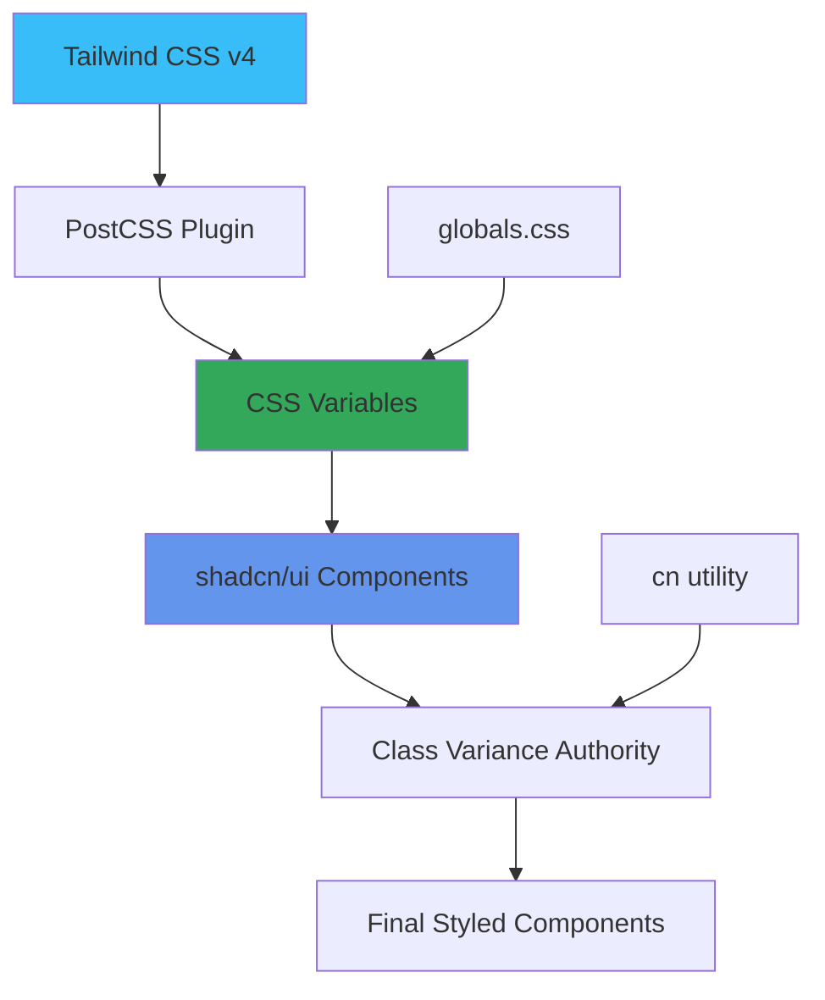
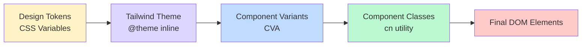
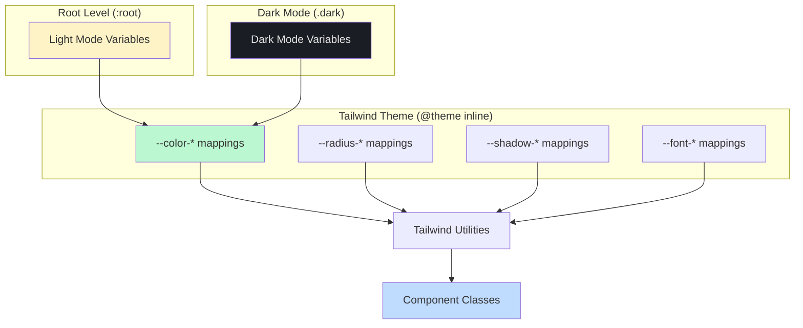
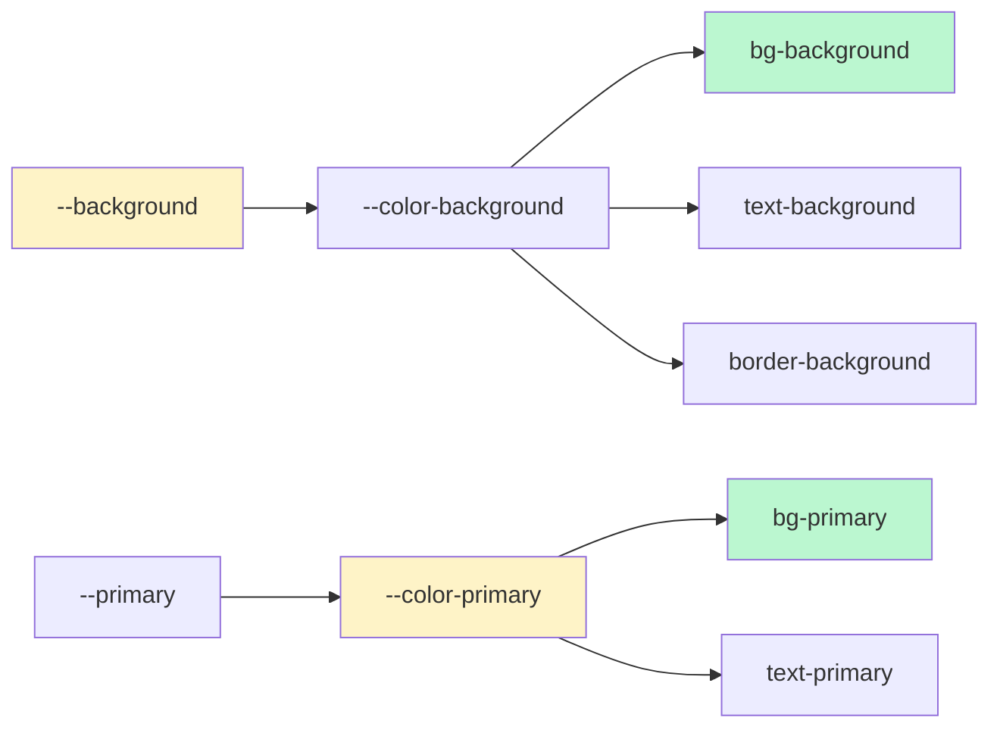
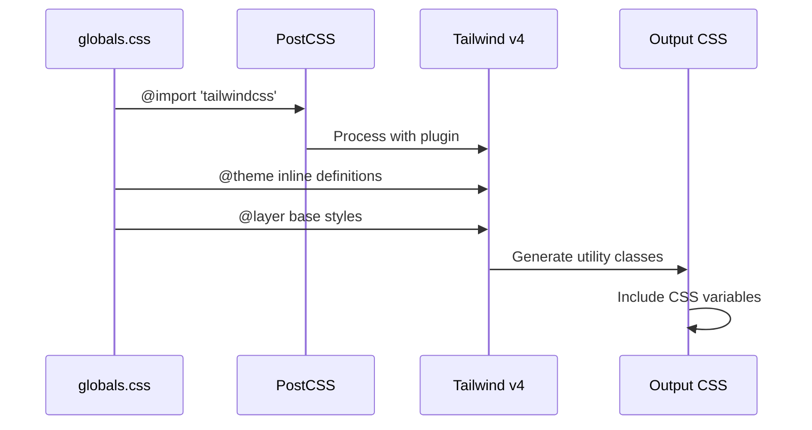
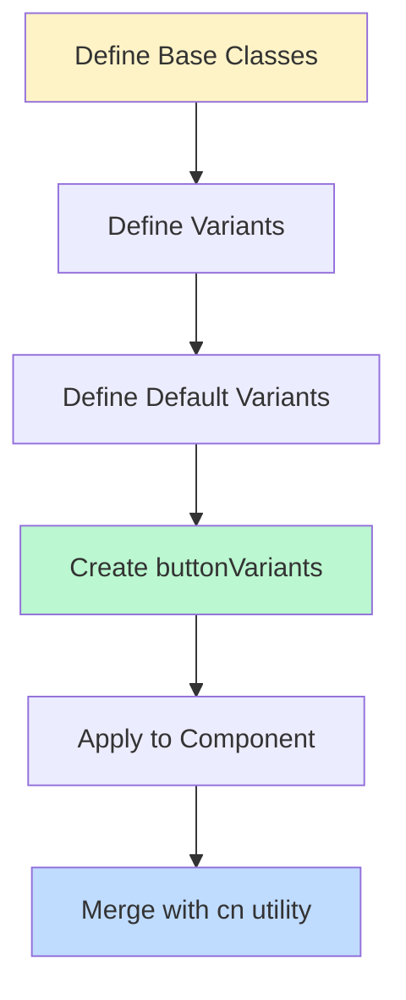
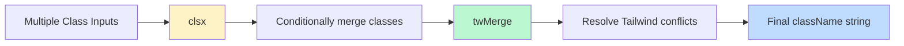
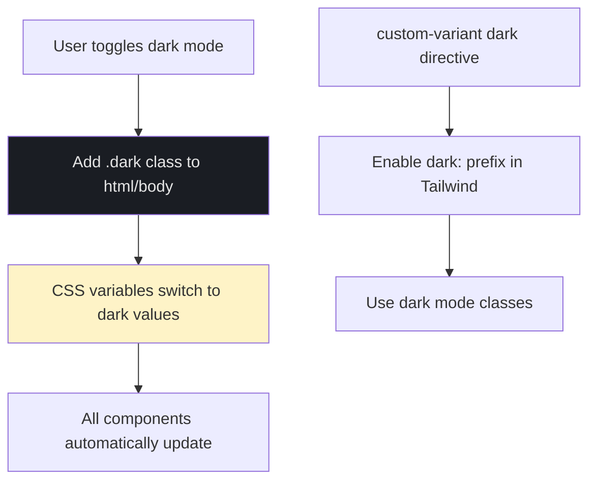

# Styling and Theming System

This document explains the styling and theming architecture of the n8n clone application, built with Tailwind CSS v4, CSS variables, and shadcn/ui components.

## Table of Contents

- [Overview](#overview)
- [Architecture](#architecture)
- [CSS Variables System](#css-variables-system)
- [Tailwind CSS v4 Integration](#tailwind-css-v4-integration)
- [Component Styling Pattern](#component-styling-pattern)
- [Dark Mode](#dark-mode)
- [Best Practices](#best-practices)

## Overview

The application uses a modern, CSS-variable-based theming system that enables:

- Light and dark mode support
- Type-safe component styling with Tailwind CSS v4
- Reusable design tokens through CSS variables
- Consistent theming across 50+ shadcn/ui components
- Runtime theme customization capability

### Technology Stack



## Architecture

### System Layers



### File Structure

```
app/
├── globals.css          # Theme variables + Tailwind imports
└── layout.tsx           # Font definitions (Geist Sans/Mono)

components/
└── ui/                  # shadcn/ui components with CVA variants

lib/
└── utils.ts             # cn() utility for className merging

components.json          # shadcn/ui configuration
postcss.config.mjs       # PostCSS with Tailwind plugin
```

## CSS Variables System

### Theme Architecture



### Variable Categories

The system defines CSS variables in four main categories:

#### 1. Color Variables

```css
:root {
  /* Semantic colors */
  --background: #f9f9fa;
  --foreground: #333333;
  --primary: #34a85a;
  --secondary: #6495ed;
  --destructive: #ef4444;
  --muted: #ddd9c4;
  --accent: #66d9ef;

  /* Component-specific colors */
  --card: #ffffff;
  --popover: #ffffff;
  --border: #d4d4d4;
  --input: #d4d4d4;
  --ring: #34a85a;

  /* Chart colors */
  --chart-1: #34a85a;
  --chart-2: #6495ed;
  /* ... more chart colors */

  /* Sidebar colors */
  --sidebar: #f9f9fa;
  --sidebar-primary: #34a85a;
  /* ... more sidebar colors */
}
```

#### 2. Typography Variables

```css
:root {
  --font-sans: Plus Jakarta Sans, sans-serif;
  --font-serif: Source Serif 4, serif;
  --font-mono: JetBrains Mono, monospace;
  --tracking-normal: 0em;
}
```

#### 3. Border Radius Variables

```css
:root {
  --radius: 0.5rem;
}

@theme inline {
  --radius-sm: calc(var(--radius) - 4px);
  --radius-md: calc(var(--radius) - 2px);
  --radius-lg: var(--radius);
  --radius-xl: calc(var(--radius) + 4px);
}
```

#### 4. Shadow Variables

```css
:root {
  --shadow-2xs: 0 1px 3px 0px hsl(0 0% 0% / 0.05);
  --shadow-xs: 0 1px 3px 0px hsl(0 0% 0% / 0.05);
  --shadow-sm: 0 1px 3px 0px hsl(0 0% 0% / 0.1),
               0 1px 2px -1px hsl(0 0% 0% / 0.1);
  --shadow: 0 1px 3px 0px hsl(0 0% 0% / 0.1),
            0 1px 2px -1px hsl(0 0% 0% / 0.1);
  /* ... more shadow scales */
}
```

### Tailwind Theme Mapping

The `@theme inline` directive maps CSS variables to Tailwind's color system:



## Tailwind CSS v4 Integration

### Configuration Flow



### Import Structure

```css
/* app/globals.css */
@import 'tailwindcss';           /* Tailwind v4 base */
@import 'tw-animate-css';        /* Animation utilities */

@custom-variant dark (&:is(.dark *));  /* Dark mode variant */
```

### Base Layer Styles

```css
@layer base {
  * {
    @apply border-border outline-ring/50;
  }

  body {
    @apply bg-background text-foreground;
    letter-spacing: var(--tracking-normal);
  }

  button:not([disabled]),
  [role='button']:not([disabled]) {
    cursor: pointer;
  }
}
```

### PostCSS Configuration

```javascript
// postcss.config.mjs
const config = {
  plugins: ["@tailwindcss/postcss"],
};
```

## Component Styling Pattern

### Class Variance Authority (CVA)

Components use CVA to define type-safe variants:



### Button Component Example

```typescript
import { cva, type VariantProps } from "class-variance-authority"
import { cn } from "@/lib/utils"

const buttonVariants = cva(
  // Base classes
  "inline-flex items-center justify-center gap-2 rounded-md...",
  {
    variants: {
      variant: {
        default: "bg-primary text-primary-foreground hover:bg-primary/90",
        destructive: "bg-destructive text-white hover:bg-destructive/90",
        outline: "border bg-background shadow-xs hover:bg-accent",
        secondary: "bg-secondary text-secondary-foreground",
        ghost: "hover:bg-accent hover:text-accent-foreground",
        link: "text-primary underline-offset-4 hover:underline",
      },
      size: {
        default: "h-9 px-4 py-2",
        sm: "h-8 rounded-md gap-1.5 px-3",
        lg: "h-10 rounded-md px-6",
        icon: "size-9",
      },
    },
    defaultVariants: {
      variant: "default",
      size: "default",
    },
  }
)

function Button({ className, variant, size, ...props }) {
  return (
    <button
      className={cn(buttonVariants({ variant, size, className }))}
      {...props}
    />
  )
}
```

### The `cn()` Utility

Located in `lib/utils.ts`, this utility merges class names intelligently:

```typescript
import { clsx, type ClassValue } from "clsx"
import { twMerge } from "tailwind-merge"

export function cn(...inputs: ClassValue[]) {
  return twMerge(clsx(inputs))
}
```

**How it works:**



**Example:**

```typescript
// Input
cn("px-2 py-1", "px-4", condition && "bg-primary")

// Output (condition = true)
"px-4 py-1 bg-primary"  // px-2 overridden by px-4
```

## Dark Mode

### Implementation Strategy



### Dark Mode Variables

```css
.dark {
  --background: #1a1d23;
  --foreground: #e5e5e5;
  --card: #2f3436;
  --primary: #34a85a;  /* Some colors stay the same */
  --border: #444444;
  /* ... all variables redefined for dark mode */
}
```

### Custom Variant Definition

```css
@custom-variant dark (&:is(.dark *));
```

This enables the `dark:` prefix in Tailwind classes:

```html
<div class="bg-white dark:bg-card text-black dark:text-foreground">
  Content
</div>
```

### Usage Patterns

**1. Automatic theme-aware styling (recommended):**

```tsx
<Button variant="default">
  Click me
</Button>
// Uses bg-primary which automatically switches based on .dark class
```

**2. Explicit dark mode overrides:**

```tsx
<div className="bg-background dark:bg-input/30 border dark:border-input">
  Content
</div>
```

## Best Practices

### 1. Use Semantic Color Variables

```tsx
// Good: Uses semantic variables
<div className="bg-background text-foreground border-border">

// Avoid: Hard-coded colors
<div className="bg-white text-black border-gray-200">
```

### 2. Leverage the cn() Utility

```tsx
// Good: Proper merging
import { cn } from "@/lib/utils"

<div className={cn("px-4 py-2", isActive && "bg-primary", className)}>

// Avoid: Manual string concatenation
<div className={`px-4 py-2 ${isActive ? "bg-primary" : ""} ${className}`}>
```

### 3. Use CVA for Component Variants

```tsx
// Good: Type-safe variants
const cardVariants = cva("rounded-lg border", {
  variants: {
    size: {
      sm: "p-2",
      md: "p-4",
      lg: "p-6",
    }
  }
})

// Avoid: Conditional classes everywhere
<Card className={size === 'sm' ? 'p-2' : size === 'md' ? 'p-4' : 'p-6'}>
```

### 4. Extend Theme Variables When Needed

```css
/* app/globals.css */
:root {
  /* Add custom variables */
  --sidebar-width: 280px;
  --header-height: 64px;
}

@theme inline {
  /* Make available to Tailwind */
  --spacing-sidebar-width: var(--sidebar-width);
}
```

### 5. Component Composition Pattern

```tsx
import { Button } from "@/components/ui/button"
import { Card } from "@/components/ui/card"

// Good: Compose with consistent styling
function MyComponent() {
  return (
    <Card className="p-6">
      <Button variant="default">Action</Button>
      <Button variant="outline">Cancel</Button>
    </Card>
  )
}
```

### 6. Dark Mode Testing

Always test components in both light and dark modes:

```tsx
// Add dark mode toggle to your dev environment
function DarkModeToggle() {
  const toggleDark = () => {
    document.documentElement.classList.toggle('dark')
  }

  return <button onClick={toggleDark}>Toggle Dark Mode</button>
}
```

## Common Patterns

### 1. Form Input Styling

```tsx
<input
  className="flex h-9 w-full rounded-md border border-input
             bg-transparent px-3 py-1 text-base
             shadow-xs transition-colors
             focus-visible:outline-none focus-visible:ring-1
             focus-visible:ring-ring
             disabled:cursor-not-allowed disabled:opacity-50"
/>
```

### 2. Card Container

```tsx
<div className="rounded-lg border bg-card text-card-foreground shadow">
  <div className="p-6">
    {/* Card content */}
  </div>
</div>
```

### 3. Interactive Elements

```tsx
<button className="inline-flex items-center gap-2
                   rounded-md bg-primary px-4 py-2
                   text-sm font-medium text-primary-foreground
                   transition-colors
                   hover:bg-primary/90
                   focus-visible:outline-none
                   focus-visible:ring-2 focus-visible:ring-ring
                   disabled:pointer-events-none disabled:opacity-50">
  Button Text
</button>
```

## shadcn/ui Configuration

### components.json

```json
{
  "style": "new-york",           // Component style variant
  "rsc": true,                   // React Server Components support
  "tsx": true,                   // TypeScript support
  "tailwind": {
    "css": "app/globals.css",    // CSS variables location
    "baseColor": "neutral",      // Base color palette
    "cssVariables": true,        // Enable CSS variables
    "prefix": ""                 // No class prefix
  },
  "iconLibrary": "lucide",       // Icon library
  "aliases": {
    "components": "@/components",
    "utils": "@/lib/utils",
    "ui": "@/components/ui"
  }
}
```

### Adding New Components

```bash
npx shadcn@latest add button
npx shadcn@latest add card
npx shadcn@latest add dialog
```

All components will automatically use the theme variables.

## Debugging Tips

### 1. Inspect CSS Variables

```javascript
// In browser console
getComputedStyle(document.documentElement).getPropertyValue('--primary')
// Returns: "#34a85a"
```

### 2. View All Tailwind Classes

```bash
# Build and inspect generated CSS
npm run build
# Check .next/static/css/ for generated stylesheets
```

### 3. Check Dark Mode Application

```javascript
// Verify dark class
document.documentElement.classList.contains('dark')

// Toggle dark mode
document.documentElement.classList.toggle('dark')
```

## Performance Considerations

1. **CSS Variables are runtime-evaluated** - minimal performance impact
2. **Tailwind classes are purged** - only used classes in production bundle
3. **Component variants are tree-shakeable** - unused variants removed
4. **cn() utility is lightweight** - ~1KB gzipped

## Future Enhancements

Potential improvements to the theming system:

1. **Multiple themes** - Add theme variants beyond light/dark
2. **User theme customization** - Allow runtime color scheme changes
3. **Theme persistence** - Store user preference in localStorage
4. **System preference detection** - Auto-detect OS dark mode preference
5. **Theme builder UI** - Visual theme customization tool

## Related Documentation

- [shadcn/ui Documentation](https://ui.shadcn.com)
- [Tailwind CSS v4 Documentation](https://tailwindcss.com)
- [Class Variance Authority](https://cva.style)
- [Radix UI Primitives](https://www.radix-ui.com)

## Summary

The styling system provides:

- Consistent design tokens through CSS variables
- Type-safe component variants with CVA
- Automatic dark mode support
- Flexible composition with the cn() utility
- 50+ pre-built shadcn/ui components
- Runtime theme customization capability

All styling follows a semantic, variable-based approach that makes the application easy to theme and maintain.
