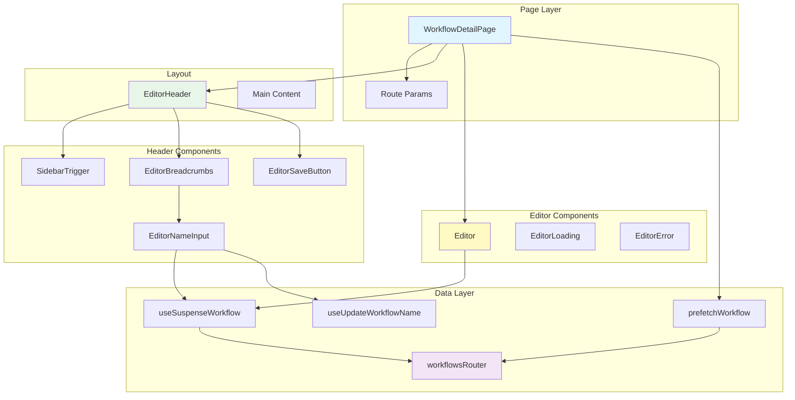
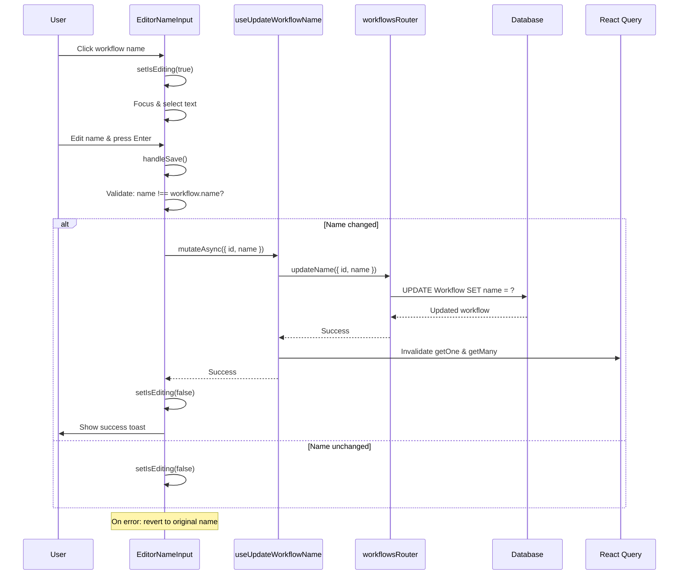
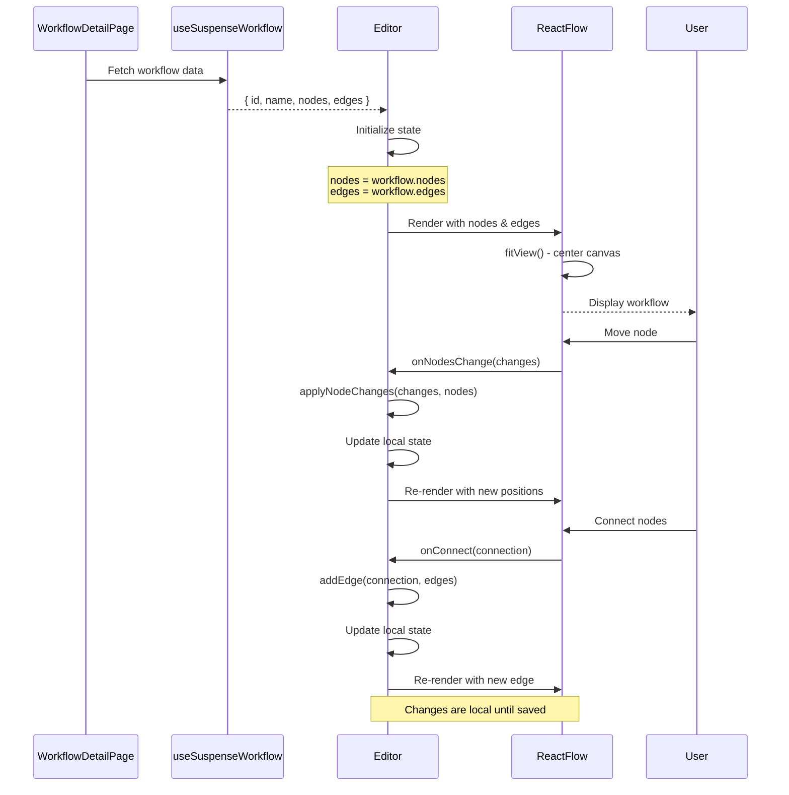
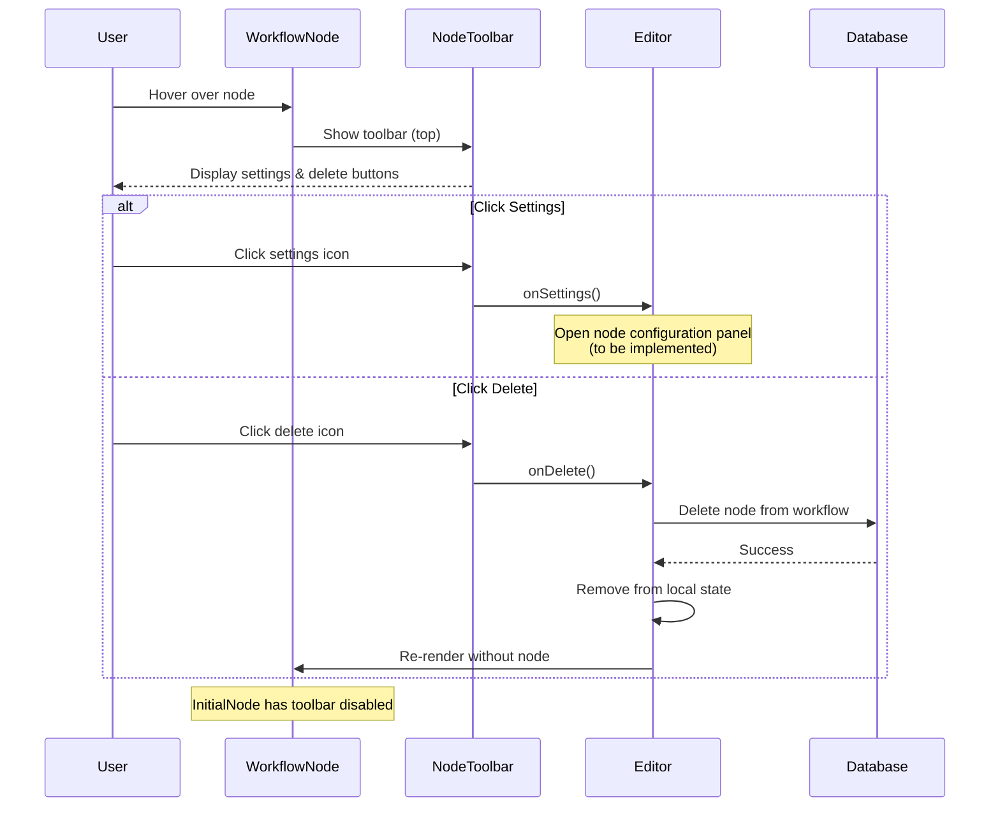
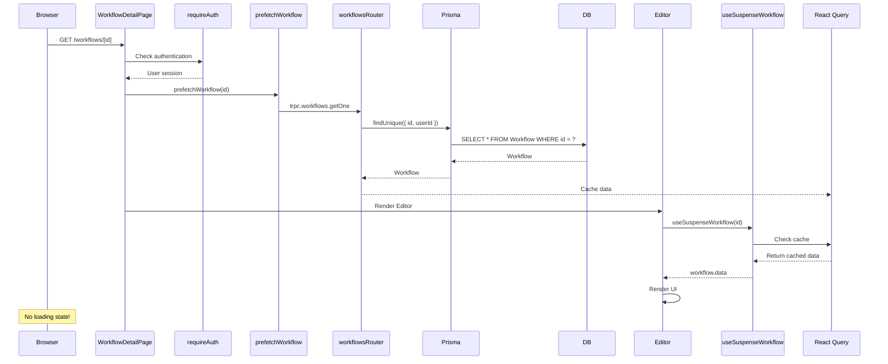

# Workflow Editor Documentation

## Overview

The Workflow Editor is a dedicated interface for editing and managing individual workflows. It provides features like breadcrumb navigation, inline name editing, and a save button for workflow changes. The editor is located in a separate route group to maximize screen space by excluding the standard dashboard header.

## Table of Contents

1. [Architecture Overview](#architecture-overview)
2. [Feature Structure](#feature-structure)
3. [Editor Components](#editor-components)
4. [Data Fetching](#data-fetching)
5. [Implementation Details](#implementation-details)
6. [Best Practices](#best-practices)

---

## Architecture Overview

The workflow editor follows a component-based architecture with clear separation of concerns:



### Key Components

| Component | Location | Purpose |
|-----------|----------|---------|
| **WorkflowDetailPage** | `app/(dashboard)/(editor)/workflows/[workflowId]/page.tsx` | Main page component with SSR |
| **EditorHeader** | `features/editor/components/editor-header.tsx` | Header with breadcrumbs and save button |
| **EditorBreadcrumbs** | `features/editor/components/editor-header.tsx` | Navigation breadcrumbs |
| **EditorNameInput** | `features/editor/components/editor-header.tsx` | Inline workflow name editor |
| **EditorSaveButton** | `features/editor/components/editor-header.tsx` | Save workflow button (placeholder) |
| **Editor** | `features/editor/components/editor.tsx` | Main editor component |
| **EditorLoading** | `features/editor/components/editor.tsx` | Loading state component |
| **EditorError** | `features/editor/components/editor.tsx` | Error state component |
| **useSuspenseWorkflow** | `features/workflows/hooks/use-workflows.ts` | Fetch single workflow hook |
| **useUpdateWorkflowName** | `features/workflows/hooks/use-workflows.ts` | Update workflow name hook |
| **prefetchWorkflow** | `features/workflows/server/prefetch.ts` | Server-side prefetch helper |

---

## Feature Structure

The editor feature is organized under the `features/editor/` directory:

```
features/editor/
├── components/
│   ├── editor-header.tsx      # EditorHeader, EditorBreadcrumbs, EditorNameInput, EditorSaveButton
│   └── editor.tsx             # Editor, EditorLoading, EditorError

features/workflows/
├── hooks/
│   └── use-workflows.ts       # useSuspenseWorkflow, useUpdateWorkflowName
└── server/
    ├── prefetch.ts            # prefetchWorkflow
    └── routers.ts             # getOne, updateName procedures

app/(dashboard)/(editor)/workflows/[workflowId]/
└── page.tsx                   # WorkflowDetailPage

components/
├── entity-components.tsx      # LoadingView, ErrorView
└── ui/
    ├── sidebar.tsx            # SidebarTrigger
    ├── breadcrumb.tsx         # Breadcrumb components
    ├── button.tsx             # Button component
    └── input.tsx              # Input component
```

---

## Editor Components

### EditorHeader

Main header component that combines breadcrumbs, sidebar trigger, and save button.

**File:** `features/editor/components/editor-header.tsx`

```typescript
'use client';

import { SidebarTrigger } from '@/components/ui/sidebar';
import { Button } from '@/components/ui/button';
import { SaveIcon } from 'lucide-react';
import { EditorBreadcrumbs } from './editor-header';

function EditorHeader({ workflowId }: { workflowId: string }) {
  return (
    <header className="flex h-14 shrink-0 items-center gap-2 border-b px-4 bg-background">
      <SidebarTrigger />
      <div className="flex flex-row items-center justify-between gap-x-4 w-full">
        <EditorBreadcrumbs workflowId={workflowId} />
        <EditorSaveButton workflowId={workflowId} />
      </div>
    </header>
  );
}

export default EditorHeader;
```

**Props:**
- `workflowId`: Workflow ID from route params

**Features:**
- Fixed height (h-14) matching dashboard header
- SidebarTrigger for collapsing/expanding sidebar
- Full-width flex layout with breadcrumbs and save button
- Border-bottom for visual separation

### EditorBreadcrumbs

Breadcrumb navigation showing "Workflows > Workflow Name".

**File:** `features/editor/components/editor-header.tsx`

```typescript
import {
  Breadcrumb,
  BreadcrumbItem,
  BreadcrumbLink,
  BreadcrumbList,
  BreadcrumbSeparator,
} from '@/components/ui/breadcrumb';
import Link from 'next/link';
import { EditorNameInput } from './editor-header';

export function EditorBreadcrumbs({ workflowId }: { workflowId: string }) {
  return (
    <Breadcrumb>
      <BreadcrumbList>
        <BreadcrumbItem>
          <BreadcrumbLink asChild>
            <Link prefetch href="/workflows">
              Workflows
            </Link>
          </BreadcrumbLink>
        </BreadcrumbItem>
        <BreadcrumbSeparator />
        <EditorNameInput workflowId={workflowId} />
      </BreadcrumbList>
    </Breadcrumb>
  );
}
```

**Props:**
- `workflowId`: Workflow ID from route params

**Features:**
- Link to workflows list page with prefetch
- Breadcrumb separator
- Inline editable workflow name

### EditorNameInput

Inline workflow name editor with click-to-edit functionality.

**File:** `features/editor/components/editor-header.tsx`

```typescript
import { useEffect, useRef, useState } from 'react';
import { Input } from '@/components/ui/input';
import { BreadcrumbItem } from '@/components/ui/breadcrumb';
import {
  useSuspenseWorkflow,
  useUpdateWorkflowName,
} from '@/features/workflows/hooks/use-workflows';

export function EditorNameInput({ workflowId }: { workflowId: string }) {
  const { data: workflow } = useSuspenseWorkflow(workflowId);
  const updateWorkflow = useUpdateWorkflowName();

  const [isEditing, setIsEditing] = useState(false);
  const [name, setName] = useState(workflow.name);

  const inputRef = useRef<HTMLInputElement>(null);

  useEffect(() => {
    if (workflow.name) {
      setName(workflow.name);
    }
  }, [workflow.name]);

  useEffect(() => {
    if (isEditing && inputRef.current) {
      inputRef.current.focus();
      inputRef.current.select();
    }
  }, [isEditing]);

  const handleSave = async () => {
    if (name === workflow.name) {
      setIsEditing(false);
      return;
    }

    try {
      await updateWorkflow.mutateAsync({ id: workflowId, name });
    } catch {
      setName(workflow.name);
    } finally {
      setIsEditing(false);
    }
  };

  const handleKeyDown = (e: React.KeyboardEvent) => {
    if (e.key === 'Enter') {
      handleSave();
    } else if (e.key === 'Escape') {
      setName(workflow.name);
      setIsEditing(false);
    }
  };

  if (isEditing) {
    return (
      <Input
        disabled={updateWorkflow.isPending}
        ref={inputRef}
        value={name}
        onChange={(e) => setName(e.target.value)}
        onBlur={handleSave}
        onKeyDown={handleKeyDown}
        className="h-7 w-auto min-w-[150px] px-2"
      />
    );
  }

  return (
    <BreadcrumbItem
      onClick={() => setIsEditing(true)}
      className="cursor-pointer hover:text-foreground transition-colors"
    >
      {workflow.name}
    </BreadcrumbItem>
  );
}
```

**Props:**
- `workflowId`: Workflow ID from route params

**Features:**
- Click to edit mode
- Auto-focus and select text on edit
- Save on blur or Enter key
- Cancel on Escape key
- Revert to original name on error
- Disabled during mutation
- Min width for better UX

**State Management:**
- `isEditing`: Toggle between view and edit modes
- `name`: Local state synced with workflow name
- `inputRef`: Reference for auto-focus

**Update Name Flow:**



### EditorSaveButton

Save button for workflow changes (placeholder for future implementation).

**File:** `features/editor/components/editor-header.tsx`

```typescript
import { Button } from '@/components/ui/button';
import { SaveIcon } from 'lucide-react';

export function EditorSaveButton({ workflowId }: { workflowId: string }) {
  return (
    <div className="ml-auto">
      <Button size="sm" onClick={() => {}} disabled={false}>
        <SaveIcon className="size-4" />
        Save
      </Button>
    </div>
  );
}
```

**Props:**
- `workflowId`: Workflow ID from route params

**Features:**
- Save icon from lucide-react
- Small button size
- Positioned at right end with `ml-auto`
- Currently placeholder implementation

### Editor

Main editor component with React Flow integration for visual workflow editing.

**File:** `features/editor/components/editor.tsx`

```typescript
'use client';

import { useState, useCallback } from 'react';
import {
  ReactFlow,
  applyNodeChanges,
  applyEdgeChanges,
  addEdge,
  type Node,
  type Edge,
  type NodeChange,
  type EdgeChange,
  type Connection,
  Background,
  Controls,
  MiniMap,
  Panel,
} from '@xyflow/react';
import { useSuspenseWorkflow } from '@/features/workflows/hooks/use-workflows';
import { ErrorView, LoadingView } from '@/components/entity-components';
import '@xyflow/react/dist/style.css';
import { nodeComponents } from '@/config/node-components';
import { AddNodeButton } from './add-node-button';

export function EditorLoading() {
  return <LoadingView message="Loading editor..." />;
}

export function EditorError() {
  return <ErrorView message="Error loading editor" />;
}

function Editor({ workflowId }: { workflowId: string }) {
  const { data: workflow } = useSuspenseWorkflow(workflowId);

  const [nodes, setNodes] = useState<Node[]>(workflow.nodes);
  const [edges, setEdges] = useState<Edge[]>(workflow.edges);

  const onNodesChange = useCallback(
    (changes: NodeChange[]) =>
      setNodes((nodesSnapshot) => applyNodeChanges(changes, nodesSnapshot)),
    []
  );
  const onEdgesChange = useCallback(
    (changes: EdgeChange[]) =>
      setEdges((edgesSnapshot) => applyEdgeChanges(changes, edgesSnapshot)),
    []
  );
  const onConnect = useCallback(
    (params: Connection) =>
      setEdges((edgesSnapshot) => addEdge(params, edgesSnapshot)),
    []
  );

  return (
    <div className="size-full">
      <ReactFlow
        nodes={nodes}
        edges={edges}
        onNodesChange={onNodesChange}
        onEdgesChange={onEdgesChange}
        onConnect={onConnect}
        nodeTypes={nodeComponents}
        fitView
      >
        <Background />
        <Controls />
        <MiniMap />
        <Panel position="top-right">
          <AddNodeButton />
        </Panel>
      </ReactFlow>
    </div>
  );
}

export default Editor;
```

**Props:**
- `workflowId`: Workflow ID from route params

**Features:**
- **React Flow Integration**: Full-featured workflow canvas with node-based editing
- **Node Management**: Add, move, and connect nodes visually
- **State Management**: Local state for nodes and edges with React Flow's change handlers
- **Visual Components**:
  - `Background`: Grid background for the canvas
  - `Controls`: Zoom and fit view controls
  - `MiniMap`: Overview map of the entire workflow
  - `Panel`: Top-right panel with add node button
- **Custom Node Types**: Registered node components via `nodeComponents` config
- **Auto-fit**: `fitView` prop centers and scales the workflow on load

**State Components:**
- `EditorLoading`: Loading state with spinner
- `EditorError`: Error state with error icon

**Dependencies:**
- `@xyflow/react`: React Flow library for node-based UIs
- Requires `@xyflow/react/dist/style.css` for proper styling

**React Flow Initialization:**



**Node Interaction Flow:**



### AddNodeButton

Button component for adding new nodes to the workflow.

**File:** `features/editor/components/add-node-button.tsx`

```typescript
'use client';

import { Button } from '@/components/ui/button';
import { PlusIcon } from 'lucide-react';
import { memo } from 'react';

export const AddNodeButton = memo(() => {
  return (
    <Button
      onClick={() => {}}
      size="icon"
      variant="outline"
      className="bg-background"
    >
      <PlusIcon />
    </Button>
  );
});

AddNodeButton.displayName = 'AddNodeButton';
```

**Features:**
- Positioned in top-right panel via React Flow `Panel` component
- Icon button with plus icon
- Outlined variant with background
- Memoized for performance
- Currently placeholder implementation

### Node Components

Custom node components for the workflow editor, registered in the `nodeComponents` config.

**File:** `config/node-components.ts`

```typescript
import { InitialNode } from '@/components/initial-node';
import { NodeType } from '@/lib/generated/prisma/enums';
import type { NodeTypes } from '@xyflow/react';

export const nodeComponents = {
  [NodeType.INITIAL]: InitialNode,
} as const satisfies NodeTypes;

export type RegisteredNodeType = keyof typeof nodeComponents;
```

#### InitialNode

The initial placeholder node shown in new workflows.

**File:** `components/initial-node.tsx`

```typescript
import { NodeProps } from '@xyflow/react';
import { memo } from 'react';
import { PlaceholderNode } from './react-flow/placeholder-node';
import { PlusIcon } from 'lucide-react';
import { WorkflowNode } from './workflow-node';

export const InitialNode = memo((props: NodeProps) => {
  return (
    <WorkflowNode showToolbar={false}>
      <PlaceholderNode {...props} onClick={() => {}}>
        <div className="cursor-pointer flex items-center justify-center">
          <PlusIcon className="size-4" />
        </div>
      </PlaceholderNode>
    </WorkflowNode>
  );
});

InitialNode.displayName = 'InitialNode';
```

**Features:**
- Wraps `PlaceholderNode` with `WorkflowNode` (toolbar disabled)
- Displays plus icon for adding first workflow step
- Clickable placeholder (handler to be implemented)
- Memoized for performance

#### WorkflowNode

Wrapper component that provides toolbar and metadata display for workflow nodes.

**File:** `components/workflow-node.tsx`

```typescript
'use client';

import { NodeToolbar, Position } from '@xyflow/react';
import { ReactNode } from 'react';
import { Button } from './ui/button';
import { SettingsIcon, TrashIcon } from 'lucide-react';

interface WorkflowNodeProps {
  children: ReactNode;
  showToolbar?: boolean;
  onDelete?: () => void;
  onSettings?: () => void;
  name?: string;
  description?: string;
}

export function WorkflowNode({
  children,
  showToolbar = true,
  onDelete,
  onSettings,
  name,
  description,
}: WorkflowNodeProps) {
  return (
    <>
      {showToolbar && (
        <NodeToolbar>
          <Button size="sm" variant="ghost" onClick={onSettings}>
            <SettingsIcon className="size-4" />
          </Button>
          <Button size="sm" variant="ghost" onClick={onDelete}>
            <TrashIcon className="size-4" />
          </Button>
        </NodeToolbar>
      )}
      {children}
      {name && (
        <NodeToolbar
          position={Position.Bottom}
          isVisible
          className="max-w-[200px] text-center"
        >
          <p className="font-medium">{name}</p>
          {description && (
            <p className="text-muted-foreground truncate text-sm">
              {description}
            </p>
          )}
        </NodeToolbar>
      )}
    </>
  );
}
```

**Props:**
- `children`: Node content to wrap
- `showToolbar`: Show settings/delete toolbar (default: true)
- `onDelete`: Delete button handler
- `onSettings`: Settings button handler
- `name`: Node name displayed below
- `description`: Optional description text

**Features:**
- Top toolbar with settings and delete actions (when enabled)
- Bottom toolbar for node name and description (when provided)
- Responsive design with max-width constraint
- Uses React Flow's `NodeToolbar` for proper positioning

#### PlaceholderNode

Base placeholder node for empty states and adding new nodes.

**File:** `components/react-flow/placeholder-node.tsx`

```typescript
'use client';

import React, { type ReactNode } from 'react';
import { Handle, Position, type NodeProps } from '@xyflow/react';
import { BaseNode } from '@/components/react-flow/base-node';

export type PlaceholderNodeProps = Partial<NodeProps> & {
  children?: ReactNode;
  onClick?: () => void;
};

export function PlaceholderNode({ children, onClick }: PlaceholderNodeProps) {
  return (
    <BaseNode
      className="w-auto h-auto bg-card border-dashed border-gray-400 p-4 text-center text-gray-400 shadow-none cursor-pointer hover:border-gray-500 hover:bg-gray-50"
      onClick={onClick}
    >
      {children}
      <Handle
        type="target"
        style={{ visibility: 'hidden' }}
        position={Position.Top}
        isConnectable={false}
      />
      <Handle
        type="source"
        style={{ visibility: 'hidden' }}
        position={Position.Bottom}
        isConnectable={false}
      />
    </BaseNode>
  );
}
```

**Features:**
- Dashed border styling for placeholder appearance
- Clickable with hover effects
- Hidden connection handles (top and bottom)
- Non-connectable by default
- Flexible content via children prop

#### BaseNode

Foundation component for all workflow nodes with consistent styling.

**File:** `components/react-flow/base-node.tsx`

```typescript
import type { ComponentProps } from "react";
import { cn } from "@/lib/utils";

export function BaseNode({ className, ...props }: ComponentProps<"div">) {
  return (
    <div
      className={cn(
        "bg-card text-card-foreground relative rounded-md border",
        "hover:ring-1",
        "[.react-flow__node.selected_&]:border-muted-foreground",
        "[.react-flow__node.selected_&]:shadow-lg",
        className,
      )}
      tabIndex={0}
      {...props}
    />
  );
}
```

**Features:**
- Consistent card styling with theme colors
- Hover ring effect
- Selected state styling (border and shadow)
- Keyboard accessible (tabIndex={0})
- Additional sub-components: `BaseNodeHeader`, `BaseNodeHeaderTitle`, `BaseNodeContent`, `BaseNodeFooter`

---

## Data Fetching

### Server-Side Prefetch

The editor page uses server-side prefetching to ensure instant rendering:

**File:** `features/workflows/server/prefetch.ts`

```typescript
import type { inferInput } from '@trpc/tanstack-react-query';
import { prefetch, trpc } from '@/trpc/server';

/**
 * Prefetch single workflow by ID
 */
export const prefetchWorkflow = (id: string) => {
  return prefetch(trpc.workflows.getOne.queryOptions({ id }));
};
```

### Client-Side Hooks

**useSuspenseWorkflow**

Fetches a single workflow with nodes and edges using React Query suspense mode.

**File:** `features/workflows/hooks/use-workflows.ts`

```typescript
/**
 * Hook to fetch a single workflow using suspense
 */
export const useSuspenseWorkflow = (id: string) => {
  const trpc = useTRPC();

  return useSuspenseQuery(
    trpc.workflows.getOne.queryOptions({
      id,
    })
  );
};
```

**Returns:**
- `id`: Workflow ID
- `name`: Workflow name
- `nodes`: Array of React Flow compatible nodes
- `edges`: Array of React Flow compatible edges

The `getOne` procedure transforms database models into React Flow format:

**File:** `features/workflows/server/routers.ts`

```typescript
getOne: protectedProcedure
  .input(z.object({ id: z.string() }))
  .query(async ({ ctx, input }) => {
    const workflow = await prisma.workflow.findUniqueOrThrow({
      where: { id: input.id, userId: ctx.auth.user.id },
      include: { nodes: true, connections: true },
    });

    // Transform server nodes to react-flow compatible nodes
    const nodes: Node[] = workflow.nodes.map((node) => ({
      id: node.id,
      type: node.type,
      position: node.position as { x: number; y: number },
      data: node.data as Record<string, unknown>,
    }));

    // Transform server connections to react-flow compatible edges
    const edges: Edge[] = workflow.connections.map((connection) => ({
      id: connection.id,
      source: connection.fromNodeId,
      target: connection.toNodeId,
      sourceHandle: connection.fromOutput,
      targetHandle: connection.toInput,
    }));

    return {
      id: workflow.id,
      name: workflow.name,
      nodes,
      edges,
    };
  })
```

**Database Schema:**

The workflow editor uses the following Prisma models:

```prisma
model Workflow {
  id String @id @default(cuid())
  name String
  createdAt DateTime @default(now())
  updatedAt DateTime @default(now())

  nodes Node[]
  connections Connection[]

  userId String
  user User @relation(fields: [userId], references: [id], onDelete: Cascade)
}

enum NodeType {
  INITIAL
}

model Node {
  id String @id @default(cuid())
  workflowId String
  workflow Workflow @relation(fields: [workflowId], references: [id], onDelete: Cascade)

  name String
  type NodeType
  position Json
  data Json @default("{}")

  outputConnections Connection[] @relation("FromNode")
  inputConnections Connection[] @relation("ToNode")

  createdAt DateTime @default(now())
  updatedAt DateTime @default(now())
}

model Connection {
  id String @id @default(cuid())
  workflowId String
  workflow Workflow @relation(fields: [workflowId], references: [id], onDelete: Cascade)

  fromNodeId String
  fromNode Node @relation("FromNode", fields: [fromNodeId], references: [id], onDelete: Cascade)

  toNodeId String
  toNode Node @relation("ToNode", fields: [toNodeId], references: [id], onDelete: Cascade)

  fromOutput String @default("main")
  toInput String @default("main")

  createdAt DateTime @default(now())
  updatedAt DateTime @default(now())

  @@unique([fromNodeId, toNodeId, fromOutput, toInput])
}
```

**Key Features:**
- `Node.position`: JSON field storing `{ x, y }` coordinates
- `Node.data`: JSON field for node-specific configuration
- `Node.type`: Enum field for node type (currently only `INITIAL`)
- `Connection`: Self-referencing many-to-many relationship between nodes
- `fromOutput`/`toInput`: Support for multiple handles per node (default: "main")
- Unique constraint on connections prevents duplicate edges

**useUpdateWorkflowName**

Updates a workflow's name with optimistic UI updates.

**File:** `features/workflows/hooks/use-workflows.ts`

```typescript
/**
 * Hook to update a workflow name
 */
export const useUpdateWorkflowName = () => {
  const queryClient = useQueryClient();
  const trpc = useTRPC();

  return useMutation(
    trpc.workflows.updateName.mutationOptions({
      onSuccess: (data) => {
        toast.success(`Workflow "${data.name}" updated.`);
        queryClient.invalidateQueries(trpc.workflows.getMany.queryOptions({}));
        queryClient.invalidateQueries(
          trpc.workflows.getOne.queryOptions({ id: data.id })
        );
      },
      onError: (error) => {
        toast.error(`Failed to update workflow: ${error.message}`);
      },
    })
  );
};
```

**Features:**
- Toast notifications on success/error
- Cache invalidation for both list and detail views
- Type-safe mutations with tRPC

---

## Implementation Details

### Page Component

**File:** `app/(dashboard)/(editor)/workflows/[workflowId]/page.tsx`

```typescript
import Editor, {
  EditorError,
  EditorLoading,
} from '@/features/editor/components/editor';
import EditorHeader from '@/features/editor/components/editor-header';
import { prefetchWorkflow } from '@/features/workflows/server/prefetch';
import { requireAuth } from '@/lib/auth-utils';
import { HydrateClient } from '@/trpc/server';
import React, { Suspense } from 'react';
import { ErrorBoundary } from 'react-error-boundary';

interface PageProps {
  params: Promise<{
    workflowId: string;
  }>;
}

async function WorkflowDetailPage({ params }: PageProps) {
  await requireAuth();

  const { workflowId } = await params;
  prefetchWorkflow(workflowId);

  return (
    <HydrateClient>
      <ErrorBoundary fallback={<EditorError />}>
        <Suspense fallback={<EditorLoading />}>
          <EditorHeader workflowId={workflowId} />
          <main className="flex-1">
            <Editor workflowId={workflowId} />
          </main>
        </Suspense>
      </ErrorBoundary>
    </HydrateClient>
  );
}

export default WorkflowDetailPage;
```

**Page Structure:**

1. **Authentication**: `requireAuth()` ensures user is logged in
2. **Params Extraction**: Extract `workflowId` from route params
3. **Prefetch**: Server-side prefetch workflow data
4. **HydrateClient**: Provides React Query hydration
5. **ErrorBoundary**: Catches errors with `EditorError` fallback
6. **Suspense**: Handles loading states with `EditorLoading` fallback
7. **Layout**: Header + main content area

### Route Structure

The editor is in a separate route group to exclude the dashboard header:

```
app/(dashboard)/
├── layout.tsx              # Dashboard layout with sidebar
├── (home)/                 # Routes with header
│   ├── layout.tsx          # Includes AppHeader
│   ├── workflows/
│   ├── credentials/
│   └── executions/
└── (editor)/               # Routes without header
    └── workflows/[workflowId]/
        └── page.tsx        # Editor page
```

**Benefits:**
- Maximizes editor screen space
- Still includes sidebar for navigation
- Consistent dashboard layout

### Data Flow



---

## Best Practices

### 1. Always Prefetch on Server

```typescript
// ✅ Good: Prefetch on server for instant render
async function WorkflowDetailPage({ params }) {
  await requireAuth();
  const { workflowId } = await params;
  prefetchWorkflow(workflowId);  // No loading state!
  return <Editor workflowId={workflowId} />;
}

// ❌ Bad: Client-only fetch shows loading spinner
function WorkflowDetailPage({ params }) {
  return <Editor workflowId={params.workflowId} />;
}
```

### 2. Use Suspense for Client Components

```typescript
// ✅ Good: Suspense handles loading states
<Suspense fallback={<EditorLoading />}>
  <Editor workflowId={workflowId} />
</Suspense>

// ❌ Bad: No loading state handling
<Editor workflowId={workflowId} />
```

### 3. Validate Input in Inline Editors

```typescript
// ✅ Good: Only save if name changed
const handleSave = async () => {
  if (name === workflow.name) {
    setIsEditing(false);
    return;
  }
  await updateWorkflow.mutateAsync({ id, name });
};

// ❌ Bad: Always makes API call
const handleSave = async () => {
  await updateWorkflow.mutateAsync({ id, name });
};
```

### 4. Handle Errors Gracefully

```typescript
// ✅ Good: Revert on error
try {
  await updateWorkflow.mutateAsync({ id, name });
} catch {
  setName(workflow.name);  // Revert to original
} finally {
  setIsEditing(false);
}

// ❌ Bad: Leave user in editing state on error
await updateWorkflow.mutateAsync({ id, name });
setIsEditing(false);
```

### 5. Auto-Focus and Select on Edit

```typescript
// ✅ Good: Better UX with auto-focus and select
useEffect(() => {
  if (isEditing && inputRef.current) {
    inputRef.current.focus();
    inputRef.current.select();
  }
}, [isEditing]);

// ❌ Bad: User must manually select text
useEffect(() => {
  if (isEditing && inputRef.current) {
    inputRef.current.focus();
  }
}, [isEditing]);
```

---

## Future Enhancements

### 1. Node Management ✅ (Partially Complete)

The workflow canvas is now implemented with React Flow:
- ✅ Node-based workflow builder
- ✅ Drag-and-drop interface
- ✅ Connection lines between nodes
- ✅ Initial node component
- 🔲 Add node functionality
- 🔲 Node configuration panels
- 🔲 Additional node types (HTTP, Database, AI, etc.)

### 2. Save Functionality

Implement the save button:
- Auto-save on changes
- Save indicator (saved/unsaved)
- Keyboard shortcut (Cmd/Ctrl + S)
- Version history

### 3. Collaboration

Add real-time collaboration features:
- Multi-user editing
- Presence indicators
- Conflict resolution
- Change notifications

### 4. Toolbar

Add a toolbar with common actions:
- Undo/redo
- Zoom controls
- Layout options
- Export workflow

---

## Related Documentation

- [Workflows Feature](./workflows-feature.md) - Workflows list and CRUD operations
- [Data Fetching Pattern](./data-fetching-pattern.md) - tRPC + React Query guide
- [Generic Components](./generic-components.md) - Reusable entity component patterns
- [Dashboard Layout and Navigation](./dashboard-layout-navigation.md) - Layout system
