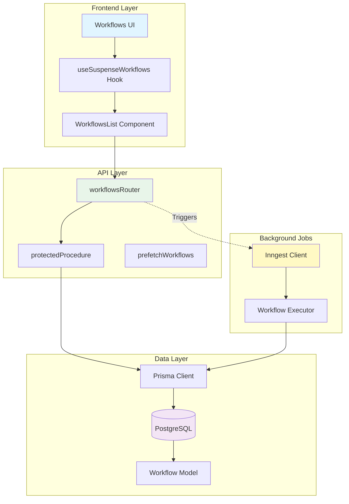
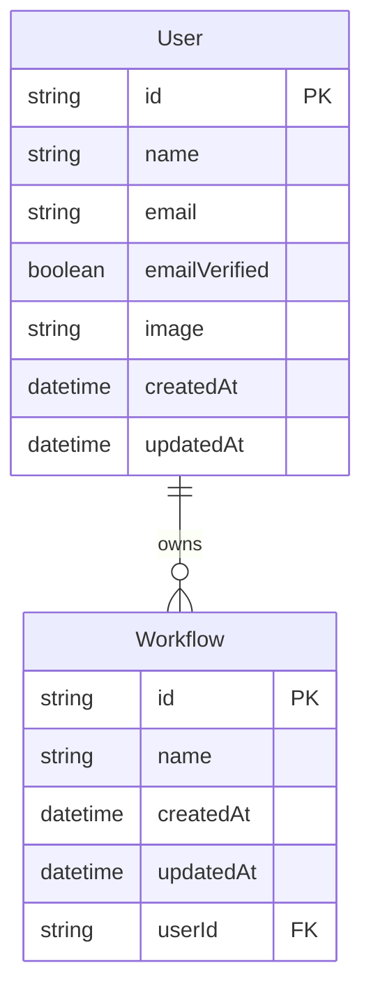
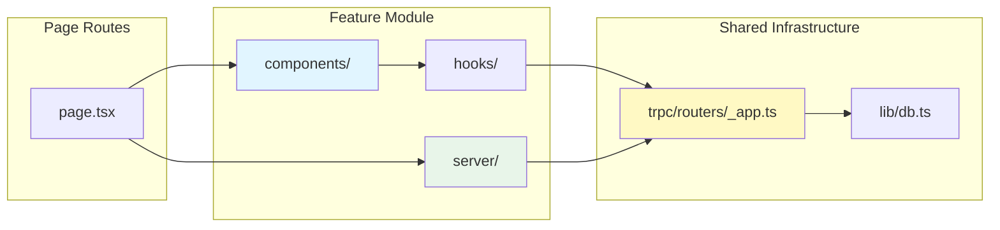
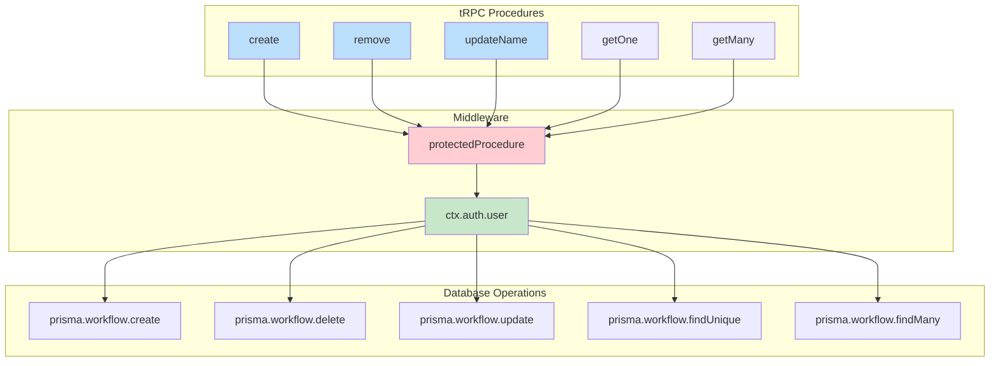
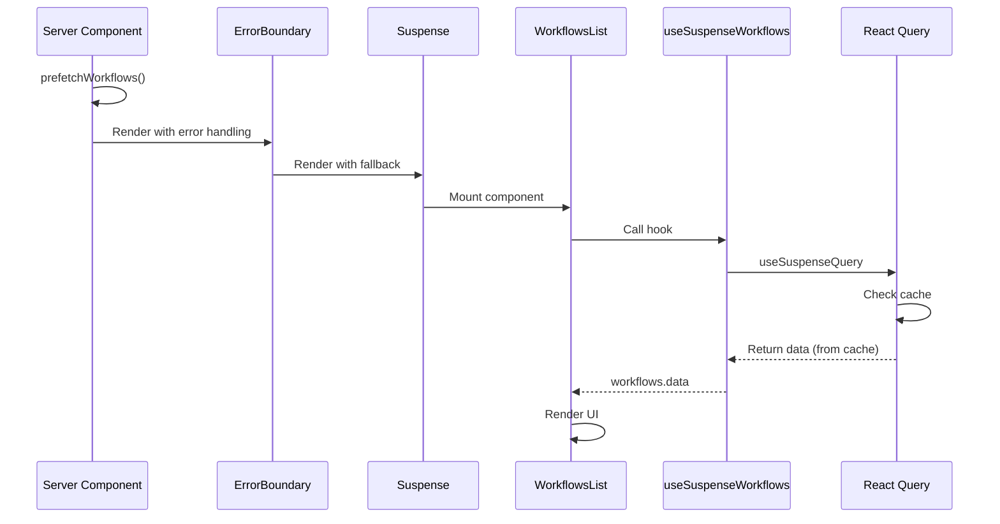
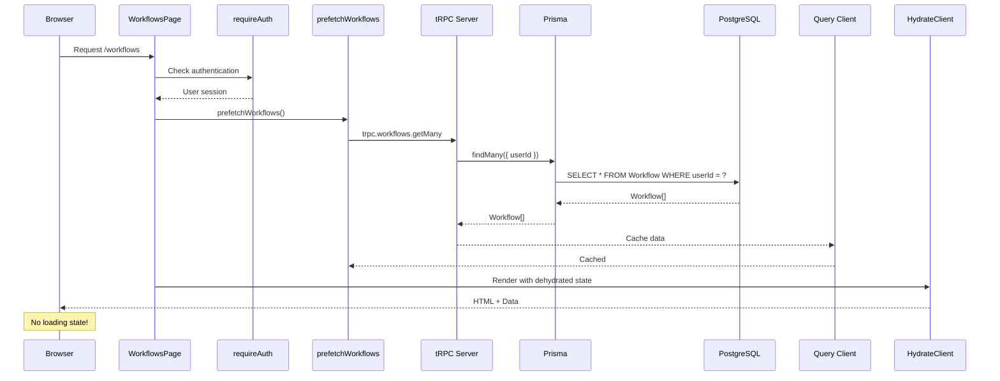
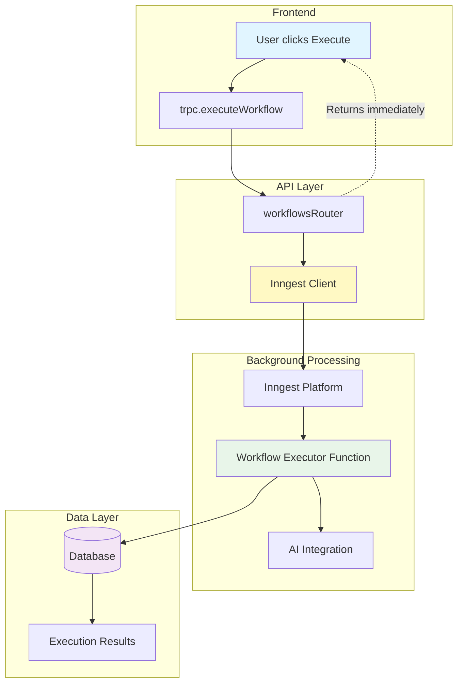
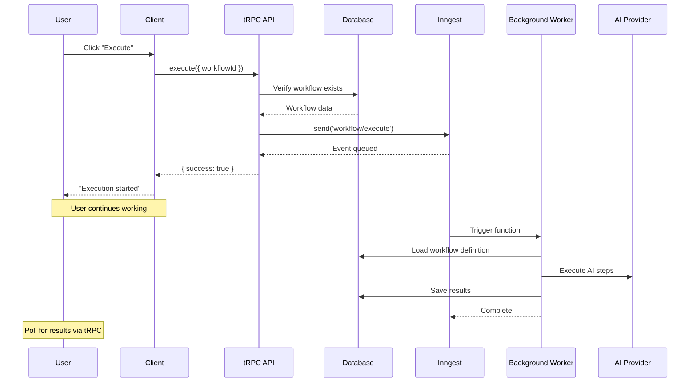
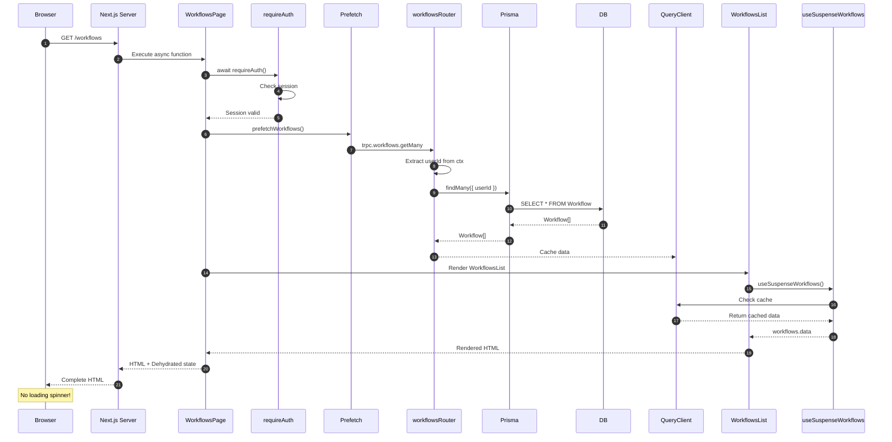
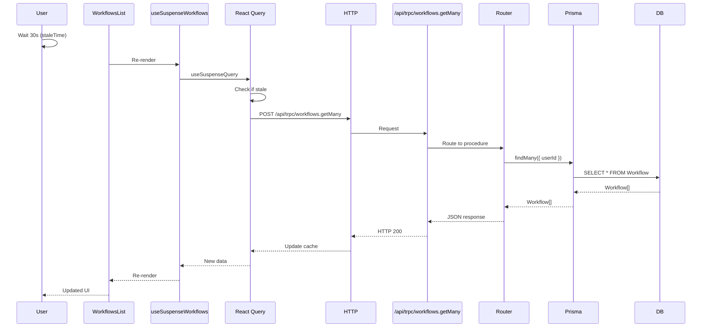

# Workflows Feature Documentation

## Overview

The Workflows feature is the core functionality of this n8n clone, allowing users to create, manage, and execute automated workflows. This document covers the complete architecture, data model, API design, and implementation patterns.

## Table of Contents

1. [Architecture Overview](#architecture-overview)
2. [Data Model](#data-model)
3. [Feature Structure](#feature-structure)
4. [API Layer (tRPC)](#api-layer-trpc)
5. [Client Components](#client-components)
6. [Data Fetching Pattern](#data-fetching-pattern)
7. [Workflow Execution](#workflow-execution)
8. [Complete Request Flow](#complete-request-flow)
9. [Code Examples](#code-examples)
10. [Best Practices](#best-practices)

---

## Architecture Overview

The workflows feature follows a clean, modular architecture:



### Key Components

| Component | Location | Purpose |
|-----------|----------|---------|
| **Workflow Model** | `prisma/schema.prisma` | Database schema definition |
| **tRPC Router** | `features/workflows/server/routers.ts` | Type-safe API endpoints |
| **Custom Hook** | `features/workflows/hooks/use-workflows.ts` | Client-side data fetching and mutations |
| **Prefetch Helper** | `features/workflows/server/prefetch.ts` | Server-side data preloading (prefetchWorkflows, prefetchWorkflow) |
| **WorkflowsList** | `features/workflows/components/workflows.tsx` | Main list component |
| **WorkflowsHeader** | `features/workflows/components/workflows.tsx` | Header with EntityHeader |
| **WorkflowsSearch** | `features/workflows/components/workflows.tsx` | Search input component |
| **WorkflowsPagination** | `features/workflows/components/workflows.tsx` | Pagination controls |
| **WorkflowsContainer** | `features/workflows/components/workflows.tsx` | Layout with EntityContainer |
| **Custom Hooks** | `features/workflows/hooks/` | use-workflows.ts, use-workflows-params.ts |
| **Params Config** | `features/workflows/params.ts` | URL search params with nuqs |
| **Params Loader** | `features/workflows/server/params-loader.ts` | Server-side params loader |
| **EntityHeader** | `components/entity-components.tsx` | Generic reusable header component |
| **EntityContainer** | `components/entity-components.tsx` | Generic reusable layout wrapper |
| **EntitySearch** | `components/entity-components.tsx` | Generic search component |
| **EntityPagination** | `components/entity-components.tsx` | Generic pagination component |
| **EntityList** | `components/entity-components.tsx` | Generic list component |
| **EntityItem** | `components/entity-components.tsx` | Generic item card component |
| **Page Component** | `app/(dashboard)/(home)/workflows/page.tsx` | Next.js page with SSR |

---

## Data Model

### Prisma Schema

**File:** `prisma/schema.prisma`

```prisma
model Workflow {
  id        String   @id @default(cuid())
  name      String
  createdAt DateTime @default(now())
  updatedAt DateTime @default(now())

  userId    String
  user      User     @relation(fields: [userId], references: [id], onDelete: Cascade)
}
```

### Model Relationships



### Field Descriptions

| Field | Type | Description | Constraints |
|-------|------|-------------|-------------|
| `id` | String | Unique identifier | Primary key, auto-generated CUID |
| `name` | String | Workflow name | Generated using `random-word-slugs` (3 words) |
| `createdAt` | DateTime | Creation timestamp | Auto-set on creation |
| `updatedAt` | DateTime | Last update timestamp | Auto-updated on modification |
| `userId` | String | Owner reference | Foreign key to User, cascading delete |

### TypeScript Types

```typescript
// Automatically generated by Prisma Client
type Workflow = {
  id: string;
  name: string;
  createdAt: Date;
  updatedAt: Date;
  userId: string;
}

// With user relation
type WorkflowWithUser = Workflow & {
  user: User;
}
```

---

## Feature Structure

The workflows feature follows the feature-based organization pattern:

```
features/workflows/
├── components/
│   └── workflows.tsx          # WorkflowsList, WorkflowsHeader, WorkflowsSearch, WorkflowsPagination, WorkflowsContainer
├── hooks/
│   ├── use-workflows.ts       # useSuspenseWorkflows, useCreateWorkflow, useRemoveWorkflow, useSuspenseWorkflow, useUpdateWorkflowName
│   └── use-workflows-params.ts # URL params management hook
├── params.ts                  # Search params configuration (nuqs)
└── server/
    ├── routers.ts             # workflowsRouter with CRUD operations + search/pagination
    ├── prefetch.ts            # Server-side prefetch helper (prefetchWorkflows, prefetchWorkflow)
    └── params-loader.ts       # Server-side params loader

components/
├── entity-components.tsx      # Generic EntityHeader, EntityContainer, EntitySearch, EntityPagination, EntityList, EntityItem
└── upgrade-modal.tsx          # Upgrade to Pro modal

hooks/
├── use-entity-search.tsx      # Generic search hook with debouncing
└── use-upgrade-modal.tsx      # Upgrade modal hook with error detection

app/(dashboard)/(home)/workflows/
└── page.tsx                   # Workflows page with SSR + params
```

### Feature Organization Pattern



---

## API Layer (tRPC)

### Router Definition

**File:** `features/workflows/server/routers.ts`

```typescript
import { generateSlug } from 'random-word-slugs';
import prisma from '@/lib/db';
import { createTRPCRouter, protectedProcedure } from '@/trpc/init';
import z from 'zod';

export const workflowsRouter = createTRPCRouter({
  // Create a new workflow
  create: protectedProcedure.mutation(({ ctx }) => {
    return prisma.workflow.create({
      data: {
        name: generateSlug(3),
        userId: ctx.auth.user.id,
      },
    });
  }),

  // Delete a workflow
  remove: protectedProcedure
    .input(z.object({ id: z.string() }))
    .mutation(({ ctx, input }) => {
      return prisma.workflow.delete({
        where: {
          id: input.id,
          userId: ctx.auth.user.id,
        },
      });
    }),

  // Update workflow name
  updateName: protectedProcedure
    .input(z.object({ id: z.string(), name: z.string().min(1) }))
    .mutation(({ ctx, input }) => {
      return prisma.workflow.update({
        where: {
          id: input.id,
          userId: ctx.auth.user.id,
        },
        data: {
          name: input.name,
        },
      });
    }),

  // Get single workflow
  getOne: protectedProcedure
    .input(z.object({ id: z.string() }))
    .query(({ ctx, input }) => {
      return prisma.workflow.findUnique({
        where: { id: input.id, userId: ctx.auth.user.id },
      });
    }),

  // Get all user workflows with search and pagination
  getMany: protectedProcedure
    .input(
      z.object({
        page: z.number().min(1).default(DEFAULT_PAGE),
        pageSize: z.number().min(1).max(MAX_PAGE_SIZE).default(DEFAULT_PAGE_SIZE),
        search: z.string().optional(),
      })
    )
    .query(async ({ ctx, input }) => {
      const { page, pageSize, search } = input;
      const skip = (page - 1) * pageSize;

      const where = {
        userId: ctx.auth.user.id,
        ...(search && {
          name: {
            contains: search,
            mode: 'insensitive' as const,
          },
        }),
      };

      const [items, totalCount] = await Promise.all([
        prisma.workflow.findMany({
          where,
          skip,
          take: pageSize,
          orderBy: { createdAt: 'desc' },
        }),
        prisma.workflow.count({ where }),
      ]);

      const totalPages = Math.ceil(totalCount / pageSize);

      return {
        items,
        page,
        pageSize,
        totalCount,
        totalPages,
        hasNextPage: page < totalPages,
        hasPreviousPage: page > 1,
      };
    }),
});
```

### Procedure Types and Security



### Procedure Specifications

| Procedure | Type | Input | Output | Auth Required |
|-----------|------|-------|--------|---------------|
| `create` | Mutation | None | `Workflow` | Yes |
| `remove` | Mutation | `{ id: string }` | `Workflow` | Yes |
| `updateName` | Mutation | `{ id: string, name: string }` | `Workflow` | Yes |
| `getOne` | Query | `{ id: string }` | `Workflow \| null` | Yes |
| `getMany` | Query | `{ page?: number, pageSize?: number, search?: string }` | `PaginatedWorkflows` | Yes |

**PaginatedWorkflows Type:**
```typescript
{
  items: Workflow[];
  page: number;
  pageSize: number;
  totalCount: number;
  totalPages: number;
  hasNextPage: boolean;
  hasPreviousPage: boolean;
}
```

### Security Features

1. **Authentication**: All procedures use `protectedProcedure` middleware
2. **Authorization**: All database queries filter by `userId` from `ctx.auth.user.id`
3. **Input Validation**: Zod schemas validate all inputs
4. **Type Safety**: Full TypeScript type inference from Prisma

---

## Client Components

### Generic Entity Components

**File:** `components/entity-components.tsx`

The application includes reusable generic components for entity management pages:

```typescript
import { PlusIcon } from 'lucide-react';
import { Button } from './ui/button';
import Link from 'next/link';

type EntityHeaderProps = {
  title: string;
  description?: string;
  newButtonLabel?: string;
  disabled?: boolean;
  isCreating?: boolean;
} & (
  | { onNew: () => void; newButtonHref?: never }
  | { newButtonHref: string; onNew?: never }
  | { onNew?: never; newButtonHref?: never }
);

export function EntityHeader({
  title,
  description,
  onNew,
  newButtonHref,
  newButtonLabel,
  disabled,
  isCreating,
}: EntityHeaderProps) {
  return (
    <div className="flex flex-row items-center justify-between gap-x-4">
      <div className="flex flex-col">
        <h1 className="text-lg md:text-xl font-semibold">{title}</h1>
        {description && (
          <p className="text-xs md:text-sm text-muted-foreground">
            {description}
          </p>
        )}
      </div>
      {onNew && !newButtonHref && (
        <Button disabled={isCreating || disabled} size="sm" onClick={onNew}>
          <PlusIcon className="size-4" />
          {newButtonLabel}
        </Button>
      )}
      {newButtonHref && !onNew && (
        <Button asChild size="sm">
          <Link href={newButtonHref} prefetch>
            <PlusIcon className="size-4" />
            {newButtonLabel}
          </Link>
        </Button>
      )}
    </div>
  );
}

type EntityContainerProps = {
  children: React.ReactNode;
  header?: React.ReactNode;
  search?: React.ReactNode;
  pagination?: React.ReactNode;
};

export function EntityContainer({
  children,
  header,
  search,
  pagination,
}: EntityContainerProps) {
  return (
    <div className="p-4 md:px-10 md:py-6 h-full">
      <div className="mx-auto max-x-screen-xl w-full flex flex-col gap-y-8 h-full">
        {header}
        <div className="flex flex-col gap-y-4 h-full">
          {search}
          {children}
        </div>
        {pagination}
      </div>
    </div>
  );
}
```

**Key Features:**

- **EntityHeader**: Displays page title, description, and optional "New" button
  - Uses discriminated union types for type-safe button handling
  - Supports both `onNew` callback and `newButtonHref` navigation
  - Responsive design with mobile-optimized text sizes

- **EntityContainer**: Provides consistent layout wrapper
  - Sections for header, search, pagination, and main content
  - Responsive padding and max-width constraints
  - Enables consistent UI patterns across all entity pages

### Custom Hooks

**File:** `features/workflows/hooks/use-workflows.ts`

```typescript
import { useTRPC } from '@/trpc/client';
import { useMutation, useQueryClient, useSuspenseQuery } from '@tanstack/react-query';
import { toast } from 'sonner';
import { useWorkflowsParams } from './use-workflows-params';

/**
 * Hook to fetch all workflows using suspense
 */
export const useSuspenseWorkflows = () => {
  const trpc = useTRPC();
  const [params] = useWorkflowsParams();

  return useSuspenseQuery(trpc.workflows.getMany.queryOptions(params));
};

/**
 * Hook to create a new workflow
 */
export const useCreateWorkflow = () => {
  const queryClient = useQueryClient();
  const trpc = useTRPC();

  return useMutation(
    trpc.workflows.create.mutationOptions({
      onSuccess: (data) => {
        toast.success(`Workflow "${data.name}" created.`);
        queryClient.invalidateQueries(trpc.workflows.getMany.queryOptions({}));
      },
      onError: (error) => {
        toast.error(`Failed to create workflow: ${error.message}`);
      },
    })
  );
};

/**
 * Hook to remove workflow
 */
export const useRemoveWorkflow = () => {
  const trpc = useTRPC();
  const queryClient = useQueryClient();

  return useMutation(
    trpc.workflows.remove.mutationOptions({
      onSuccess: (data) => {
        toast.success(`Workflow "${data.name}" removed.`);
        queryClient.invalidateQueries(trpc.workflows.getMany.queryOptions({}));
        queryClient.invalidateQueries(
          trpc.workflows.getOne.queryFilter({ id: data.id })
        );
      },
    })
  );
};

/**
 * Hook to fetch a single workflow using suspense
 */
export const useSuspenseWorkflow = (id: string) => {
  const trpc = useTRPC();

  return useSuspenseQuery(
    trpc.workflows.getOne.queryOptions({
      id,
    })
  );
};

/**
 * Hook to update a workflow name
 */
export const useUpdateWorkflowName = () => {
  const queryClient = useQueryClient();
  const trpc = useTRPC();

  return useMutation(
    trpc.workflows.updateName.mutationOptions({
      onSuccess: (data) => {
        toast.success(`Workflow "${data.name}" updated.`);
        queryClient.invalidateQueries(trpc.workflows.getMany.queryOptions({}));
        queryClient.invalidateQueries(
          trpc.workflows.getOne.queryOptions({ id: data.id })
        );
      },
      onError: (error) => {
        toast.error(`Failed to update workflow: ${error.message}`);
      },
    })
  );
};
```

**File:** `features/workflows/hooks/use-workflows-params.ts`

```typescript
import { useQueryStates } from 'nuqs';
import { workflowsSearchParams } from '../params';

/**
 * Hook to manage workflow URL search params (page, pageSize, search)
 */
export const useWorkflowsParams = () => {
  return useQueryStates(workflowsSearchParams);
};
```

**File:** `features/workflows/params.ts`

```typescript
import { createSearchParamsCache, parseAsInteger, parseAsString } from 'nuqs/server';
import { DEFAULT_PAGE, DEFAULT_PAGE_SIZE, MAX_PAGE_SIZE } from '@/config/constants';

export const workflowsSearchParams = {
  page: parseAsInteger.withDefault(DEFAULT_PAGE),
  pageSize: parseAsInteger
    .withDefault(DEFAULT_PAGE_SIZE)
    .withOptions({ clearOnDefault: true })
    .validate((value) => Math.min(value, MAX_PAGE_SIZE)),
  search: parseAsString.withDefault('').withOptions({ clearOnDefault: true }),
};

export const workflowsSearchParamsCache = createSearchParamsCache(workflowsSearchParams);
```

### Workflows Components

**File:** `features/workflows/components/workflows.tsx`

The workflows feature exports five composable components:

```typescript
'use client';

import React from 'react';
import {
  useCreateWorkflow,
  useRemoveWorkflow,
  useSuspenseWorkflows,
} from '../hooks/use-workflows';
import {
  EmptyView,
  EntityContainer,
  EntityHeader,
  EntityItem,
  EntityList,
  EntityPagination,
  EntitySearch,
  ErrorView,
  LoadingView,
} from '@/components/entity-components';
import { useRouter } from 'next/navigation';
import { useUpgradeModal } from '@/hooks/use-upgrade-modal';
import { useWorkflowsParams } from '../hooks/use-workflows-params';
import { useEntitySearch } from '@/hooks/use-entity-search';
import type { Workflow } from '@/lib/generated/prisma/client';
import { WorkflowIcon } from 'lucide-react';
import { formatDistanceToNow } from 'date-fns';

// Search component with debouncing
export function WorkflowsSearch() {
  const [params, setParams] = useWorkflowsParams();
  const { searchValue, onSearchChange } = useEntitySearch({
    params,
    setParams,
  });

  return (
    <EntitySearch
      value={searchValue}
      onChange={onSearchChange}
      placeholder="Search workflows"
    />
  );
}

// Main list component using EntityList
export function WorkflowsList() {
  const workflows = useSuspenseWorkflows();

  return (
    <EntityList
      items={workflows.data.items}
      getKey={(workflow) => workflow.id}
      renderItem={(workflow) => <WorkflowItem data={workflow} />}
      emptyView={<WorkflowsEmpty />}
    />
  );
}

// Header component with create button and upgrade modal
export function WorkflowsHeader({ disabled }: { disabled?: boolean }) {
  const createWorkflow = useCreateWorkflow();
  const router = useRouter();
  const { handleError, modal } = useUpgradeModal();

  const handleCreate = () => {
    createWorkflow.mutate(undefined, {
      onSuccess: (data) => {
        router.push(`/workflows/${data.id}`);
      },
      onError: (error) => {
        handleError(error);
      },
    });
  };

  return (
    <>
      {modal}
      <EntityHeader
        title="Workflows"
        description="Create and manage your workflows"
        onNew={handleCreate}
        newButtonLabel="New workflow"
        disabled={disabled}
        isCreating={createWorkflow.isPending}
      />
    </>
  );
}

// Pagination component with disabled state
export function WorkflowsPagination() {
  const workflows = useSuspenseWorkflows();
  const [params, setParams] = useWorkflowsParams();

  return (
    <EntityPagination
      disabled={workflows.isFetching}
      totalPages={workflows.data.totalPages}
      page={workflows.data.page}
      onPageChange={(page) => setParams({ ...params, page })}
    />
  );
}

// Container component wrapping the entire page layout
export function WorkflowsContainer({
  children,
}: {
  children: React.ReactNode;
}) {
  return (
    <EntityContainer
      header={<WorkflowsHeader />}
      search={<WorkflowsSearch />}
      pagination={<WorkflowsPagination />}
    >
      {children}
    </EntityContainer>
  );
}

// Loading state component
export function WorkflowsLoading() {
  return <LoadingView message="Loading workflows..." />;
}

// Error state component
export function WorkflowsError() {
  return <ErrorView message="Error loading workflows" />;
}

// Empty state component
export function WorkflowsEmpty() {
  const router = useRouter();
  const createWorkflow = useCreateWorkflow();
  const { handleError, modal } = useUpgradeModal();

  const handleCreate = () => {
    createWorkflow.mutate(undefined, {
      onError: (error) => {
        handleError(error);
      },
      onSuccess: (data) => {
        router.push(`/workflows/${data.id}`);
      },
    });
  };

  return (
    <>
      {modal}
      <EmptyView
        onNew={handleCreate}
        message="No workflows found. Get started by creating a workflow."
      />
    </>
  );
}

// Individual workflow item
export function WorkflowItem({ data }: { data: Workflow }) {
  const removeWorkflow = useRemoveWorkflow();

  const handleRemove = () => {
    removeWorkflow.mutate({ id: data.id });
  };

  return (
    <EntityItem
      href={`/workflows/${data.id}`}
      title={data.name}
      subtitle={
        <>
          Updated {formatDistanceToNow(data.updatedAt, { addSuffix: true })}{' '}
          &bull; Created{' '}
          {formatDistanceToNow(data.createdAt, { addSuffix: true })}{' '}
        </>
      }
      image={
        <div className="size-8 flex items-center justify-center">
          <div className="size-5 text-muted-foreground">
            <WorkflowIcon className="size-5 text-muted-foreground" />
          </div>
        </div>
      }
      onRemove={handleRemove}
      isRemoving={removeWorkflow.isPending}
    />
  );
}
```

**Component Responsibilities:**

- **WorkflowsList**: Uses `EntityList` to render workflows with `WorkflowItem` and `WorkflowsEmpty` state
- **WorkflowItem**: Individual workflow card using `EntityItem` with delete functionality and timestamps
- **WorkflowsHeader**: Provides title, description, and "New Workflow" button with upgrade modal and navigation
- **WorkflowsSearch**: Search input with debouncing via `useEntitySearch` hook that updates URL params
- **WorkflowsPagination**: Pagination controls with disabled state during fetching
- **WorkflowsContainer**: Wraps the entire page with consistent layout including header, search, pagination
- **WorkflowsLoading**: Loading state using `LoadingView`
- **WorkflowsError**: Error state using `ErrorView`
- **WorkflowsEmpty**: Empty state using `EmptyView` with create action

### Component Lifecycle



---

## Data Fetching Pattern

### Server-Side Prefetch

**File:** `features/workflows/server/prefetch.ts`

```typescript
import type { inferInput } from '@trpc/tanstack-react-query';
import { prefetch, trpc } from '@/trpc/server';

type Input = inferInput<typeof trpc.workflows.getMany>;

/**
 * Prefetch all workflows with search/pagination params
 */
export const prefetchWorkflows = (params: Input) => {
  return prefetch(trpc.workflows.getMany.queryOptions(params));
};
```

**File:** `features/workflows/server/params-loader.ts`

```typescript
import { workflowsSearchParamsCache } from '../params';

type Props = {
  searchParams: Promise<Record<string, string | string[] | undefined>>;
};

/**
 * Load and validate workflow search params on the server
 */
export const loadWorkflowsParams = async (props: Props) => {
  const searchParams = await props.searchParams;
  return workflowsSearchParamsCache.parse(searchParams);
};
```

### Page Component with SSR

**File:** `app/(dashboard)/(home)/workflows/page.tsx`

```typescript
import { prefetchWorkflows } from '@/features/workflows/server/prefetch';
import { loadWorkflowsParams } from '@/features/workflows/server/params-loader';
import { requireAuth } from '@/lib/auth-utils';
import { HydrateClient } from '@/trpc/server';
import { ErrorBoundary } from 'react-error-boundary';
import React, { Suspense } from 'react';
import {
  WorkflowsList,
  WorkflowsContainer,
} from '@/features/workflows/components/workflows';

async function WorkflowsPage(props: {
  searchParams: Promise<Record<string, string | string[] | undefined>>;
}) {
  await requireAuth();

  // Load and validate search params from URL
  const params = await loadWorkflowsParams(props);

  // Prefetch workflows with params for SSR
  await prefetchWorkflows(params);

  return (
    <WorkflowsContainer>
      <HydrateClient>
        <ErrorBoundary fallback={<p>Error!</p>}>
          <Suspense fallback={<p>Loading...</p>}>
            <WorkflowsList />
          </Suspense>
        </ErrorBoundary>
      </HydrateClient>
    </WorkflowsContainer>
  );
}

export default WorkflowsPage;
```

**Page Component Structure:**

The page demonstrates the component composition pattern with search/pagination:

1. **Load URL Params**: Parse and validate search params (page, pageSize, search) from URL
2. **Prefetch Data**: Server-side prefetch workflows with params for instant render
3. **WorkflowsContainer** (outermost): Wraps the entire page with layout, header, search, and pagination
4. **HydrateClient**: Provides React Query hydration for SSR data
5. **ErrorBoundary**: Catches and displays errors gracefully
6. **Suspense**: Handles loading states during client-side navigation
7. **WorkflowsList** (innermost): Renders the actual workflow cards from `data.items`

This layered approach ensures proper data hydration, error handling, loading states, and URL-based state management.

### Prefetch Flow Diagram



---

## Workflow Execution

### Integration with Inngest

Workflows are executed asynchronously using Inngest background jobs:



### Example: Execute Workflow Procedure

```typescript
// In workflowsRouter
import { inngest } from '@/inngest/client';

export const workflowsRouter = createTRPCRouter({
  // ... other procedures ...

  execute: protectedProcedure
    .input(z.object({ workflowId: z.string() }))
    .mutation(async ({ input, ctx }) => {
      // Verify workflow ownership
      const workflow = await prisma.workflow.findUnique({
        where: { id: input.workflowId, userId: ctx.auth.user.id },
      });

      if (!workflow) {
        throw new Error('Workflow not found');
      }

      // Trigger background job
      await inngest.send({
        name: 'workflow/execute',
        data: {
          workflowId: input.workflowId,
          userId: ctx.auth.user.id,
          triggeredAt: new Date().toISOString(),
        },
      });

      return {
        success: true,
        message: 'Workflow execution started',
        workflowId: input.workflowId,
      };
    }),
});
```

### Execution Flow



---

## Complete Request Flow

### Initial Page Load (SSR)



### Client-Side Interaction



---

## Code Examples

### Example 1: Create Workflow

**Client Component:**

```typescript
'use client';

import { trpc } from '@/trpc/client';

export function CreateWorkflowButton() {
  const createWorkflow = trpc.workflows.create.useMutation({
    onSuccess: (newWorkflow) => {
      console.log('Created:', newWorkflow);
      // Invalidate cache to refetch list
      trpc.useUtils().workflows.getMany.invalidate();
    },
  });

  return (
    <button
      onClick={() => createWorkflow.mutate()}
      disabled={createWorkflow.isPending}
    >
      {createWorkflow.isPending ? 'Creating...' : 'New Workflow'}
    </button>
  );
}
```

### Example 2: Update Workflow Name

**Client Component:**

```typescript
'use client';

import { trpc } from '@/trpc/client';
import { useState } from 'react';

export function WorkflowNameEditor({ workflowId, currentName }: Props) {
  const [name, setName] = useState(currentName);

  const updateName = trpc.workflows.updateName.useMutation({
    onSuccess: () => {
      trpc.useUtils().workflows.getMany.invalidate();
    },
  });

  const handleSave = () => {
    updateName.mutate({ id: workflowId, name });
  };

  return (
    <div>
      <input
        value={name}
        onChange={(e) => setName(e.target.value)}
      />
      <button onClick={handleSave}>Save</button>
    </div>
  );
}
```

### Example 3: Delete Workflow

**Client Component:**

```typescript
'use client';

import { trpc } from '@/trpc/client';

export function DeleteWorkflowButton({ workflowId }: Props) {
  const deleteWorkflow = trpc.workflows.remove.useMutation({
    onSuccess: () => {
      trpc.useUtils().workflows.getMany.invalidate();
    },
  });

  const handleDelete = () => {
    if (confirm('Are you sure?')) {
      deleteWorkflow.mutate({ id: workflowId });
    }
  };

  return (
    <button onClick={handleDelete}>
      Delete
    </button>
  );
}
```

### Example 4: Get Single Workflow

**Client Component:**

```typescript
'use client';

import { trpc } from '@/trpc/client';

export function WorkflowDetails({ workflowId }: Props) {
  const { data, isLoading, error } = trpc.workflows.getOne.useQuery({
    id: workflowId,
  });

  if (isLoading) return <div>Loading...</div>;
  if (error) return <div>Error: {error.message}</div>;
  if (!data) return <div>Not found</div>;

  return (
    <div>
      <h1>{data.name}</h1>
      <p>Created: {data.createdAt.toLocaleDateString()}</p>
      <p>Updated: {data.updatedAt.toLocaleDateString()}</p>
    </div>
  );
}
```

---

## Best Practices

### 1. Always Use Suspense for Workflows List

```typescript
// ✅ Good: Using suspense hook with ErrorBoundary
<ErrorBoundary fallback={<ErrorMessage />}>
  <Suspense fallback={<LoadingSpinner />}>
    <WorkflowsList />
  </Suspense>
</ErrorBoundary>

// ❌ Bad: Using regular hook (shows loading state on SSR)
const { data, isLoading } = trpc.workflows.getMany.useQuery();
```

### 2. Always Invalidate Cache After Mutations

```typescript
// ✅ Good: Cache invalidation ensures UI updates
const createWorkflow = trpc.workflows.create.useMutation({
  onSuccess: () => {
    trpc.useUtils().workflows.getMany.invalidate();
  },
});

// ❌ Bad: No invalidation means stale data
const createWorkflow = trpc.workflows.create.useMutation();
```

### 3. Use Server-Side Prefetch for Critical Data

```typescript
// ✅ Good: Prefetch on server for instant render
export default async function Page() {
  await requireAuth();
  prefetchWorkflows();  // No loading state!
  return <WorkflowsList />;
}

// ❌ Bad: Client-only fetch shows loading spinner
export default function Page() {
  return <WorkflowsList />;  // Shows "Loading..."
}
```

### 4. Filter by User in All Queries

```typescript
// ✅ Good: Always filter by userId
prisma.workflow.findMany({
  where: { userId: ctx.auth.user.id }
});

// ❌ Bad: Missing userId filter (security vulnerability!)
prisma.workflow.findMany();  // Returns ALL workflows!
```

### 5. Use Protected Procedures

```typescript
// ✅ Good: Use protectedProcedure for authenticated routes
export const workflowsRouter = createTRPCRouter({
  getMany: protectedProcedure.query(/* ... */),
});

// ❌ Bad: publicProcedure exposes data to unauthenticated users
export const workflowsRouter = createTRPCRouter({
  getMany: publicProcedure.query(/* ... */),  // Security risk!
});
```

---

## Router Registration

The workflows router must be registered in the main tRPC app router:

**File:** `trpc/routers/_app.ts`

```typescript
import { createTRPCRouter } from '@/trpc/init';
import { workflowsRouter } from '@/features/workflows/server/routers';

export const appRouter = createTRPCRouter({
  workflows: workflowsRouter,
  // ... other routers
});

export type AppRouter = typeof appRouter;
```

---

## Summary

The workflows feature demonstrates:

1. **Clean Architecture**: Feature-based organization with clear separation of concerns
2. **Type Safety**: End-to-end TypeScript types from database to UI
3. **Security**: Authentication and authorization at every layer
4. **Performance**: Server-side prefetching eliminates loading states
5. **Developer Experience**: Minimal boilerplate with maximum type inference
6. **Scalability**: Ready for async execution via Inngest integration

## Related Documentation

- [Workflow Editor](./workflow-editor.md) - Workflow editor implementation with breadcrumbs and inline editing
- [Data Fetching Pattern](./data-fetching-pattern.md) - Complete guide to tRPC + React Query
- [Background Jobs with Inngest](./background-jobs-inngest.md) - Async workflow execution
- [Authentication System](./authentication-system.md) - Security and authorization patterns
- [Dashboard Layout and Navigation](./dashboard-layout-navigation.md) - UI structure
- [Generic Components](./generic-components.md) - Reusable entity component patterns
